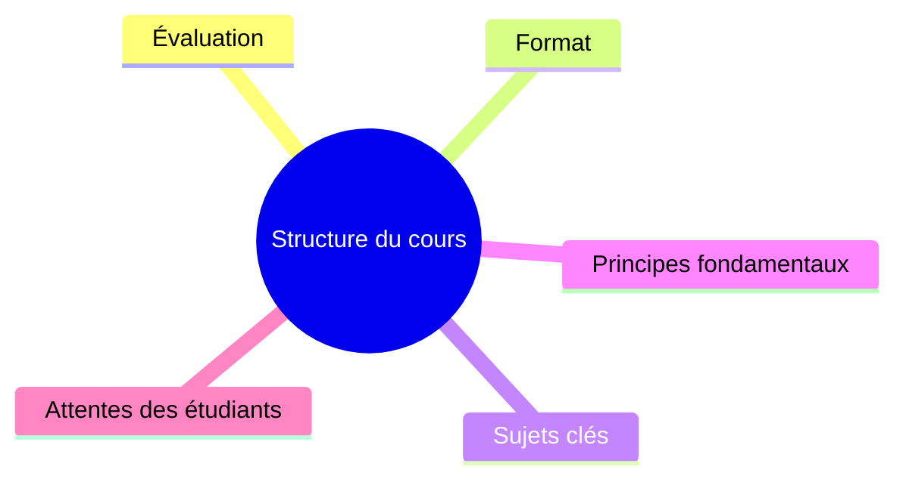

<link rel="stylesheet" href="https://cdn.jsdelivr.net/npm/katex@0.16.4/dist/katex.min.css">

______________________________________________________________________

<!-- paginate: true -->

<!-- colorPreset: sunset -->

# Introduction

<!-- vale off -->

- [About this course](#about-this-course)
- [Evaluation & grading](#evaluation--grading)
- [Course format](#course-format)
- [Core topics](#core-topics)
- [Key principles](#key-principles)
- [Expectations](#expectations)

<!-- vale on -->

## About this course

Welcome! I'm **Julien Dauliac**, a Site Reliability Engineer (SRE), it's like **DevOps**. I have a background in **software architecture** and enjoy **development** in general. My favorite technologies include **Nix** , **Kubernetes** and **Rust**, and I take a strong stance in advocating for efficient and modern software practices.

You can find my **GitHub** here: [https://github.com/Dauliac](https://github.com/Dauliac)

My courses are structured but adaptable. I frequently adjust the content based on my mood, **your questions**, and the interests of the group. If a topic excites you, feel free to ask—I am happy to form smaller breakout groups to dive deeper.

I am opinionated and **proselytizing** about good software practices.

All course materials are available on GitHub: [https://github.com/Dauliac/Cours](https://github.com/Dauliac/Cours)

My CV is also available here: [https://github.com/Dauliac/resume](https://github.com/Dauliac/resume)

______________________________________________________________________

## Evaluation & grading

You will be graded on the **project** in collaboration with **Alan**, but based on **different criteria**:

1. **Build System**
1. **CI/CD**
1. **Supply Chain Security**

The further you progress, the **better your grade**.

______________________________________________________________________

## Course format

- **Formal Lessons**: Structured content that will be adapted as needed.
- **Interactive Sessions**: Q&A and real-world case studies.
- **Breakout Groups**: If you have a particular interest, I can take smaller groups aside to dive deeper into specific topics.
- **Hands-on Practice**: Practical work will be emphasized throughout the course.

______________________________________________________________________

## Core topics

- **Software Delivery Life Cycle (SDLC)**: Key methodologies and industry best practices.
- **Operating Systems**: Understanding how systems work under the hood.
- **Licensing Models**: Exploring software licenses and their implications.
- **Technical Documentation**: Writing clear and effective documentation.

______________________________________________________________________

## Key principles

- **Automation**: Leveraging CI/CD and modern infrastructure tools.
- **Security**: Ensuring a robust software supply chain.
- **Efficiency**: Writing scalable and maintainable code.
- **Open Source**: Advocating and contributing to open-source projects.

______________________________________________________________________

## Expectations

- **Engagement**: Participation in discussions and hands-on sessions.
- **Curiosity**: Asking questions and exploring beyond the course content.
