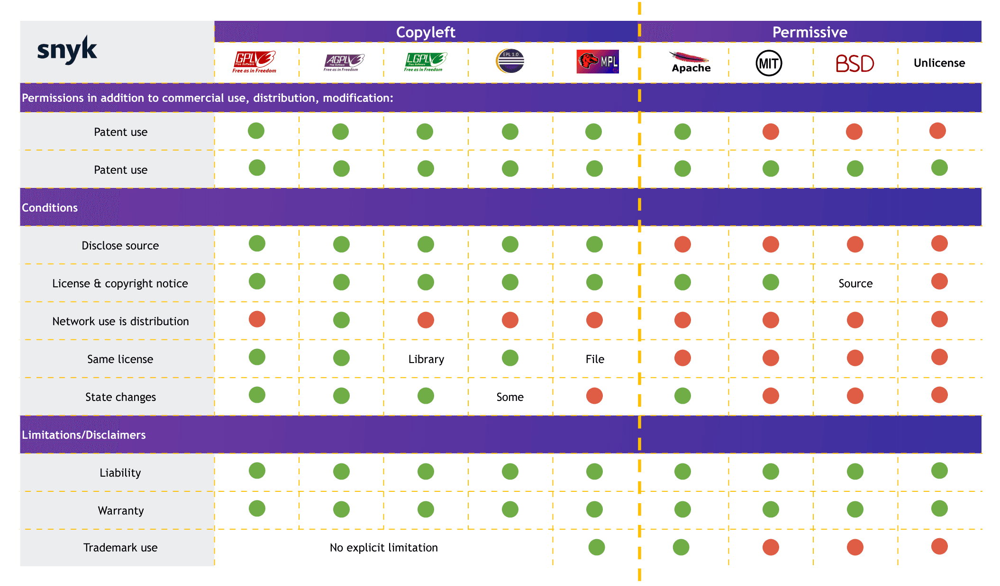

<link rel="stylesheet" href="https://cdn.jsdelivr.net/npm/katex@0.16.4/dist/katex.min.css">

______________________________________________________________________

## header: 'License Course' footer: 'Julien Dauliac -- ynov.casualty925@passfwd.com'

<!-- headingDivider: 3 -->

<!-- paginate: true -->

<!-- colorPreset: sunset -->

# License Course

<!-- vale off -->

- [Intangible Assets](#intangible-assets)
- [Theft](#theft)
- [Software Can't be stolen](#software-cant-be-stolen)
- [Internet](#internet)
- [Licenses and Business Models](#licenses-and-business-models)
  - [Rights Holder](#rights-holder)
  - [Proprietary Licenses](#proprietary-licenses)
  - [Shareware Licenses](#shareware-licenses)
  - [Freeware](#freeware)
  - [Freemium](#freemium)
  - [Open Source](#open-source)
    - [Copyleft](#copyleft)
    - [Summary](#summary)
    - [Economically](#economically)
- [French Law](#french-law)
  - [Asymmetry](#asymmetry)
  - [EPO](#epo)
  - [Patent Trolls](#patent-trolls)
    - [Useless Patents](#useless-patents)
  - [Primacy of US Law](#primacy-of-us-law)
  - [Hindrance to Innovation](#hindrance-to-innovation)
- [Degradation](#degradation)
  - [Hashicorp Case](#hashicorp-case)
  - [Monetization of Social and Symbolic Capital](#monetization-of-social-and-symbolic-capital)
- [Cyber War](#cyber-war)
- [Issues with AI Models](#issues-with-ai-models)
- [Making Money](#making-money)
- [Bibliography](#bibliography)

<!-- vale on -->

## Intangible Assets

[go 👮](https://www.youtube.com/watch?v=sODZLSHJm6Q&pp=ygUZbGUgcGlyYXRhZ2UgYydlc3QgZHUgdm9sIA%3D%3D)

______________________________________________________________________

- Intangibles, which can't be touched.
- No competition on products.

## Theft

> Theft is the **fraudulent appropriation** of another person's property.
> Penal Code **[Article 311-1](https://www.legifrance.gouv.fr/codes/article_lc/LEGIARTI000006418127)**

> [Withdraw](https://fr.wiktionary.org/wiki/retirer), [steal](https://fr.wiktionary.org/wiki/d%C3%A9rober)

Wiktionary

>

## Software Can't be stolen

- Software is an intangible asset.

## Internet

- Allows a marginal technical cost:
  e.g:
  - Proliferation of e-commerce, e-learning, e-services.

# Licenses and Business Models

## Rights Holder

> ***The author of an intellectual work enjoys, by the mere act of its creation, an exclusive incorporeal property right enforceable against all.*
> Intellectual Property Code ([article L111-1](https://www.legifrance.gouv.fr/affichCodeArticle.do?idArticle=LEGIARTI000006278868&cidTexte=LEGITEXT000006069414))**

______________________________________________________________________

- The rights holder chooses the license.

______________________________________________________________________

- In a company, rights are transferred to the company *(except for interns)*

## Proprietary Licenses

- Classic, closed, proprietary.

## Shareware Licenses

- WinRAR
  - Viral marketing
  - No longer exists
- Difficulty at the time in reaching an audience
  - `1 million use it and 100 pay == 1000 use it and 100 pay`

## Freeware

- Indirect monetization:
  - Often used for services: SAAS
  - If the service is free, you are the product.

Examples:

- Google Drive
- Discord

______________________________________________________________________

- Discord doesn't sell user data.
- Discord dilutes its shares.

## Freemium

- Free at first and then encourage payment.

______________________________________________________________________

Examples:

- Pay to win
- Tinder

## Open Source

- Free
- Can benefit from community support
- Internet allows marginal economic sharing cost

### Copyleft

- Contagious
- A way to make software (or other works) free

### Summary



### Economically

- Highly effective:
  - Network effect:
    - Viral
    - Popular
  - Devastates competition
    - Chromium
    - KDE

# French Law

## Asymmetry

- Primacy of French law

______________________________________________________________________

- Patents are illegal in France
- Software patents are legal in Europe

______________________________________________________________________

## EPO

- A hybrid organization
- No accountability
- No democratic control
- No legal oversight

______________________________________________________________________

- Changing the EU constitution would be required to reform the EPO.

______________________________________________________________________

- Anti-free software

______________________________________________________________________

- 3/4 of software patents granted by the EPO are held by non-European countries.

______________________________________________________________________

- Dicey

## Patent Trolls

- Companies that exist solely to file lawsuits.

______________________________________________________________________

### Useless Patents

- Useless patents:
  - Double click: Microsoft, 2007
  - One-click purchase: Amazon, 1999
  - Hyperlink patent: IBM, 1998
  - Window patent: Xerox, 1984

______________________________________________________________________

## Primacy of US Law

- Entering the patent system means submitting to US law.

## Hindrance to Innovation

- Anti-innovation
- Allows international firms to appropriate technologies
- Puts small and medium enterprises at a disadvantage against giants

______________________________________________________________________

- Innovation doesn't come from large corporations.

______________________________________________________________________

- Large corporations buy, fund, integrate

# Degradation

## Hashicorp Case

All Hashicorp software has moved from free licenses to BUSL.

## Monetization of Social and Symbolic Capital

Bourdieu:

- Economic capital
- Cultural capital
- Symbolic capital
- Social capital

Deterioration of public goods?

# Cyber War

- A war has been won:

______________________________________________________________________

Free software dominates in all areas:

- Profitability
- Individual rights and freedoms
- Performance

______________________________________________________________________

But

______________________________________________________________________

- A new war is ongoing...

______________________________________________________________________

- A battle over cloud providers and, more generally, platforms.

______________________________________________________________________

- SAAS, a new tool for depriving freedoms.

______________________________________________________________________

Copyright law shows its limits on databases due to artificial intelligence:

- Freeing models
- Risks of privatization
- Risk of theft

# Issues with AI Models

```
ChatGPT === Wikipedia + Reddit + Twitter + Marmiton + ...
```

______________________________________________________________________

The problem with recommendation algorithms:

- Cambridge Analytica
- QAnon
- X
- etc...

______________________________________________________________________

Tools that are:

- Opaque
- Non-democratic
- Uncontrolled
- Built on unclear data usage.

# Making Money

- It's possible to build an open-source company, and it even has several advantages:
  - Psychological support from the community.
  - Regional support
  - Forces better product design
  - Easier recruitment

# Bibliography

- [https://fr.wiktionary.org/wiki/soustraction](https://fr.wiktionary.org/wiki/soustraction)
- [https://opentf.org/](https://opentf.org/)
- [https://fr.wikipedia.org/wiki/Bien_immatériel](https://fr.wikipedia.org/wiki/Bien_immat%C3%A9riel)
- **Intellectual Property Code:**
  - **[article L111-1](https://www.legifrance.gouv.fr/affichCodeArticle.do?idArticle=LEGIARTI000006278868&cidTexte=LEGITEXT000006069414)**
  - **[article 113-9](https://www.legifrance.gouv.fr/affichCodeArticle.do?idArticle=LEGIARTI000006278890&cidTexte=LEGITEXT000006069414)**
- Penal Code:
  - **[Article 311-1](https://www.legifrance.gouv.fr/codes/article_lc/LEGIARTI000006418127)**
