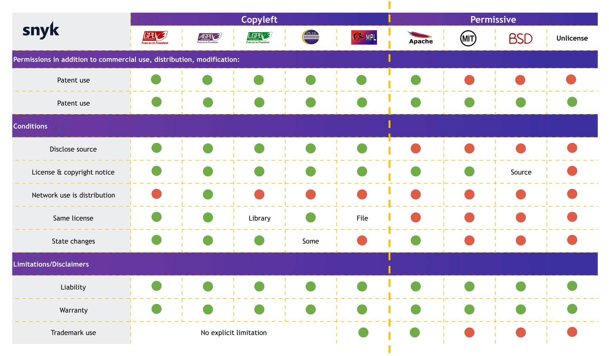

______________________________________________________________________

<!-- header: 'License Course' -->
<!-- footer: 'Julien Dauliac -- ynov.casualty925@passfwd.com' -->

<!-- headingDivider: 3 -->

<!-- paginate: true -->

<!-- colorPreset: sunset -->

# License Course

<!-- vale off -->

  * [Intangible Assets](#intangible-assets)
  * [Theft](#theft)
  * [Software Can't be stolen](#software-cant-be-stolen)
  * [Internet](#internet)
* [Licenses and Business Models](#licenses-and-business-models)
  * [Rights Holder](#rights-holder)
  * [Proprietary Licenses](#proprietary-licenses)
  * [Shareware Licenses](#shareware-licenses)
  * [Freeware](#freeware)
  * [Freemium](#freemium)
  * [Open Source](#open-source)
    * [Copyleft](#copyleft)
    * [Summary](#summary)
    * [Non-American Open Source Licenses](#non-american-open-source-licenses)
    * [Recommended Licenses](#recommended-licenses)
    * [Economically](#economically)
* [French Law](#french-law)
  * [Asymmetry](#asymmetry)
  * [EPO](#epo)
  * [Patent Trolls](#patent-trolls)
    * [Useless Patents](#useless-patents)
  * [Primacy of US Law](#primacy-of-us-law)
  * [Hindrance to Innovation](#hindrance-to-innovation)
* [Degradation](#degradation)
  * [The "Merdification" Pattern](#the-merdification-pattern)
    * [Hashicorp Case (2023)](#hashicorp-case-2023)
    * [Redis (2024)](#redis-2024)
    * [MongoDB (2018)](#mongodb-2018)
    * [Elasticsearch (2021)](#elasticsearch-2021)
    * [CockroachDB (2019)](#cockroachdb-2019)
    * [Confluent / Kafka Tools (2019)](#confluent--kafka-tools-2019)
    * [Grafana, Loki, Tempo (2021)](#grafana-loki-tempo-2021)
    * [Docker Desktop (2021)](#docker-desktop-2021)
    * [Common Pattern](#common-pattern)
  * [Monetization of Social and Symbolic Capital](#monetization-of-social-and-symbolic-capital)
* [Cyber War](#cyber-war)
* [Issues with AI Models](#issues-with-ai-models)
* [Making Money](#making-money)
* [License Compliance Tooling](#license-compliance-tooling)
  * [The REUSE Standard (FSFE)](#the-reuse-standard-fsfe)
  * [SBOM Generation](#sbom-generation)
  * [License Auditing](#license-auditing)
  * [License File Generators](#license-file-generators)
  * [Recommended Workflow](#recommended-workflow)
* [Bibliography](#bibliography)

<!-- vale on -->

## Intangible Assets

[go 👮](https://www.youtube.com/watch?v=sODZLSHJm6Q&pp=ygUZbGUgcGlyYXRhZ2UgYydlc3QgZHUgdm9sIA%3D%3D)

______________________________________________________________________

- Intangibles, which can't be touched.
- No competition on products.

## Theft

> Theft is the **fraudulent appropriation** of another person's property.
> Penal Code **[Article 311-1](https://www.legifrance.gouv.fr/codes/article_lc/LEGIARTI000006418127)**

> [Withdraw](https://fr.wiktionary.org/wiki/retirer), [steal](https://fr.wiktionary.org/wiki/d%C3%A9rober)

Wiktionary


## Software Can't be stolen

- Software is an intangible asset.

## Internet

- Allows a marginal technical cost:
  e.g:
  - Proliferation of e-commerce, e-learning, e-services.

# Licenses and Business Models

## Rights Holder

> ***The author of an intellectual work enjoys, by the mere act of its creation, an exclusive incorporeal property right enforceable against all.*
> Intellectual Property Code ([article L111-1](https://www.legifrance.gouv.fr/affichCodeArticle.do?idArticle=LEGIARTI000006278868&cidTexte=LEGITEXT000006069414))**

______________________________________________________________________

- The rights holder chooses the license.

______________________________________________________________________

- In a company, rights are transferred to the company *(except for interns)*

## Proprietary Licenses

- Classic, closed, proprietary.

## Shareware Licenses

- WinRAR
  - Viral marketing
  - No longer exists
- Difficulty at the time in reaching an audience
  - `1 million use it and 100 pay == 1000 use it and 100 pay`

## Freeware

- Indirect monetization:
  - Often used for services: SAAS
  - If the service is free, you are the product.

Examples:

- Google Drive
- Discord

______________________________________________________________________

- Discord doesn't sell user data.
- Discord dilutes its shares.

## Freemium

- Free at first and then encourage payment.

______________________________________________________________________

Examples:

- Pay to win
- Tinder

## Open Source

- Free
- Can benefit from community support
- Internet allows marginal economic sharing cost

### Copyleft

- Contagious
- A way to make software (or other works) free

### Summary



### Non-American Open Source Licenses

Some well-known licenses (MIT, BSD, Apache) are tied to American institutions.
Alternatives exist:

- **[ISC](https://opensource.org/license/isc-license-txt)** — functionally equivalent to MIT, simpler wording
- **[EUPL](https://eupl.eu/)** — European Union Public License, copyleft, written under EU law, available in 23 languages
- **[CeCILL](https://en.wikipedia.org/wiki/CeCILL)** — French license (CEA/CNRS/INRIA), GPL-compatible
- **[CC0](https://creativecommons.org/publicdomain/zero/1.0/)** — Public domain dedication (Creative Commons)
- **[Unlicense](https://unlicense.org/)** — Public domain, no conditions
- **[Zlib](https://opensource.org/license/zlib)** — Very permissive, no institution

### Recommended Licenses

| Use case | License | Type |
|---|---|---|
| Library / small project | **ISC** or **MIT** | Permissive |
| Want contributions back | **EUPL** or **MPL 2.0** | Weak copyleft |
| Maximum freedom protection | **AGPLv3** | Strong copyleft |
| French context / public sector | **CeCILL v2.1** or **EUPL** | Copyleft, EU/FR law |
| Documentation | **CC BY-SA 4.0** | Creative Commons |
| Give up all rights | **CC0** | Public domain |

______________________________________________________________________

- Prefer **EUPL** or **CeCILL** in French/European contexts: they are governed by EU law, not US law.
- **MPL 2.0** is a good middle ground: file-level copyleft, compatible with proprietary code.

### Economically

- Highly effective:
  - Network effect:
    - Viral
    - Popular
  - Devastates competition
    - Chromium
    - KDE

# French Law

## Asymmetry

- Primacy of French law

______________________________________________________________________

- Patents are illegal in France
- Software patents are legal in Europe

______________________________________________________________________

## EPO

- A hybrid organization
- No accountability
- No democratic control
- No legal oversight

______________________________________________________________________

- Changing the EU constitution would be required to reform the EPO.

______________________________________________________________________

- Anti-free software

______________________________________________________________________

- 3/4 of software patents granted by the EPO are held by non-European countries.

______________________________________________________________________

- Dicey

## Patent Trolls

- Companies that exist solely to file lawsuits.

______________________________________________________________________

### Useless Patents

- Useless patents:
  - Double click: Microsoft, 2007
  - One-click purchase: Amazon, 1999
  - Hyperlink patent: IBM, 1998
  - Window patent: Xerox, 1984

______________________________________________________________________

## Primacy of US Law

- Entering the patent system means submitting to US law.

## Hindrance to Innovation

- Anti-innovation
- Allows international firms to appropriate technologies
- Puts small and medium enterprises at a disadvantage against giants

______________________________________________________________________

- Innovation doesn't come from large corporations.

______________________________________________________________________

- Large corporations buy, fund, integrate

# Degradation

## The "Merdification" Pattern

A recurring trend: companies build products on open-source licenses,
gain massive adoption, then switch to restrictive licenses once dominant.

______________________________________________________________________

### Hashicorp Case (2023)

All Hashicorp software (Terraform, Vault, Consul, Nomad, Vagrant...)
moved from **MPL 2.0** to **BUSL** (Business Source License).

- Community response: **[OpenTofu](https://opentofu.org/)** (Terraform fork, Linux Foundation)
- **[OpenBao](https://openbao.org/)** (Vault fork)

______________________________________________________________________

### Redis (2024)

Redis moved from **BSD** to **SSPL / RSALv2**.

- Community response: **[Valkey](https://valkey.io/)** (fork, Linux Foundation)

______________________________________________________________________

### MongoDB (2018)

MongoDB moved from **AGPL** to **SSPL** (Server Side Public License).

- SSPL is so restrictive that OSI does not recognize it as open source.
- Community response: **[FerretDB](https://github.com/FerretDB/FerretDB)** (PostgreSQL-based alternative)

______________________________________________________________________

### Elasticsearch (2021)

Elasticsearch moved from **Apache 2.0** to **SSPL / Elastic License v2**.

- Community response: **[OpenSearch](https://opensearch.org/)** (fork, AWS / Linux Foundation)

______________________________________________________________________

### CockroachDB (2019)

CockroachDB moved from **Apache 2.0** to **BSL**.

______________________________________________________________________

### Confluent / Kafka Tools (2019)

Confluent Platform components moved from **Apache 2.0** to **Confluent Community License**.

- Kafka itself remains Apache 2.0 (ASF project).

______________________________________________________________________

### Grafana, Loki, Tempo (2021)

Moved from **Apache 2.0** to **AGPLv3**.

- AGPLv3 is still open source, but much more restrictive (copyleft on network use).

______________________________________________________________________

### Docker Desktop (2021)

Docker Desktop moved from **free** to a **paid subscription** for enterprises (>250 employees).

- Alternative: **[Podman](https://podman.io/)** (Red Hat, fully open source)

______________________________________________________________________

### Common Pattern

```text
1. Build open source, gain adoption
2. Become the standard (network effect)
3. Change license to capture value
4. Community forks (sometimes)
```

______________________________________________________________________

- The BUSL and SSPL are **not** open source licenses (per OSI definition).
- They restrict cloud providers from offering the software as a service.
- The stated justification: "AWS/cloud providers profit without contributing back."

## Monetization of Social and Symbolic Capital

Bourdieu:

- Economic capital
- Cultural capital
- Symbolic capital
- Social capital

Deterioration of public goods?

# Cyber War

- A war has been won:

______________________________________________________________________

Free software dominates in all areas:

- Profitability
- Individual rights and freedoms
- Performance

______________________________________________________________________

But

______________________________________________________________________

- A new war is ongoing...

______________________________________________________________________

- A battle over cloud providers and, more generally, platforms.

______________________________________________________________________

- SAAS, a new tool for depriving freedoms.

______________________________________________________________________

Copyright law shows its limits on databases due to artificial intelligence:

- Freeing models
- Risks of privatization
- Risk of theft

# Issues with AI Models

```
ChatGPT === Wikipedia + Reddit + Twitter + Marmiton + ...
```

______________________________________________________________________

The problem with recommendation algorithms:

- Cambridge Analytica
- QAnon
- X
- etc...

______________________________________________________________________

Tools that are:

- Opaque
- Non-democratic
- Uncontrolled
- Built on unclear data usage.

# Making Money

- It's possible to build an open-source company, and it even has several advantages:
  - Psychological support from the community.
  - Regional support
  - Forces better product design
  - Easier recruitment

# License Compliance Tooling

## The REUSE Standard (FSFE)

[REUSE](https://reuse.software/) makes licensing easy and machine-readable:

- Add **SPDX headers** to every file (`SPDX-License-Identifier: MIT`)
- Store full license texts in a `LICENSES/` directory
- Lint compliance with `reuse lint`
- Generate SBOM with `reuse spdx`

```bash
pip install reuse
reuse download MIT EUPL-1.2
reuse annotate --license MIT --copyright "Your Name" src/*.py
reuse lint
```

- Integrates into CI/CD with the `fsfe/reuse` Docker image.

______________________________________________________________________

## SBOM Generation

A **Software Bill of Materials** (SBOM) lists all components and their licenses.

> Required by US Executive Order 14028, and EU Cyber Resilience Act (2027).

| Tool | What it does | Format |
|---|---|---|
| **[Syft](https://github.com/anchore/syft)** | SBOM generator from images, filesystems, archives | CycloneDX, SPDX |
| **[Trivy](https://github.com/aquasecurity/trivy)** | Vulnerability scanner + SBOM generation | CycloneDX, SPDX |
| **[CycloneDX CLI](https://github.com/CycloneDX)** | SBOM creation and conversion | CycloneDX |

```bash
# Generate SBOM from a container image
syft myimage:latest -o spdx-json > sbom.json
```

______________________________________________________________________

## License Auditing

| Tool | What it does |
|---|---|
| **[ScanCode Toolkit](https://github.com/aboutcode-org/scancode-toolkit)** | Deep license & copyright detection by scanning source code |
| **[ORT](https://github.com/oss-review-toolkit/ort)** (OSS Review Toolkit) | Full compliance pipeline: analyze, scan, evaluate policies, report (Linux Foundation) |
| **[OWASP Dependency-Track](https://dependencytrack.org/)** | Continuous SBOM analysis platform, identifies license & vulnerability risks |
| **[FOSSA](https://fossa.com/)** | Commercial license compliance (free tier available) |

______________________________________________________________________

## License File Generators

For bootstrapping a project with the right license file:

| Tool | Language |
|---|---|
| **[reuse download](https://reuse.software/)** | Python (recommended) |
| **[license](https://nishanths.github.io/license/)** | Go |
| **[license-generator](https://github.com/intincrab/license-generator)** | Go |

______________________________________________________________________

## Recommended Workflow

```text
1. Choose license (EUPL, MIT, AGPLv3...)
2. Add SPDX headers to all files (reuse annotate)
3. Generate SBOM in CI (syft / trivy)
4. Audit dependencies licenses (scancode / ORT)
5. Lint compliance (reuse lint)
```

# Bibliography

- [https://fr.wiktionary.org/wiki/soustraction](https://fr.wiktionary.org/wiki/soustraction)
- [https://opentf.org/](https://opentf.org/)
- [https://fr.wikipedia.org/wiki/Bien_immatériel](https://fr.wikipedia.org/wiki/Bien_immat%C3%A9riel)
- **Intellectual Property Code:**
  - **[article L111-1](https://www.legifrance.gouv.fr/affichCodeArticle.do?idArticle=LEGIARTI000006278868&cidTexte=LEGITEXT000006069414)**
  - **[article 113-9](https://www.legifrance.gouv.fr/affichCodeArticle.do?idArticle=LEGIARTI000006278890&cidTexte=LEGITEXT000006069414)**
- Penal Code:
  - **[Article 311-1](https://www.legifrance.gouv.fr/codes/article_lc/LEGIARTI000006418127)**