# TP 5: Local Kubernetes with k3d

## Learning Objectives

By the end of this practical, you will be able to:

1. **Create** a local Kubernetes cluster with k3d that runs inside Docker
2. **Understand** core Kubernetes concepts: Pods, Deployments, Services, Namespaces, Ingress
3. **Navigate** the cluster visually with k9s
4. **Deploy** applications using raw YAML manifests and `kubectl`
5. **Package** and deploy applications using Helm charts
6. **Manage** environment-specific configurations with Kustomize overlays
7. **Install** Argo CD and manage it through its web UI and CLI
8. **Implement** a GitOps workflow where Git is the single source of truth for deployments
9. **Set up** a fast local development loop with Skaffold that live-syncs code into the cluster

## Prerequisites

- Completed [TP 2: Building Containers](../perfect-container-with/README.md) (you need to understand container basics)
- Docker installed and running (Docker Desktop on WSL/macOS, Docker Engine on Linux)
- Nix installed (from TP 1) with flakes enabled
- Git installed
- A GitHub account (for the GitOps section)

> **WSL users**: all commands in this TP run inside your WSL terminal. Docker Desktop must have WSL integration enabled (Settings > Resources > WSL Integration).

______________________________________________________________________

## Overview

This workshop takes you from zero Kubernetes knowledge to a full local GitOps workflow.
You will progress through increasingly sophisticated deployment methods:

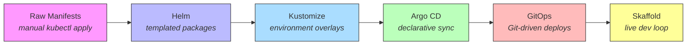

Each step builds on the previous one. By the end, you will have a local cluster
where pushing to Git automatically deploys your application, and editing code locally
instantly reflects in the cluster.

### What is Kubernetes?

Before we dive in, let's understand **why Kubernetes exists**. Imagine you have a web application running in a container. That works fine on one machine. But what happens when:

- The container crashes? Nobody restarts it.
- You need 10 copies to handle traffic? You manage them manually.
- You want to update without downtime? You have to orchestrate it yourself.

**Kubernetes solves all of this.** It is a **container orchestrator** -- you tell it *what you want* (e.g. "run 3 copies of my app"), and it figures out *how to make it happen* (scheduling containers, restarting crashed ones, rolling out updates).

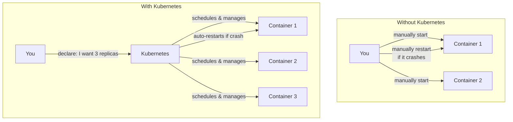

Think of Kubernetes as a **declarative system**: you describe the desired state, and Kubernetes continuously works to make reality match that description.

______________________________________________________________________

## Part 1: Setting Up k3d (20 min)

### What is k3d?

[k3d](https://k3d.io/) runs [k3s](https://k3s.io/) (a lightweight Kubernetes distribution) inside Docker containers.
This means you get a fully functional Kubernetes cluster without needing a VM or cloud provider.

In production, Kubernetes runs on real servers (physical or virtual machines). Each server is a **node**. But for learning and development, we don't need real servers -- k3d **simulates** a multi-node cluster by running each node as a Docker container on your laptop:

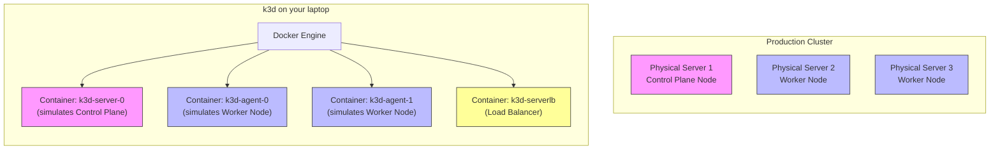

**Key insight**: it's containers all the way down. Your application containers run *inside* the k3d node containers. This is "Docker-in-Docker" -- and it works perfectly for local development.

Why k3d over alternatives?

| Tool | How it works | Pros | Cons |
|------|-------------|------|------|
| **k3d** | k3s in Docker containers | Fast startup, multi-node, works in WSL | Needs Docker |
| minikube | VM or Docker | Many addons | Heavier, slower |
| kind | Kubernetes in Docker | Official K8s conformance | Slower than k3d |
| Docker Desktop K8s | Built-in | Zero setup | Single node, not configurable |

k3d starts a cluster in seconds and works everywhere Docker runs -- including WSL 2.

### Step 1: Set up your environment with Nix

All the tools for this workshop are packaged in a Nix flake template. This gives you a **reproducible, declarative** development environment -- no manual installation of individual tools.

```bash
mkdir -p k8s-workshop
cd k8s-workshop
nix flake init -t github:Dauliac/Cours#tp5-k8s
```

This creates a `flake.nix` and Nix modules that declare all the tools you need. Enter the development shell:

```bash
# If you have direnv installed (recommended):
direnv allow

# Otherwise, enter the shell manually:
nix develop
```

Verify that all tools are available:

```bash
k3d version
kubectl version --client
helm version
k9s version
argocd version --client
kustomize version
skaffold version
```

> **What just happened?** The Nix flake declared all workshop dependencies (`k3d`, `kubectl`, `helm`, `k9s`, `argocd`, `kustomize`, `skaffold`) in a single file. `nix develop` downloads and makes them available in an isolated shell -- nothing is installed globally, and everyone gets the exact same versions. This is the same reproducibility approach from TP 1, applied to infrastructure tooling.

### Step 2: Create your first cluster

> **Before creating**: if you have an existing k3d cluster using ports 8080 or 8443, the creation will hang silently. Check with `k3d cluster list` and delete stale clusters with `k3d cluster delete <name>` first.

```bash
k3d cluster create my-cluster \
  --image rancher/k3s:v1.31.6-k3s1 \
  --port "8080:80@loadbalancer" \
  --port "8443:443@loadbalancer" \
  --agents 2
```

> **Why `--image`?** The default k3s version bundled with k3d can be very old. Pinning a recent k3s release avoids compatibility issues with newer Kubernetes APIs and ensures images pull correctly.

Let's break down what each flag does:

| Flag | What it does |
|------|-------------|
| `my-cluster` | The name of your cluster (you can choose any name) |
| `--image rancher/k3s:v1.31.6-k3s1` | Pin a specific Kubernetes version (avoids surprises) |
| `--port "8080:80@loadbalancer"` | Map your machine's port 8080 to the cluster's port 80 |
| `--port "8443:443@loadbalancer"` | Map your machine's port 8443 to the cluster's port 443 |
| `--agents 2` | Create 2 worker nodes (in addition to 1 control plane node) |

This creates:

- **1 server node** (control plane): runs the Kubernetes API server, scheduler, and etcd
- **2 agent nodes** (workers): run your workloads
- **1 load balancer**: forwards ports 8080 and 8443 from your machine into the cluster

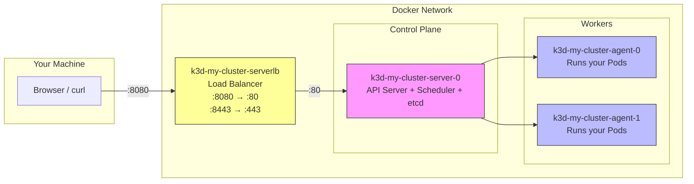

**What happens behind the scenes** when you run this command:

1. k3d pulls the `rancher/k3s` Docker image
2. It creates a Docker network so all nodes can communicate
3. It starts 4 Docker containers (1 server + 2 agents + 1 load balancer)
4. The server node bootstraps Kubernetes (starts the API server, etcd database, scheduler)
5. The agent nodes register themselves with the server
6. k3d writes a **kubeconfig** file so `kubectl` knows how to connect to the cluster
7. The load balancer starts forwarding your ports into the cluster

All of this happens in a few seconds.

### Step 3: Verify the cluster

```bash
# k3d automatically configures kubectl to point at your cluster
kubectl cluster-info

# List the nodes
kubectl get nodes
```

You should see three nodes with status `Ready`. Your cluster is running.

> **What is a kubeconfig?** When k3d creates a cluster, it writes connection details (server address, certificates) to a file called `~/.kube/config`. This file can contain configurations for *multiple* clusters. A **context** is a named entry in this file that points to a specific cluster. `kubectl` always talks to whichever context is currently selected.

> **Important**: if you have other Kubernetes clusters configured (e.g. from work), make sure your context points at k3d:
> ```bash
> kubectl config current-context    # Should show: k3d-my-cluster
> kubectl config use-context k3d-my-cluster   # Switch if needed
> ```

### Step 4: Explore cluster management

```bash
# List all clusters
k3d cluster list

# Stop the cluster (preserves state)
k3d cluster stop my-cluster

# Start it again
k3d cluster start my-cluster

# Delete the cluster entirely
# k3d cluster delete my-cluster    # Don't run this yet!
```

### Checkpoint

Run these commands and verify they work:

```bash
kubectl get nodes          # 3 nodes, all Ready
kubectl get namespaces     # default, kube-system, kube-public, kube-node-lease
docker ps                  # 4 containers (server, 2 agents, loadbalancer)
```

### Step 5: Meet k9s -- your visual cluster explorer

[k9s](https://k9scli.io/) is a terminal UI that makes it much easier to understand what is happening in your cluster. Instead of typing `kubectl get` commands repeatedly, k9s gives you a live, interactive view.

```bash
k9s
```

You will see a full-screen terminal interface showing your cluster resources. Key navigation:

| Key | Action |
|-----|--------|
| `:pods` | View all pods (type any resource name) |
| `:deploy` | View deployments |
| `:svc` | View services |
| `:ns` | View namespaces |
| `/` | Filter/search |
| `d` | Describe selected resource |
| `l` | View logs of selected pod |
| `s` | Shell into selected pod |
| `Ctrl+C` or `:q` | Quit k9s |

> **Tip**: keep k9s running in a separate terminal throughout this workshop. It updates in real time, so you can watch pods being created, scaled, and deleted as you run commands in another terminal. This is much more intuitive than repeatedly running `kubectl get pods`.

______________________________________________________________________

## Part 2: Kubernetes Fundamentals with Raw Manifests (40 min)

### Core Concepts

Before deploying anything, understand the building blocks. Kubernetes has many resource types, but you only need a handful to get started. Here is how they relate to each other:

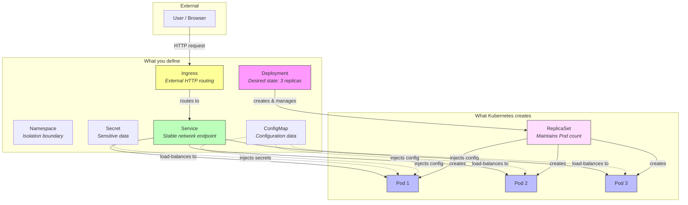

| Concept | What it is | Analogy |
|---------|-----------|---------|
| **Pod** | Smallest deployable unit. One or more containers. | A single process |
| **Deployment** | Manages Pods. Handles scaling, rolling updates, rollbacks. | A process supervisor |
| **ReplicaSet** | Created by Deployment. Ensures N pods are always running. | The supervisor's checklist |
| **Service** | Stable network endpoint for a set of Pods. | A DNS entry + load balancer |
| **Namespace** | Virtual cluster within a cluster. Isolates resources. | A folder |
| **Ingress** | Routes external HTTP traffic to Services. | A reverse proxy rule |
| **ConfigMap** | Key-value configuration injected into Pods. | Environment variables file |
| **Secret** | Like ConfigMap, but for sensitive data (base64-encoded). | An encrypted env file |

**The declarative model**: notice that you never say "start a container". You say "I want a Deployment with 3 replicas". Kubernetes then figures out what needs to happen -- creating Pods, scheduling them on nodes, restarting crashed ones. This is the fundamental difference from Docker Compose where you describe *how* to run things.

### Step 5: Create a namespace

Create a working directory for this TP:

```bash
mkdir -p k8s-workshop
cd k8s-workshop
```

Create `namespace.yaml`:

```yaml
apiVersion: v1
kind: Namespace
metadata:
  name: workshop
```

Apply it:

```bash
kubectl apply -f namespace.yaml
kubectl get namespaces
```

You should see `workshop` in the list. From now on, we will deploy everything into this namespace.

> **What just happened?** You sent a YAML file to the Kubernetes API server using `kubectl apply`. The API server validated it, stored the desired state in etcd (its database), and created the namespace. This is the pattern for *everything* in Kubernetes: write YAML, apply it, Kubernetes makes it real.

### Step 6: Deploy a Pod directly

Create `pod.yaml`:

```yaml
apiVersion: v1
kind: Pod
metadata:
  name: hello-pod
  namespace: workshop
  labels:
    app: hello
spec:
  containers:
    - name: hello
      image: traefik/whoami:v1.10
      ports:
        - containerPort: 80
```

```bash
kubectl apply -f pod.yaml
kubectl get pods -n workshop
```

Wait until `STATUS` shows `Running`. Then test it:

```bash
# Forward the pod's port to your machine
kubectl port-forward -n workshop pod/hello-pod 9090:80 &

# Test it
curl http://localhost:9090

# Stop the port-forward
kill %1
```

You should see a response showing the hostname, IP address, and request headers. [traefik/whoami](https://github.com/traefik/whoami) is a tiny Go server (Apache 2.0 license) that echoes back request information -- perfect for testing.

> **What is port-forwarding?** Your Pod runs *inside* the cluster, on the cluster's internal network. Your laptop cannot reach it directly. `kubectl port-forward` creates a tunnel from your machine (port 9090) into the Pod (port 8080):
>
> ```
> Your laptop:9090 ──tunnel──→ Pod hello-pod:80
> ```
>
> This is useful for debugging but not how you'd expose services in production.

Now delete the Pod:

```bash
kubectl delete -f pod.yaml
kubectl get pods -n workshop
```

The Pod is gone. **Nobody recreates it.** This is the problem -- raw Pods have no self-healing. That is what Deployments solve.

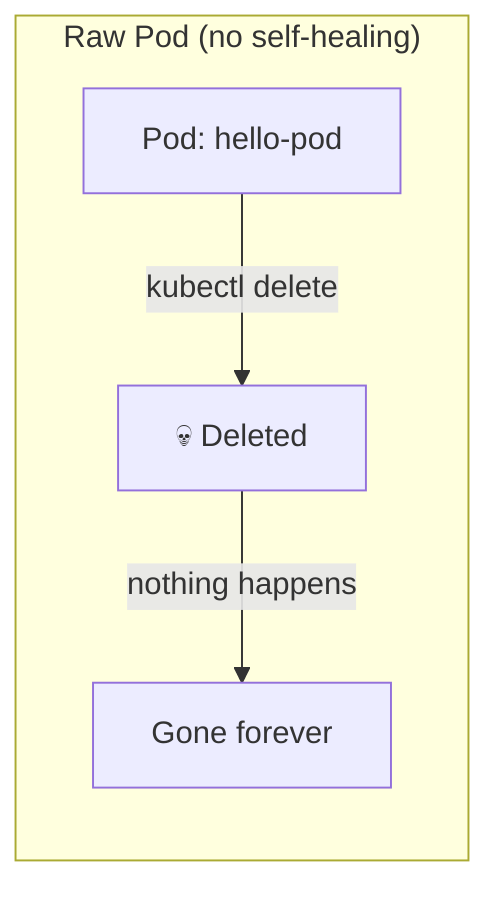

### Step 7: Deploy with a Deployment

Create `deployment.yaml`:

```yaml
apiVersion: apps/v1
kind: Deployment
metadata:
  name: hello
  namespace: workshop
  labels:
    app: hello
spec:
  replicas: 3
  selector:
    matchLabels:
      app: hello
  template:
    metadata:
      labels:
        app: hello
    spec:
      containers:
        - name: hello
          image: traefik/whoami:v1.10
          ports:
            - containerPort: 80
          resources:
            requests:
              cpu: 50m
              memory: 32Mi
            limits:
              cpu: 100m
              memory: 64Mi
```

Let's understand the YAML structure before applying it:

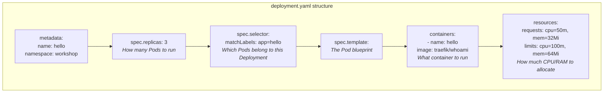

> **What are resource requests and limits?**
> - **Requests** = the minimum resources guaranteed to your container. Kubernetes uses this to decide which node has enough room.
> - **Limits** = the maximum resources your container can use. If it exceeds memory limits, Kubernetes kills it (OOMKilled).
> - `50m` CPU = 0.05 CPU cores (1000m = 1 full core). `32Mi` memory = 32 mebibytes.

```bash
kubectl apply -f deployment.yaml
kubectl get deployments -n workshop
kubectl get pods -n workshop
```

You should see 3 Pods running. Notice that each Pod has a unique name like `hello-7d4b8c6f9-x2k4m` -- Kubernetes generates these names automatically.

Now try killing one:

```bash
# Delete one pod (replace with an actual pod name from `kubectl get pods`)
kubectl delete pod -n workshop -l app=hello --field-selector=status.phase=Running --wait=false | head -1

# Watch what happens
kubectl get pods -n workshop -w
```

The Deployment automatically creates a new Pod to maintain 3 replicas. Press `Ctrl+C` to stop watching.

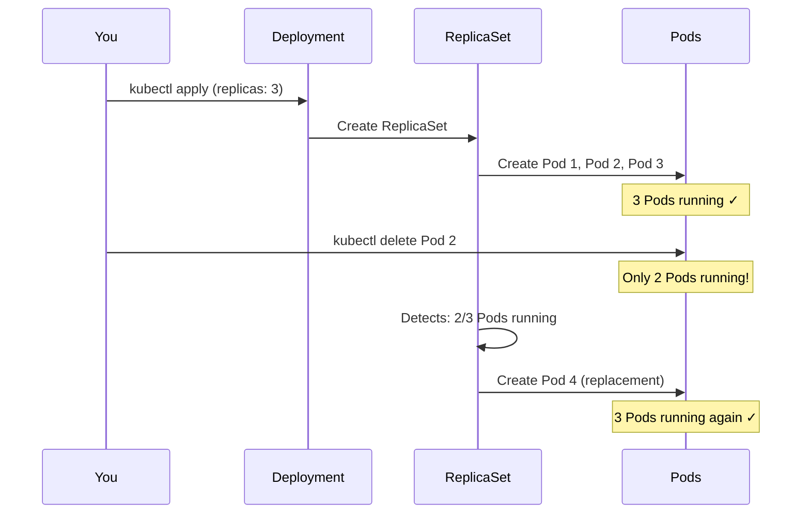

**This is self-healing in action.** The Deployment's ReplicaSet continuously watches the actual state (how many Pods are running) and compares it to the desired state (3 replicas). When they differ, it takes action to reconcile. This is called the **reconciliation loop** -- the core pattern of Kubernetes.

### Step 8: Expose with a Service

Create `service.yaml`:

```yaml
apiVersion: v1
kind: Service
metadata:
  name: hello
  namespace: workshop
spec:
  selector:
    app: hello
  ports:
    - port: 80
      targetPort: 80
  type: ClusterIP
```

```bash
kubectl apply -f service.yaml
kubectl get services -n workshop
```

**Why do we need a Service?** Pods are ephemeral -- they can be killed, rescheduled, and get new IP addresses at any time. If your frontend tried to talk to a Pod's IP directly, it would break whenever the Pod restarts. A Service provides a **stable address** that never changes, and automatically load-balances traffic across all matching Pods:

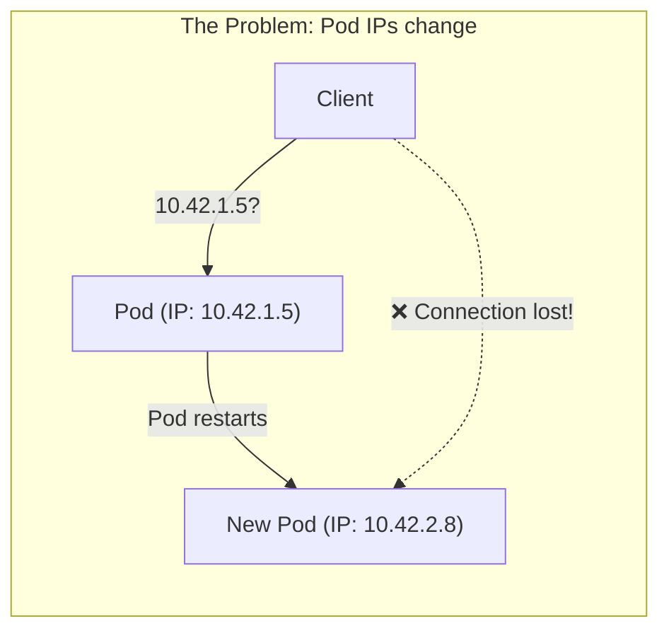

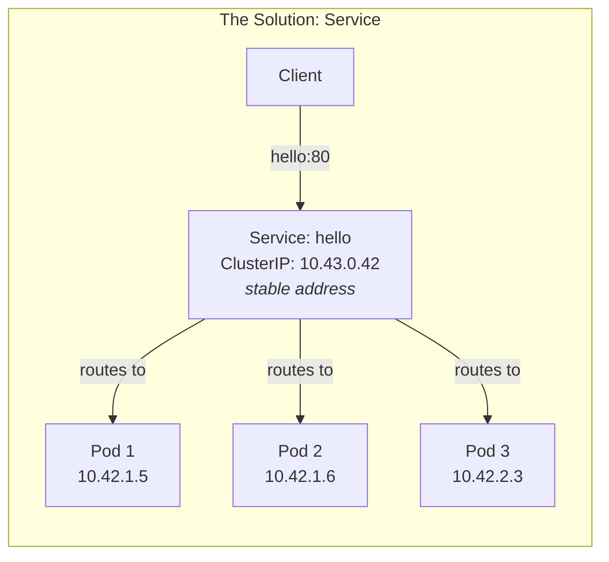

The Service creates a stable DNS name (`hello.workshop.svc.cluster.local`) that load-balances across all 3 Pods.

> **How does the Service find the right Pods?** Through **labels**. The Service has `selector: app: hello` and the Pods have `labels: app: hello`. Kubernetes matches them automatically. If a Pod doesn't have the right label, the Service ignores it. If a new Pod appears with the right label, the Service starts sending traffic to it.

Test it from inside the cluster:

```bash
kubectl run curl --rm -i --tty --image=curlimages/curl -n workshop -- \
  curl -s http://hello.workshop.svc.cluster.local
```

> **Why "from inside the cluster"?** A `ClusterIP` Service is only reachable from within the cluster's network. That's why we launch a temporary `curl` Pod inside the cluster to test it. To make it reachable from your laptop, you need either port-forwarding or an Ingress (next step).

### Step 9: Expose externally with Ingress

**What is an Ingress?** While a Service makes your app reachable inside the cluster, an Ingress makes it reachable from outside -- it acts like a reverse proxy (think nginx) that routes HTTP traffic based on hostnames and paths.

An Ingress needs an **Ingress Controller** to work -- a program that reads Ingress resources and configures the actual routing. k3d ships with **Traefik** as its Ingress controller, pre-installed and ready to use.

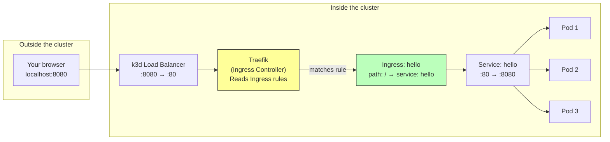

Create `ingress.yaml`:

```yaml
apiVersion: networking.k8s.io/v1
kind: Ingress
metadata:
  name: hello
  namespace: workshop
spec:
  rules:
    - http:
        paths:
          - path: /
            pathType: Prefix
            backend:
              service:
                name: hello
                port:
                  number: 80
```

```bash
kubectl apply -f ingress.yaml
```

Now access it through the k3d load balancer:

```bash
curl http://localhost:8080
```

You should see a response with the pod's hostname, IP, and request headers.

**Trace the full request path** to understand what happened:

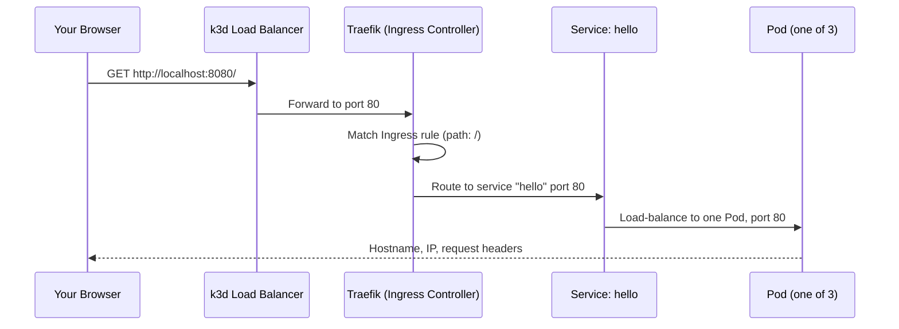

Every layer adds a capability: the load balancer maps external ports, Traefik routes by URL path, the Service load-balances across Pods, and the Pod runs your container.

### Step 10: Use ConfigMaps for configuration

**The problem**: you don't want to hardcode configuration (database URLs, feature flags, API keys) inside your container image. That would mean rebuilding the image every time you change a setting. Instead, Kubernetes lets you inject configuration at deploy time using **ConfigMaps** (for non-sensitive data) and **Secrets** (for passwords, tokens, etc.).

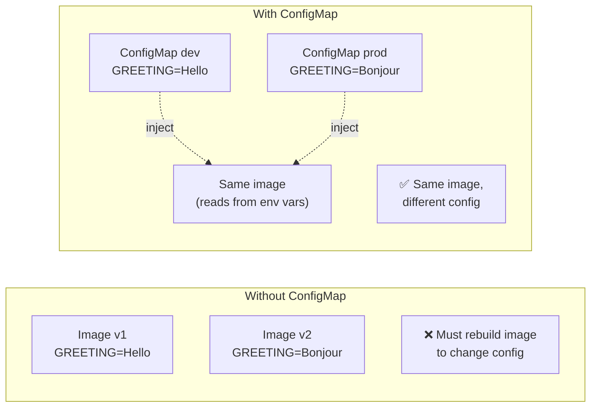

Create `configmap.yaml`:

```yaml
apiVersion: v1
kind: ConfigMap
metadata:
  name: hello-config
  namespace: workshop
data:
  GREETING: "Hello from ConfigMap!"
```

Update the Deployment to use an image that reads environment variables. Replace the deployment with `deployment-v2.yaml`:

```yaml
apiVersion: apps/v1
kind: Deployment
metadata:
  name: hello
  namespace: workshop
  labels:
    app: hello
spec:
  replicas: 3
  selector:
    matchLabels:
      app: hello
  template:
    metadata:
      labels:
        app: hello
    spec:
      containers:
        - name: hello
          image: nginx:1.27-alpine
          ports:
            - containerPort: 80
          envFrom:
            - configMapRef:
                name: hello-config
          resources:
            requests:
              cpu: 50m
              memory: 32Mi
            limits:
              cpu: 100m
              memory: 64Mi
```

```bash
kubectl apply -f configmap.yaml
kubectl apply -f deployment-v2.yaml

# Verify the env var is injected
kubectl exec -n workshop deploy/hello -- env | grep GREETING
```

### Checkpoint

At this point you have deployed:

```bash
kubectl get all -n workshop
```

You should see: 1 Deployment, 1 Service, 3 Pods, 1 ReplicaSet.

### What you have built so far

Let's take a moment to review the full architecture you've created with raw manifests:

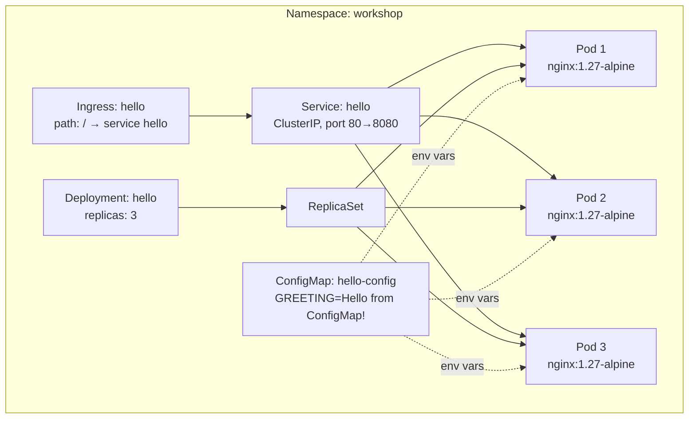

You created **6 YAML files** and applied them one by one. This works for learning, but imagine managing 50 services with 3 environments each -- that's 900 YAML files! The next section introduces **Helm** to solve this.

### Step 11: Clean up raw manifests

```bash
kubectl delete namespace workshop
```

This deletes everything in the namespace. A clean slate for the next section.

> **Why does deleting the namespace delete everything inside it?** Namespaces are an ownership boundary. Every resource belongs to a namespace, and when the namespace is deleted, Kubernetes garbage-collects all resources inside it. This is similar to deleting a directory and all its files.

______________________________________________________________________

## Part 3: Deploying with Helm (30 min)

### Why Helm?

Raw manifests work, but they have problems:

- **No templating**: you copy-paste for each environment (dev, staging, prod)
- **No versioning**: you cannot roll back to a previous set of manifests
- **No dependency management**: complex apps need many manifests in the right order

[Helm](https://helm.sh/) solves these. It is the package manager for Kubernetes -- think `apt` for Ubuntu or `npm` for Node.js, but for Kubernetes applications.

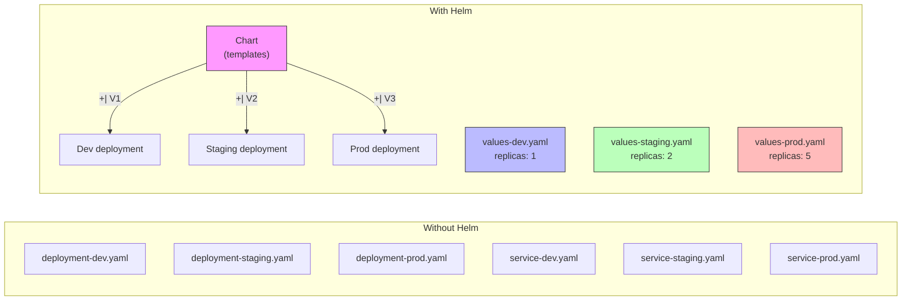

**One chart, many configurations.** You write your Kubernetes manifests once as templates, then provide different `values.yaml` files for each environment.

| Concept | What it is | Analogy |
|---------|-----------|---------|
| **Chart** | A package of Kubernetes manifests with templating | A package (like an npm package) |
| **Release** | A deployed instance of a chart | An installed package |
| **Values** | Configuration that customises a chart | Package configuration |
| **Repository** | A collection of charts (like a package registry) | npm registry |

### Step 12: Use an existing Helm chart

Deploy nginx using the official Bitnami chart:

```bash
# Add the Bitnami repository
helm repo add bitnami https://charts.bitnami.com/bitnami
helm repo update

# Install nginx
helm install my-nginx bitnami/nginx \
  --create-namespace \
  --namespace helm-demo \
  --set service.type=ClusterIP

# Watch the deployment
kubectl get pods -n helm-demo -w
```

Press `Ctrl+C` when the Pod is `Running`. Inspect what Helm created:

```bash
# List releases
helm list -n helm-demo

# See all resources created by the chart
kubectl get all -n helm-demo

# See the values used
helm get values my-nginx -n helm-demo --all
```

### Step 13: Create your own Helm chart

```bash
helm create hello-chart
```

This generates a chart skeleton. Let's explore and customise it:

```bash
tree hello-chart/
```

```
hello-chart/
├── Chart.yaml          # Chart metadata (name, version, description)
├── values.yaml         # Default configuration values
├── templates/          # Kubernetes manifest templates
│   ├── deployment.yaml
│   ├── service.yaml
│   ├── ingress.yaml
│   ├── hpa.yaml
│   ├── serviceaccount.yaml
│   ├── _helpers.tpl    # Template helpers
│   ├── NOTES.txt       # Post-install message
│   └── tests/
│       └── test-connection.yaml
└── charts/             # Sub-chart dependencies
```

**How Helm templating works**: templates contain Go template placeholders like `{{ .Values.replicaCount }}` that get replaced with actual values at install time:

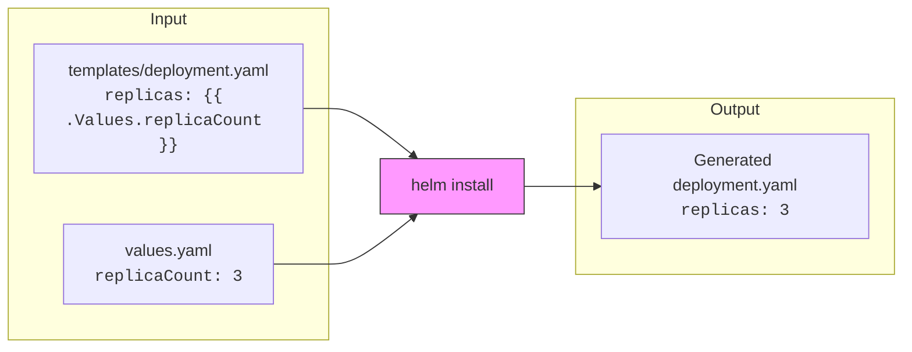

Edit `hello-chart/values.yaml` to configure our app:

```yaml
replicaCount: 3

image:
  repository: traefik/whoami
  pullPolicy: IfNotPresent
  tag: "v1.10"

service:
  type: ClusterIP
  port: 80

ingress:
  enabled: true
  className: ""
  hosts:
    - host: hello.local
      paths:
        - path: /
          pathType: Prefix

whoamiName: "hello-from-helm"
```

Edit `hello-chart/templates/deployment.yaml` to pass the `whoamiName` value as an environment variable. Find the `containers` section and add after `ports`:

```yaml
          env:
            - name: WHOAMI_NAME
              value: {{ .Values.whoamiName | default "hello-chart" | quote }}
```

### Step 14: Install your chart

```bash
# Preview what will be deployed (dry run — renders templates without applying)
helm template hello ./hello-chart --namespace helm-demo
```

> **Always preview first.** `helm template` renders your templates with the values and prints the resulting YAML -- without sending anything to the cluster. Read the output carefully: this is exactly what Helm will send to Kubernetes. This is like a "what would happen if..." check.

```bash
# Install it (upgrade --install creates the release if it doesn't exist, or upgrades it)
helm upgrade --install hello ./hello-chart \
  --create-namespace \
  --namespace helm-demo

# Check the deployment
kubectl get all -n helm-demo -l app.kubernetes.io/name=hello-chart
```

### Step 15: Override values

Helm charts are designed to be customised. Create `values-staging.yaml`:

```yaml
replicaCount: 1

whoamiName: "hello-from-staging"
```

```bash
helm upgrade --install hello-staging ./hello-chart \
  --create-namespace \
  --namespace staging \
  -f values-staging.yaml
```

Now you have two environments running different configurations from the same chart:

```bash
helm list --all-namespaces
```

### Step 16: Manage releases

```bash
# See release history
helm history hello -n helm-demo

# Rollback to a previous version
# helm rollback hello 1 -n helm-demo

# Uninstall a release
helm uninstall hello-staging -n staging
kubectl delete namespace staging
```

### Checkpoint

```bash
helm list --all-namespaces
kubectl get pods -n helm-demo
```

Clean up before the next section:

```bash
helm uninstall my-nginx -n helm-demo
helm uninstall hello -n helm-demo
kubectl delete namespace helm-demo
```

______________________________________________________________________

## Part 4: Managing Environments with Kustomize (30 min)

### What is Kustomize?

[Kustomize](https://kustomize.io/) is a configuration management tool built into `kubectl`. It lets you customise Kubernetes manifests **without templates**. Instead of injecting variables into YAML (like Helm), you write plain YAML and layer modifications on top.

```
Helm approach:          Kustomize approach:
  template + values       base manifests + overlays (patches)
  → rendered YAML         → merged YAML
```

| Feature | Helm | Kustomize |
|---------|------|-----------|
| Templating | Go templates (`{{ .Values.x }}`) | None -- plain YAML |
| Customisation | Values files | Overlays and patches |
| Packaging | Charts with dependencies | Directories with `kustomization.yaml` |
| Built into kubectl | No (separate binary) | Yes (`kubectl apply -k`) |
| Best for | Reusable packages, third-party apps | Environment-specific config, in-house apps |

In practice, teams often use **both**: Helm for third-party charts and Kustomize for their own services.

### Step 17: Create a Kustomize base

A Kustomize project has a **base** (shared resources) and **overlays** (environment-specific patches).

```bash
mkdir -p kustomize-demo/base
mkdir -p kustomize-demo/overlays/dev
mkdir -p kustomize-demo/overlays/staging
```

Create `kustomize-demo/base/deployment.yaml`:

```yaml
apiVersion: apps/v1
kind: Deployment
metadata:
  name: hello
  labels:
    app: hello
spec:
  replicas: 1
  selector:
    matchLabels:
      app: hello
  template:
    metadata:
      labels:
        app: hello
    spec:
      containers:
        - name: hello
          image: traefik/whoami:v1.10
          args:
            - "--name=hello-base"
          ports:
            - containerPort: 80
          resources:
            requests:
              cpu: 50m
              memory: 32Mi
            limits:
              cpu: 100m
              memory: 64Mi
```

Create `kustomize-demo/base/service.yaml`:

```yaml
apiVersion: v1
kind: Service
metadata:
  name: hello
spec:
  selector:
    app: hello
  ports:
    - port: 80
      targetPort: 80
  type: ClusterIP
```

Create `kustomize-demo/base/kustomization.yaml`:

```yaml
apiVersion: kustomize.config.k8s.io/v1beta1
kind: Kustomization
resources:
  - deployment.yaml
  - service.yaml
```

Test the base renders correctly:

```bash
kubectl kustomize kustomize-demo/base
```

This outputs the merged YAML. No templating -- just plain Kubernetes manifests.

### Step 18: Create environment overlays

**Dev overlay** -- 1 replica, dev-specific name:

Create `kustomize-demo/overlays/dev/kustomization.yaml`:

```yaml
apiVersion: kustomize.config.k8s.io/v1beta1
kind: Kustomization
resources:
  - ../../base
namePrefix: dev-
namespace: dev
patches:
  - target:
      kind: Deployment
      name: hello
    patch: |-
      - op: replace
        path: /spec/replicas
        value: 1
      - op: replace
        path: /spec/template/spec/containers/0/args
        value: ["--name=hello-dev"]
```

**Staging overlay** -- 3 replicas, staging-specific name:

Create `kustomize-demo/overlays/staging/kustomization.yaml`:

```yaml
apiVersion: kustomize.config.k8s.io/v1beta1
kind: Kustomization
resources:
  - ../../base
namePrefix: staging-
namespace: staging
patches:
  - target:
      kind: Deployment
      name: hello
    patch: |-
      - op: replace
        path: /spec/replicas
        value: 3
      - op: replace
        path: /spec/template/spec/containers/0/args
        value: ["--name=hello-staging"]
```

### Step 19: Deploy with Kustomize

```bash
# Preview what each environment produces
kubectl kustomize kustomize-demo/overlays/dev
kubectl kustomize kustomize-demo/overlays/staging
```

Notice how each overlay adds a namespace, a name prefix, and different replica counts -- all **without modifying the base** files.

Deploy the dev overlay:

```bash
kubectl create namespace dev
kubectl apply -k kustomize-demo/overlays/dev

kubectl get all -n dev
```

Deploy the staging overlay:

```bash
kubectl create namespace staging
kubectl apply -k kustomize-demo/overlays/staging

kubectl get all -n staging
```

> **`-k` vs `-f`**: `kubectl apply -f` applies a single file. `kubectl apply -k` applies a Kustomize directory -- it reads the `kustomization.yaml`, merges the base with the overlay, and applies the result.

### Step 20: Verify the environments

```bash
# Dev: 1 replica
kubectl get pods -n dev

# Staging: 3 replicas
kubectl get pods -n staging
```

> **Tip**: if you have k9s running, press `:ns` to see all namespaces, then select `dev` or `staging` to see the pods. Much faster than typing kubectl commands!

### Checkpoint

```bash
kubectl get all -n dev
kubectl get all -n staging
```

You should see different replica counts and name prefixes for each environment, all from the same base manifests.

Clean up:

```bash
kubectl delete namespace dev staging
```

______________________________________________________________________

## Part 5: Installing Argo CD (30 min)

### What is Argo CD?

[Argo CD](https://argo-cd.readthedocs.io/) is a declarative GitOps continuous delivery tool for Kubernetes.

The key idea: **Git is the single source of truth.** You describe what should run in Git, and Argo CD continuously ensures the cluster matches.

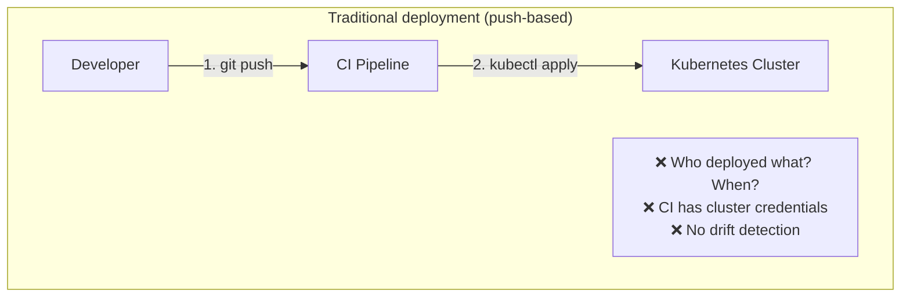

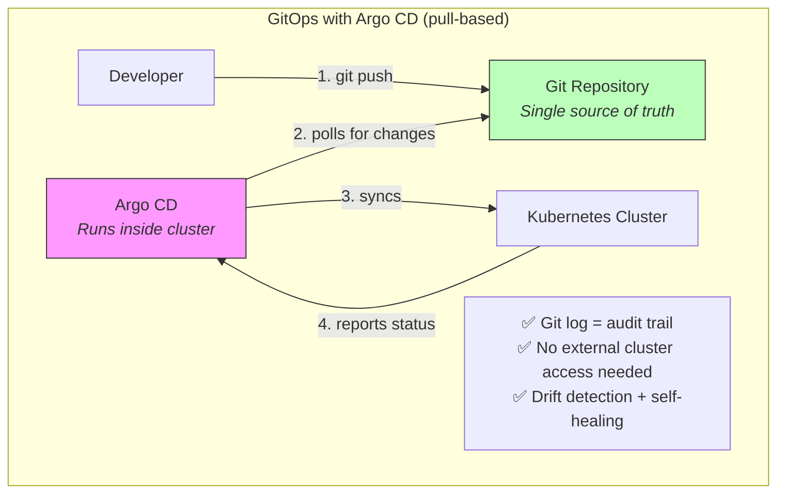

**Why is GitOps better?** Three key advantages:

1. **Audit trail**: every change is a Git commit -- you know who changed what, when, and why
2. **Security**: no one needs `kubectl` access to production -- only Argo CD (running inside the cluster) applies changes
3. **Self-healing**: if someone manually changes the cluster, Argo CD detects the drift and reverts it to match Git

### Step 17: Install Argo CD with Helm

```bash
# Add the Argo Helm repository
helm repo add argo https://argoproj.github.io/argo-helm
helm repo update

# Install Argo CD
helm install argocd argo/argo-cd \
  --create-namespace \
  --namespace argocd \
  --set 'configs.params.server\.insecure=true' \
  --set server.service.type=ClusterIP \
  --wait
```

Wait for all pods to be ready:

```bash
kubectl get pods -n argocd -w
```

Press `Ctrl+C` when all pods show `Running` and `READY` is `1/1`.

### Step 18: Access the Argo CD UI

Expose Argo CD through an Ingress so both the browser and CLI can access it reliably:

```bash
kubectl apply -f - <<'EOF'
apiVersion: networking.k8s.io/v1
kind: Ingress
metadata:
  name: argocd-server
  namespace: argocd
  annotations:
    ingress.kubernetes.io/ssl-redirect: "false"
spec:
  rules:
    - host: argocd.localhost
      http:
        paths:
          - path: /
            pathType: Prefix
            backend:
              service:
                name: argocd-server
                port:
                  number: 80
EOF
```

> **Why an Ingress instead of port-forward?** The `argocd` CLI uses gRPC (HTTP/2), which causes `kubectl port-forward` to crash. An Ingress avoids this problem entirely and is closer to how you would access Argo CD in production.

Get the initial admin password:

```bash
kubectl get secret argocd-initial-admin-secret -n argocd \
  -o jsonpath="{.data.password}" | base64 -d; echo
```

Open [http://argocd.localhost:8080](http://argocd.localhost:8080) in your browser.

- **Username**: `admin`
- **Password**: the output of the command above

> **Note**: `argocd.localhost` resolves to `127.0.0.1` on most systems. If it does not work, add `127.0.0.1 argocd.localhost` to your `/etc/hosts` file.

You should see the Argo CD dashboard. It is empty for now -- we have not configured any applications yet.

### Step 19: Install the Argo CD CLI

```bash
# Using nix
nix profile install 'nixpkgs#argocd'

# Or download directly
# curl -sSL -o argocd https://github.com/argoproj/argo-cd/releases/latest/download/argocd-linux-amd64
# chmod +x argocd && sudo mv argocd /usr/local/bin/
```

Log in:

```bash
argocd login argocd.localhost:8080 --plaintext --grpc-web --insecure --username admin \
  --password "$(kubectl get secret argocd-initial-admin-secret -n argocd -o jsonpath='{.data.password}' | base64 -d)"
```

> **Flags explained**: `--plaintext` disables TLS (we are on localhost), `--grpc-web` uses HTTP/1.1 for gRPC which works through the Traefik Ingress, `--insecure` skips the TLS certificate verification prompt caused by Traefik's self-signed certificate.

______________________________________________________________________

## Part 6: GitOps with Argo CD (40 min)

### The GitOps Workflow

In GitOps, deployments work like this:

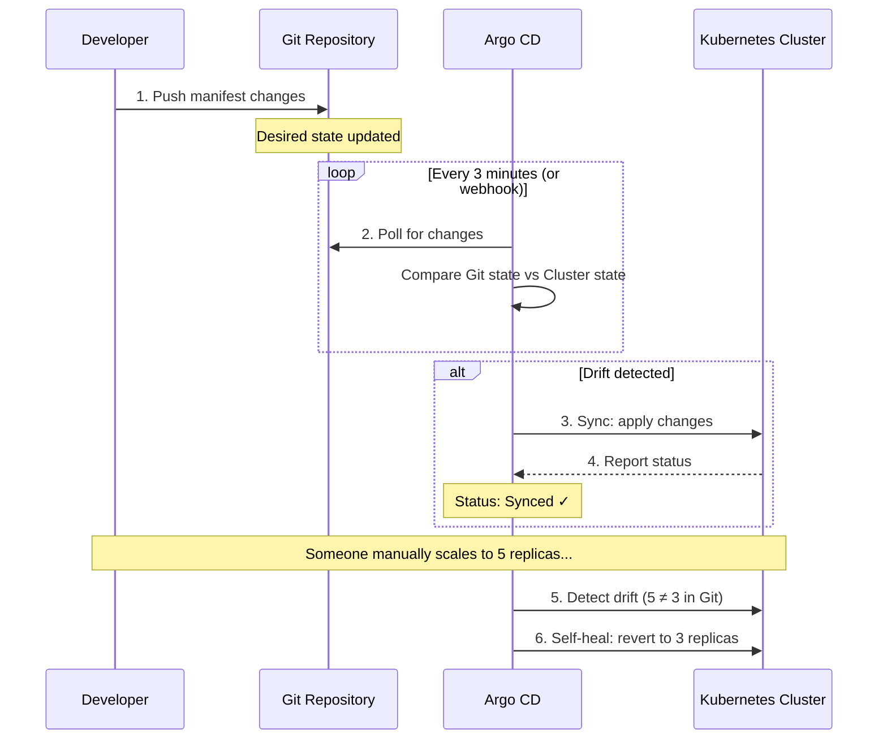

1. You define your desired state in a **Git repository**
2. Argo CD **watches** the repository (polls every 3 minutes by default)
3. When Git changes, Argo CD **syncs** the cluster to match
4. If someone manually changes the cluster, Argo CD **detects the drift** and auto-corrects

No more `kubectl apply` from your laptop. No more "who deployed what and when?" -- Git log is your audit trail.

### Step 20: Create a GitOps repository

Create a new Git repository to hold your Kubernetes manifests. This is separate from your application code -- it is your **deployment configuration** repository.

> **Why a separate repository?** In GitOps, you typically have two repositories:
> - **Application repo**: your source code (Go, Python, Java...). CI builds and pushes container images from this.
> - **GitOps repo**: your Kubernetes manifests. Argo CD watches this and deploys whatever is defined here.
>
> This separation means application developers don't need cluster access, and infrastructure changes go through their own review process.

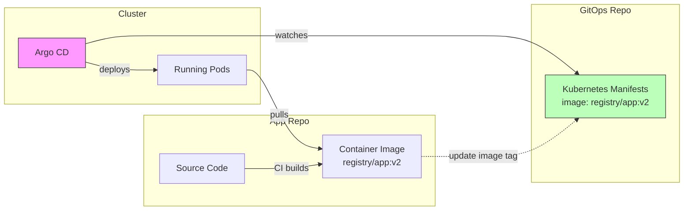

```bash
cd ~
mkdir -p gitops-demo
cd gitops-demo
git init
```

Create the directory structure:

```bash
mkdir -p apps/hello
```

Create `apps/hello/deployment.yaml`:

```yaml
apiVersion: apps/v1
kind: Deployment
metadata:
  name: hello
  labels:
    app: hello
spec:
  replicas: 2
  selector:
    matchLabels:
      app: hello
  template:
    metadata:
      labels:
        app: hello
    spec:
      containers:
        - name: hello
          image: traefik/whoami:v1.10
          args:
            - "--name=GitOps v1"
          ports:
            - containerPort: 80
          resources:
            requests:
              cpu: 50m
              memory: 32Mi
            limits:
              cpu: 100m
              memory: 64Mi
```

Create `apps/hello/service.yaml`:

```yaml
apiVersion: v1
kind: Service
metadata:
  name: hello
spec:
  selector:
    app: hello
  ports:
    - port: 80
      targetPort: 80
  type: ClusterIP
```

Commit and push to GitHub:

```bash
git add .
git commit -m "feat: initial hello deployment"

# Create a repository on GitHub and push
# Replace <your-username> with your GitHub username
gh repo create gitops-demo --public --source=. --push
# Or: git remote add origin git@github.com:<your-username>/gitops-demo.git
#     git push -u origin main
```

> **If you do not have `gh` installed**: create the repository manually on GitHub, add the remote, and push.

### Step 21: Create an Argo CD Application

An Argo CD "Application" is the central concept -- it connects a **Git repository path** to a **Kubernetes namespace**. Think of it as a rule: "whatever YAML is in *this directory* of *this repo*, deploy it to *this namespace*."

```mermaid
graph LR
    subgraph "Argo CD Application"
        SOURCE["Source<br/>repo: github.com/.../gitops-demo<br/>path: apps/hello<br/>branch: main"]
        DEST["Destination<br/>server: local cluster<br/>namespace: gitops"]
        POLICY["Sync Policy<br/>automated + self-heal + auto-prune"]
    end

    SOURCE -->|"reads manifests"| DEST
    POLICY -->|"controls behavior"| DEST

    style SOURCE fill:#bfb,stroke:#333
    style DEST fill:#bbf,stroke:#333
    style POLICY fill:#ff9,stroke:#333
```

```bash
argocd app create hello \
  --plaintext --grpc-web --insecure \
  --repo https://github.com/<your-username>/gitops-demo.git \
  --path apps/hello \
  --dest-server https://kubernetes.default.svc \
  --dest-namespace gitops \
  --sync-policy automated \
  --auto-prune \
  --self-heal \
  --sync-option CreateNamespace=true
```

Replace `<your-username>` with your GitHub username.

> **Note**: all `argocd` CLI commands need `--plaintext --grpc-web --insecure` when using the Ingress setup. You can set these permanently with:
> ```bash
> export ARGOCD_OPTS="--plaintext --grpc-web --insecure"
> ```

Flags explained:

| Flag | Meaning |
|------|---------|
| `--repo` | The Git repository to watch |
| `--path` | The directory within the repo containing manifests |
| `--dest-server` | The Kubernetes cluster (here: the local cluster) |
| `--dest-namespace` | The target namespace |
| `--sync-policy automated` | Automatically sync when Git changes |
| `--auto-prune` | Delete resources that were removed from Git |
| `--self-heal` | Revert manual changes made directly to the cluster |

Alternatively, you can define the Application as YAML. Create `apps/hello-app.yaml` in the gitops-demo repo:

```yaml
apiVersion: argoproj.io/v1alpha1
kind: Application
metadata:
  name: hello
  namespace: argocd
spec:
  project: default
  source:
    repoURL: https://github.com/<your-username>/gitops-demo.git
    targetRevision: main
    path: apps/hello
  destination:
    server: https://kubernetes.default.svc
    namespace: gitops
  syncPolicy:
    automated:
      prune: true
      selfHeal: true
    syncOptions:
      - CreateNamespace=true
```

```bash
kubectl apply -f apps/hello-app.yaml
```

### Step 22: Watch Argo CD sync

```bash
# Check the application status
argocd app get hello

# Watch the sync in real time
argocd app wait hello --sync
```

Open the Argo CD UI at [http://argocd.localhost:8080](http://argocd.localhost:8080). You should see the `hello` application with a green "Synced" status. Click on it to see the resource tree.

Verify the deployment:

```bash
kubectl get all -n gitops
```

### Step 23: Deploy by pushing to Git

This is the GitOps magic. Change the deployment in Git and watch Argo CD deploy it automatically.

```bash
cd ~/gitops-demo
```

Edit `apps/hello/deployment.yaml` -- change the message:

```yaml
          args:
            - "--name=GitOps v2 - Updated via Git push!"
```

Commit and push:

```bash
git add .
git commit -m "feat: update greeting to v2"
git push
```

Watch Argo CD detect and deploy the change:

```bash
# Watch the sync (Argo CD polls every 3 minutes by default, or you can force it)
argocd app sync hello

# Verify the new version
kubectl port-forward svc/hello -n gitops 9091:80 &
curl http://localhost:9091
kill %2  # or whatever job number
```

You should see the updated message.

### Step 24: Test self-healing

Argo CD with `--self-heal` reverts unauthorised changes. Try it:

```bash
# Manually scale the deployment (bypassing Git)
kubectl scale deployment hello -n gitops --replicas=5

# Watch Argo CD revert it back to 2 replicas
kubectl get pods -n gitops -w
```

Within seconds, Argo CD detects the drift and scales back to 2 replicas (as defined in Git). Press `Ctrl+C`.

### Step 25: Deploy a Helm chart with Argo CD

Argo CD can also deploy Helm charts from Git. Create a Helm-based app in your gitops repo:

```bash
cd ~/gitops-demo
mkdir -p apps/nginx-helm
```

Create `apps/nginx-helm/Chart.yaml`:

```yaml
apiVersion: v2
name: nginx-helm
version: 1.0.0
dependencies:
  - name: nginx
    version: "18.3.1"
    repository: https://charts.bitnami.com/bitnami
```

Create `apps/nginx-helm/values.yaml`:

```yaml
nginx:
  service:
    type: ClusterIP
  replicaCount: 1
```

Commit and push:

```bash
git add .
git commit -m "feat: add nginx helm chart"
git push
```

Create the Argo CD application:

```bash
argocd app create nginx-helm \
  --plaintext --grpc-web --insecure \
  --repo https://github.com/<your-username>/gitops-demo.git \
  --path apps/nginx-helm \
  --dest-server https://kubernetes.default.svc \
  --dest-namespace nginx-helm \
  --sync-policy automated \
  --auto-prune \
  --self-heal \
  --sync-option CreateNamespace=true
```

Watch it deploy in the Argo CD UI.

### Step 26: Deploy a Kustomize app with Argo CD

Argo CD natively supports Kustomize -- it detects the `kustomization.yaml` file and applies the overlay automatically.

Add a Kustomize-based app to your gitops repo:

```bash
cd ~/gitops-demo
mkdir -p apps/hello-kustomize/base
mkdir -p apps/hello-kustomize/overlays/dev
```

Create `apps/hello-kustomize/base/deployment.yaml`:

```yaml
apiVersion: apps/v1
kind: Deployment
metadata:
  name: hello-kustomize
  labels:
    app: hello-kustomize
spec:
  replicas: 1
  selector:
    matchLabels:
      app: hello-kustomize
  template:
    metadata:
      labels:
        app: hello-kustomize
    spec:
      containers:
        - name: hello
          image: traefik/whoami:v1.10
          args:
            - "--name=hello-kustomize"
          ports:
            - containerPort: 80
```

Create `apps/hello-kustomize/base/service.yaml`:

```yaml
apiVersion: v1
kind: Service
metadata:
  name: hello-kustomize
spec:
  selector:
    app: hello-kustomize
  ports:
    - port: 80
      targetPort: 80
```

Create `apps/hello-kustomize/base/kustomization.yaml`:

```yaml
apiVersion: kustomize.config.k8s.io/v1beta1
kind: Kustomization
resources:
  - deployment.yaml
  - service.yaml
```

Create `apps/hello-kustomize/overlays/dev/kustomization.yaml`:

```yaml
apiVersion: kustomize.config.k8s.io/v1beta1
kind: Kustomization
resources:
  - ../../base
patches:
  - target:
      kind: Deployment
      name: hello-kustomize
    patch: |-
      - op: replace
        path: /spec/replicas
        value: 2
      - op: replace
        path: /spec/template/spec/containers/0/args
        value: ["--name=hello-kustomize-dev"]
```

Commit and push:

```bash
git add .
git commit -m "feat: add kustomize-based hello app"
git push
```

Create the Argo CD application pointing at the **overlay** directory:

```bash
argocd app create hello-kustomize \
  --plaintext --grpc-web --insecure \
  --repo https://github.com/<your-username>/gitops-demo.git \
  --path apps/hello-kustomize/overlays/dev \
  --dest-server https://kubernetes.default.svc \
  --dest-namespace kustomize-demo \
  --sync-policy automated \
  --auto-prune \
  --self-heal \
  --sync-option CreateNamespace=true
```

Argo CD detects the `kustomization.yaml`, applies the overlay on top of the base, and deploys the result. Check it in the UI -- you should see 2 replicas running.

```bash
kubectl get all -n kustomize-demo
```

> **Key insight**: Argo CD supports raw manifests, Helm charts, **and** Kustomize out of the box. Choose the tool that fits your use case:
> - **Raw manifests**: simple apps, learning
> - **Helm**: third-party charts, heavily templated configs
> - **Kustomize**: environment-specific patches for your own services

### Checkpoint

At this point:

- Argo CD is running and managing deployments
- Pushing to Git triggers automatic deployments
- Manual cluster changes are reverted (self-heal)
- Raw manifests, Helm charts, **and** Kustomize overlays all work with Argo CD

```bash
argocd app list
```

______________________________________________________________________

## Part 7: Local Development with Skaffold (40 min)

### The Inner Loop Problem

In software development, there are two loops:

```mermaid
graph TB
    subgraph "Outer Loop (CI/CD — minutes to hours)"
        OL1[Push code] --> OL2[CI builds & tests]
        OL2 --> OL3[Push image to registry]
        OL3 --> OL4[Update GitOps repo]
        OL4 --> OL5[Argo CD deploys]
        OL5 --> OL6[Production running]
    end

    subgraph "Inner Loop (local dev — seconds)"
        IL1[Edit code] --> IL2[Skaffold detects change]
        IL2 --> IL3[Rebuild container]
        IL3 --> IL4[Redeploy to local cluster]
        IL4 --> IL5[Test locally]
        IL5 --> IL1
    end

    style IL1 fill:#bfb,stroke:#333
    style IL2 fill:#bfb,stroke:#333
    style IL3 fill:#bfb,stroke:#333
    style IL4 fill:#bfb,stroke:#333
    style IL5 fill:#bfb,stroke:#333
```

So far, every change requires: edit code > build image > push > update manifest > wait for sync.
For local development, this is too slow. You want to edit a file and see the change in seconds.

[Skaffold](https://skaffold.dev/) solves this. It watches your source code, rebuilds the container, and redeploys -- all automatically. **The inner loop should feel as fast as saving a file.**

> **Why not just use `docker compose`?** Docker Compose doesn't run Kubernetes. If your production uses Kubernetes, testing locally with Docker Compose means you're testing a different system. Skaffold lets you develop against a real Kubernetes cluster (k3d), so what works locally will work in production.

### Step 26: Install Skaffold

```bash
# Using nix
nix profile install 'nixpkgs#skaffold'

# Or download directly
# curl -Lo skaffold https://storage.googleapis.com/skaffold/releases/latest/skaffold-linux-amd64
# chmod +x skaffold && sudo mv skaffold /usr/local/bin/
```

```bash
skaffold version
```

### Step 27: Create a sample application

Create a new project directory:

```bash
cd ~
mkdir -p skaffold-demo
cd skaffold-demo
```

Create a simple Go application. Create `main.go`:

```go
package main

import (
	"fmt"
	"net/http"
	"os"
)

func handler(w http.ResponseWriter, r *http.Request) {
	hostname, _ := os.Hostname()
	fmt.Fprintf(w, "Hello from Skaffold! Hostname: %s\n", hostname)
}

func main() {
	http.HandleFunc("/", handler)
	fmt.Println("Server starting on :8080...")
	http.ListenAndServe(":8080", nil)
}
```

Create `go.mod`:

```
module skaffold-demo

go 1.22
```

Create a `Dockerfile`:

```dockerfile
FROM golang:1.22 AS builder
WORKDIR /app
COPY go.mod .
COPY main.go .
RUN CGO_ENABLED=0 go build -o server .

FROM scratch
COPY --from=builder /app/server /server
EXPOSE 8080
CMD ["/server"]
```

### Step 28: Create Kubernetes manifests for Skaffold

Create `k8s/deployment.yaml`:

```bash
mkdir -p k8s
```

```yaml
apiVersion: apps/v1
kind: Deployment
metadata:
  name: skaffold-demo
spec:
  replicas: 1
  selector:
    matchLabels:
      app: skaffold-demo
  template:
    metadata:
      labels:
        app: skaffold-demo
    spec:
      containers:
        - name: skaffold-demo
          image: skaffold-demo
          ports:
            - containerPort: 8080
          resources:
            requests:
              cpu: 50m
              memory: 32Mi
            limits:
              cpu: 100m
              memory: 64Mi
```

Create `k8s/service.yaml`:

```yaml
apiVersion: v1
kind: Service
metadata:
  name: skaffold-demo
spec:
  selector:
    app: skaffold-demo
  ports:
    - port: 80
      targetPort: 8080
  type: ClusterIP
```

### Step 29: Configure Skaffold

Create `skaffold.yaml`:

```yaml
apiVersion: skaffold/v4beta11
kind: Config
metadata:
  name: skaffold-demo
build:
  artifacts:
    - image: skaffold-demo
      docker:
        dockerfile: Dockerfile
  local:
    push: false
manifests:
  rawYaml:
    - k8s/*.yaml
deploy:
  kubectl: {}
portForward:
  - resourceType: service
    resourceName: skaffold-demo
    port: 80
    localPort: 9092
```

> **No registry needed.** Skaffold automatically detects k3d and uses `k3d image import` to load images directly into the cluster nodes. This avoids the complexity of setting up a local container registry.

### Step 30: Run Skaffold in dev mode

```bash
skaffold dev
```

Skaffold will:

1. Build the Docker image locally
2. Import it directly into the k3d cluster nodes (no registry needed!)
3. Deploy the manifests to the cluster
4. Set up port-forwarding
5. **Watch for file changes** and re-do everything automatically

```mermaid
sequenceDiagram
    participant You as Your Editor
    participant Skaffold as Skaffold (watching)
    participant Docker as Docker (build)
    participant k3d as k3d Cluster

    Note over Skaffold: skaffold dev starts

    Skaffold->>Docker: 1. Build image from Dockerfile
    Docker-->>Skaffold: Image built: skaffold-demo:abc123
    Skaffold->>k3d: 2. k3d image import (no push!)
    Skaffold->>k3d: 3. kubectl apply k8s/*.yaml
    Skaffold->>Skaffold: 4. Port-forward localhost:9092 → service:80
    Note over Skaffold: Watching for file changes...

    You->>You: Edit main.go, save

    Skaffold->>Skaffold: 5. Detects file change!
    Skaffold->>Docker: 6. Rebuild image
    Docker-->>Skaffold: New image: skaffold-demo:def456
    Skaffold->>k3d: 7. Import + redeploy
    Note over k3d: New version running in seconds
```

In another terminal:

```bash
curl http://localhost:9092
```

You should see `Hello from Skaffold!`.

### Step 31: Experience the live reload

Edit `main.go` -- change the greeting:

```go
fmt.Fprintf(w, "Hello from Skaffold -- LIVE UPDATED! Hostname: %s\n", hostname)
```

Save the file. Watch the Skaffold terminal -- it detects the change, rebuilds, and redeploys. After a few seconds:

```bash
curl http://localhost:9092
```

You should see the updated message. **This is the inner loop.** Edit, save, see results in seconds.

Press `Ctrl+C` in the Skaffold terminal to stop. Skaffold cleans up all deployed resources.

### Step 32: Combine Skaffold with Argo CD (bonus)

For a complete workflow, use Skaffold for **local development** and Argo CD for **deployment to shared environments**:

```mermaid
graph TB
    subgraph "Local Development (Inner Loop)"
        DEV[Developer] -->|"edits code"| CODE[Source Code]
        CODE -->|"watches"| SKAFFOLD[Skaffold]
        SKAFFOLD -->|"build + deploy"| LOCAL[k3d Local Cluster]
        LOCAL -->|"test"| DEV
    end

    subgraph "Production Deployment (Outer Loop)"
        DEV -->|"git push"| APPREPO[App Repository]
        APPREPO -->|"triggers"| CI[CI Pipeline]
        CI -->|"build & push"| REGISTRY[Container Registry]
        CI -->|"update image tag"| GITOPSREPO[GitOps Repository]
        GITOPSREPO -->|"watched by"| ARGOCD[Argo CD]
        ARGOCD -->|"sync"| PROD[Production Cluster]
    end

    style SKAFFOLD fill:#bfb,stroke:#333
    style ARGOCD fill:#f9f,stroke:#333
    style LOCAL fill:#bbf,stroke:#333
    style PROD fill:#fbb,stroke:#333
```

1. Develop locally with `skaffold dev` (fast inner loop)
2. When ready, push code to the app repo (CI builds and pushes the image)
3. Update the image tag in the gitops repo
4. Argo CD deploys to staging/production

This separation means developers get fast feedback locally while production deployments go through a controlled GitOps pipeline.

______________________________________________________________________

## Exercises

### Exercise 1: Add resource limits and health checks

Add `livenessProbe` and `readinessProbe` to your Deployment. What happens when the health check fails? Experiment with different `initialDelaySeconds` and `failureThreshold` values.

### Exercise 2: Rolling updates

Change the container image version in your Deployment and observe how Kubernetes performs a rolling update. Use `kubectl rollout status` and `kubectl rollout history` to monitor it.

### Exercise 3: Argo CD App of Apps

Create an "App of Apps" pattern: a single Argo CD Application that manages other Applications. This is how real teams manage dozens of services.

### Exercise 4: Skaffold with Helm

Modify your Skaffold configuration to deploy using Helm instead of raw manifests. Use the `deploy.helm` section in `skaffold.yaml`.

### Exercise 5: Multi-environment GitOps

Extend your Kustomize setup from Part 4 and Part 6 by adding a `production` overlay with stricter resource limits and more replicas. Deploy `dev`, `staging`, and `production` as three separate Argo CD Applications from the same gitops repo. Verify that each environment has different configuration while sharing the same base.

______________________________________________________________________

## Troubleshooting

### Common issues

| Problem | Solution |
|---------|----------|
| `k3d cluster create` fails | Ensure Docker is running: `docker ps` |
| `k3d cluster create` hangs | Another cluster may be using the same ports. Run `k3d cluster list` and delete stale clusters. |
| `kubectl` cannot connect | Run `k3d kubeconfig merge my-cluster --kubeconfig-switch-context` |
| Pods stuck in `Pending` | Check node resources: `kubectl describe pod <name> -n <ns>` |
| Pods stuck in `ImagePullBackOff` | Check image name/tag. For local images use k3d registry. |
| Argo CD UI not loading | Check Ingress: `kubectl get ingress -n argocd`. Ensure `argocd.localhost` resolves to 127.0.0.1. |
| `argocd` CLI connection refused | Set `export ARGOCD_OPTS="--plaintext --grpc-web --insecure"` and use `argocd.localhost:8080` |
| Skaffold: image can't be pulled | Ensure `push: false` in skaffold.yaml. Skaffold auto-imports to k3d. |
| WSL: Docker not found | Enable WSL integration in Docker Desktop settings |
| Port already in use | Find and kill: `lsof -i :8080` or change the port |

### Useful debug commands

```bash
# Describe a resource (shows events and conditions)
kubectl describe pod <pod-name> -n <namespace>

# View container logs
kubectl logs <pod-name> -n <namespace>

# Follow logs in real time
kubectl logs -f <pod-name> -n <namespace>

# Open a shell in a running container
kubectl exec -it <pod-name> -n <namespace> -- /bin/sh

# View all events in a namespace
kubectl get events -n <namespace> --sort-by='.lastTimestamp'

# Check Argo CD application details
argocd app get <app-name> --show-operation
```

______________________________________________________________________

## Grading Criteria

| Criterion | Weight |
|-----------|--------|
| Nix flake provides all tools via `nix develop` | High |
| k3d cluster is **running** with multiple nodes | High |
| Raw manifests deploy correctly (Deployment + Service + Ingress) | High |
| Helm chart installs and can be customised with values | High |
| Kustomize base/overlay deploys multiple environments | High |
| Argo CD is installed and accessible | High |
| At least one app is deployed via **GitOps** (push to Git triggers deploy) | High |
| Kustomize app deployed via **Argo CD** | Medium |
| **Self-healing** is demonstrated (manual change is reverted) | Medium |
| Skaffold dev mode works with **live reload** | Medium |
| k9s used to explore cluster state | Medium |
| Clean namespace separation between environments | Medium |
| Health checks and resource limits are configured | Medium |
| **App of Apps** or multi-environment GitOps | Bonus |
| Skaffold + Helm integration | Bonus |

______________________________________________________________________

## Summary

| What you learned | Key takeaway |
|------------------|-------------|
| Nix dev environment | All tools declared in a flake, reproducible across machines |
| k3d cluster management | Full Kubernetes in Docker, starts in seconds, works on WSL |
| Kubernetes fundamentals | Pods, Deployments, Services, Ingress, ConfigMaps, Namespaces |
| k9s cluster exploration | Terminal UI for navigating and debugging Kubernetes in real time |
| Raw manifest deployment | `kubectl apply` for direct, imperative control |
| Helm charts | Templated, versioned, reusable Kubernetes packages |
| Kustomize overlays | Environment-specific config without templates, built into kubectl |
| Argo CD | Declarative GitOps -- Git as the single source of truth |
| GitOps workflow | Push to Git = deploy to cluster, with self-healing and audit trail |
| Skaffold | Fast inner-loop development with live code reload in the cluster |

### The Big Picture

This TP ties into the rest of the course:

```mermaid
graph LR
    TP1["TP 1<br/>Nix<br/><i>Reproducible builds</i>"] --> TP2["TP 2<br/>Containers<br/><i>Package apps</i>"]
    TP2 --> TP3["TP 3<br/>Nix + Containers<br/><i>Minimal images</i>"]
    TP3 --> TP4["TP 4<br/>CI Pipeline<br/><i>Automated testing</i>"]
    TP4 --> TP5["TP 5<br/>Kubernetes + GitOps<br/><i>Automated deployment</i>"]

    style TP5 fill:#bfb,stroke:#333,stroke-width:3px
```

The full chain is now: **build reproducibly > package in a minimal container > deploy via GitOps > develop with fast feedback**. This is how modern software delivery works.

### Key Commands Reference

| Command | Purpose |
|---------|---------|
| `nix develop` | Enter the Nix shell with all workshop tools |
| `k3d cluster create` | Create a local Kubernetes cluster |
| `k3d cluster list` | List clusters |
| `kubectl apply -f file.yaml` | Deploy a manifest |
| `kubectl apply -k dir/` | Deploy a Kustomize directory |
| `kubectl get pods -n <ns>` | List pods in a namespace |
| `kubectl logs <pod>` | View pod logs |
| `kubectl port-forward` | Forward a port from cluster to localhost |
| `k9s` | Launch the terminal cluster UI |
| `helm install <name> <chart>` | Install a Helm release |
| `helm upgrade --install` | Install or upgrade a Helm release |
| `helm list` | List installed releases |
| `kustomize build dir/` | Render a Kustomize overlay to YAML |
| `argocd app create` | Create an Argo CD application |
| `argocd app sync` | Force-sync an application |
| `argocd app list` | List all applications |
| `skaffold dev` | Start live development mode |
| `skaffold run` | Build and deploy once |