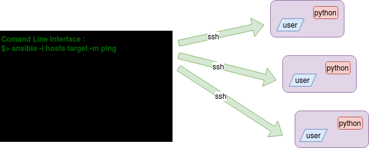

# Présentation Ansible

* [Contexte](#contexte)
* [Usages](#usages)
* [Principe de fonctionnement](#principe-de-fonctionnement)
* [Vocabulaire](#vocabulaire)
* [Installation](#installation)
* [Utilisation d'ansible](#utilisation-dansible)
  * [Les commandes](#les-commandes)
  * [L'inventaire](#linventaire)
  * [Les Commandes ad-Hoc](#les-commandes-ad-hoc)
    * [Les *modules*](#les-modules)
  * [Configuration ansible](#configuration-ansible)
  * [Les playbooks](#les-playbooks)
  * [Les roles](#les-roles)
  * [Les collections](#les-collections)
* [Conclusion](#conclusion)

## Contexte

La mise en oeuvre d'une application en production est effectuée par des opérations récurrentes sur des **objets de configuration** :

* paramétrage des composants du système (compte, groupe, système de fichier)
* gestion des dépôts logiciels
* installation de packages logiciels
* gestion et modification de fichiers de configuration

Ansible est l'outil de gestion et déploiement de configuration "à la mode" permettant d'automatiser ces actions sur les système Linux.

### Usages

Ansible est l'outil idéal pour :

* Automatiser le déploiement d'un environement de test/lab dans un projet de dev
* Automatiser des tâches récurrentes sur tout un parc (gestion des utilisateurs, gestion d'inventaire, audit de sécurité, instanciation d'un nouveau host etc...)
* Packager une brique d'infrastucture pour simplifier son intégration et son exploitation.
* Gérer la configuration d'une platforme de service.

## Principe de fonctionnement

* Ansible est un framework de gestion des configuration
* Il est codé en python
* Il réalise des opérations de configuration sur des hosts distants
* Au travers d'une connexion `ssh` vers un compte utilisateur (avec authentification par clef ssh de préférence)
* En utilisant l'interpréteur `python` découvert sur les hosts distants
* Et `sudo` pour l'élévation de privilège



## Environnement de tests

Depuis le dossier tp-ansible de ce dépôt git, l'outil vagrant associé au Vagrantfile permettent de déployer :

* 3 VMs : un master sous debian buster et deux slaves sous debian buster et centos7.
* un compte cfg-master sur les 3 hosts avec
  * une relation d'approbation ssh depuis le master vers les slave
  * des droits sudo root complet

les exercices de ce cours s'appuient sur cet environnement :

On lancera les commande ansible sur le host master qui configurera les deux slaves.

## Vocabulaire

* *Un node* : Une cible identifiée pour être configuée : un host.
* *Inventaire* : Une liste des hosts managés
  * rassemblés dans des groupes
  * pour lesquels on peut définir des variables
* *Module* Ansible : Un "outil" unitaire de configuration.
  * Il permettant de réaliser certaines actions, de même type ou portant sur les mêmes objets de configuration : utilisateur, packet, fichier, etc...
* *Playbook* : Une "recette" de configuration
  * que configure-t-on
  * comment
  * sur quel *hosts*
* *Rôles* : Une unité de configuration cohérente
  * Une unité de code ansible offrant la gestion d'un ensemble cohérent d'éléments de configuration
  * Une bonne pratique de codage consiste à coder des rôles autonomes et **réutilisables**
* *Collection* : un package ansible contenant playbooks, rôles, modules et même des plugins ansible.

## Installation

Il existe des packages officiels pour la plupart des distributions GNU/Linux. Cependant ces packages installent une version système pour tous les comptes utilisateur et maintenue via root.

Je préfère ici avoir une version "user" indépendante de la vesrion système me permettant ainsi de gérer sa version indépendament des autres comptes utilisateur et environnement.

L'installation se fait avec `pip`, le gestionnaire de paquets Python, après avoir installé `python` et `python-pip`.

```bash
sudo [apt|yum] install python3 python3-pip
```

Sous l'identité du compte exécutant ansible, on pourra utiliser `pip3` pour installer Ansible.

Sous centos7 on résoudra la dépendance cryptography avec la version 3.3.2 avant l'installation d'ansible afin d'éviter l'incompatibilité pip de la version 3.4 :

```bash
$ pip3 install --user cryptography==3.3.2
.../...
```

```bash
$ pip3 install --user ansible
.../...
```

On se réfèrera toujours à la [documentation d'installation officielle](https://docs.ansible.com/ansible/latest/installation_guide/intro_installation.html#basics-what-will-be-installed)

### Exercice : installez Ansible

Sur le host master de l'environnement de test installez ansible pour le compte utilisateur cfg-master.

Sinon avec vagrant depuis le dossier tp-vagrant:

```bash
vagrant provision --provision-with installansible
```

## Utilisation d'ansible

### Les commandes

* `ansible-inventory` permet de tester ou traduire un inventaire ansible
`ansible-inventory -i hosts --list -y`
* `ansible` : appel d'ansible pour effectuer une action simple : une commande `ad-Hoc` l'appel d'un module ansible.
* `ansible-config` Permet de consulter la configuration ansible courante.
* `ansible-playbook` Permet d'éxécuter un playbook.
* `ansible-collection` Permet de gérer une ou des collections ansible.

### L'inventaire

Ansible se base sur un *inventaire*, une liste de *hosts* appartenant à un ou plusieurs groupe(s). Les actions seront ensuite effectuées sur un *host* ou un groupe de *hosts* de cet inventaire.

Au minima nous aurons un fichier INI contenant des groupes et des listes de host.

Le format INI définit des groupes et les hosts qui le constitue.

Exemple :

```ini
[all:children]
slaves
masters

[masters]
master

[slaves]
slave1
slave2
```

Ici le groupe all est constitué des deux sous groupes masters et slaves.

Ansible utilisera le nom slave1 pour se connecter en ssh, il est donc indispensable que ce nom soit résolu en une adresse IP.

On trouve souvant des inventaires uniquement constitués d'adresses ip.

> Passez donc voir à l'ocasion [la doc officielle concernant les *inventaires*](https://docs.ansible.com/ansible/latest/user_guide/intro_inventory.html). Mais nous reviendrons sur ce sujet plus en détail.

#### Exercice : créer un fichier d'inventaire

Depuis le dossier tp-ansible toujours, créez un fichier d'inventaire et placez le dans le dossier `src` que vous resynchronisez sur le master avec vagrant :

```bash
vagrant rsync
```

### Les Commandes ad-Hoc

**Avant d'utiliser des *playbooks* Ansible**, nous allons utiliser la commande `ansible` pour exécuter de simples opérations distantes sur vos *hosts*. Nous allons effectuer une seule action sur ces *hosts* :

Executez tour à tour cette commande depuis le host master et le dossier /opt/src

**Exemple :**

```bash
[cfg-master@master src]$ ansible -i hosts all -a "echo hello" -u cfg-master
slave2 | CHANGED | rc=0 >>
hello
slave1 | CHANGED | rc=0 >>
hello
master | CHANGED | rc=0 >>
hello
```

Options `ansible` utilisées :

* `-i` (*inventory*) pour préciser le dossier d'*inventaire*
* `-m` (*module*) le module utilisé, c'est le module shell par défaut s'il n'est pas précisé
* `-a` (*arguments*) les arguments à passer au module, ici c'est la commande à passer
* `-u` (*user*) pour l'utilisateur à utiliser sur le *host* distant (si ce n'est pas le vôtre)

En ajoutant l'option `--become` vous faites l'action sous l'identité `root` :

```bash
[cfg-master@master src]$ ansible -i hosts all -a "id" -u cfg-master --become
slave2 | CHANGED | rc=0 >>
uid=0(root) gid=0(root) groups=0(root)
master | CHANGED | rc=0 >>
uid=0(root) gid=0(root) groups=0(root) context=unconfined_u:unconfined_r:unconfined_t:s0-s0:c0.c1023
slave1 | CHANGED | rc=0 >>
uid=0(root) gid=0(root) groups=0(root) context=unconfined_u:unconfined_r:unconfined_t:s0-s0:c0.c1023
```

> **En détail** :
>  
> * Avec votre compte et votre clef privée SSH locaux
> * vous vous connectez **avec le compte `cfg-master`** sur les hosts de l'inventaire
> * **ce compte devient root** (avec sudo)
> * il utilise le module `shell`
> * pour passer la commande `id`

#### Les *modules*

Avec Ansible vous utilisez en fait des *modules*. Ceux-ci savent effectuer des actions sur une **classe d'objet** gérés par Ansible.

Les paramètres transmis au module permettent de définir l'état attendu sur l'objet géré.

Le module par défaut est le module command ; en argument on transmettra la commande à passer.

**Exemples :**

**Délivrer un fichier avec le module `copy` :**

```bash
[cfg-master@master src]$ ansible -i hosts all -m copy -a "src=./hosts dest=/tmp/hosts"
.../...
```

> Attention : tout les arguments du module sont transmis via une seule chaine de caractères

**Gérer les *inodes* (les attributs de fichier) avec le module `file` :**

```bash
$ ansible -i hosts all -m file -a "dest=/tmp/hosts mode=600 owner=vagrant state=file" --become
.../...
```

> Ici on modifie le owner du fichier /tmp/hosts

**Gérer les installations de paquets RPM avec le module um` :**

```bash
$ ansible -i hosts slave1 -m yum -a "name=epel-release state=present" --become
.../...
```

> à noter :
> Les retour verbeux des commandes ansible et notament dans ceux-ci le champs `changed` qui prend la valeur True ou False. Celle-ci détermine si une opération a été effectuée sur le host distant ou non.
> Les nombreux modules d'Ansible sont documentés ici : <https://docs.ansible.com/ansible/latest/modules/list_of_all_modules.html>.

#### Exercice : recherche de processus

Avec une simple commande Ad-hoc depuis le host master, avec le compte cfg-master et depuis le dossier /opt/src :

recherchez les processus /bin/auditd sur tous les hosts de l'environement de test.

### Configuration ansible

Jusque ici, nous avons utiliser ansible avec sa configuration par défaut. Par ailleurs certains paramètres doivent être passés en argument des commandes ansible car il n'y a pas de valeur par défaut. Nous allons voir ici comment configurer le framework ansible.

Ansible va rechercher sa configuration :

* globale sur le système : /etc/ansible/ansible.cfg
* pour le compte courant : ~/.ansible.cfg
* pour le répertoire courant : ./ansible.cfg
* dans les variables d'environement ANSIBLE_* (si la variable ANSIBLE_CONFIG est définie.)

La commande `ansible-config dump` permet de visualiser la configuration courante via les valeurs des variables d'environnement.

#### Les fichiers de configuration

Il est en général au format INI : on notera ici quelques sections et paramètres :

* [defaults]
  * il est possible de forcer l'utilisation du fichier hosts du dossier courant comme inventaire, cela nous évite de le préciser sur la ligne de commande avec l'arument `-i`
  `inventory = hosts`
  * de même il est possible de fixer l'utilisateur avec lequel on se connecte sur les hosts distants et éviter alors l'argument `-u`
  `remote_user = cfg-master`
  * déterminer un port de connexion ssh spécifique (le port 22 est utilisé par défaut mais on peut en préciser un autre)
  `remote_port = 2222`
  * ne pas vérifier les host key ssh (cela eéite d'avoir à les ajouter pour chaque nouveau host)
  `host_key_checking = False`
  * découvrir automatiquement python3 plutôt que python2 `interpreter_python = auto`
* [privilege_escalation]
  * méthode pour récupérer les droits d'admin
  `become_method=sudo`
  `become_user=root`
  `become_ask_pass=False`
* [ssh_connection]
  * Arguements pour toutes les commandes ssh :
  `ssh_args = -C -o ControlMaster=auto -o ControlPersist=60s`
* [persistent_connection]
* [accelerate]

#### Exercice : configuration locale

Déployez un fichier ansible.cfg à la racine du dossier `src` :

* Précisant la position du fichier d'inventaire créé plus haut
* Utilisant le compte remote cfg-master
* Désactivant les messages de warning dans la section defaults :
  `deprecation_warnings=False`

Synchronisez le sur le host master et testez avec une commande ad-hoc sans l'option `-i`

### Les playbooks

Les playbook ansible permettent de décrire une recette de configuration pour plusieurs hosts cibles en listant les tâches de configuration avec leurs paramètres, la suite de tâches à effectuer ou les **roles** à appliquer.

Un déploiement de configuration est effectué par le jeu d'un playbook via le passage d'une commande `ansible-playbook`

la commande :

```bash
$ ansible-playbook -i ./hosts playbook.yml -u cfg-master
.../...
```

### Les roles

Un rôle est un ensemble de fichiers ordonnés, contenant du code ansible et permettant de déployer ou de gérer un ensemble d'éléments de configuration cohérents entre eux.

Exemple :

* le rôle gérant le déploiement d'une base de données mariadb 10.4 sur un host centos7 ou debian 10 déploie les packages, modifie quelques fichiers de configuration, démarre le moteur de base de données, créé un ou plusieurs comptes et la base de données.
* le rôle netbox déploie ou met à jour l'application netbox.

Nous verrons cela dans le détail un peu plus loin.

### Les collections

Une collection ansible est un package ansible pouvant contenir des playbooks, des rôles, des modules, et même des plugins ansible.

Beaucoup de rôles réutilisables et déjà développés sont disponibles sur Ansible Galaxy, il est donc possible d'en télécharger.

Ansible Galaxy télécharge et dépose les *rôles* dans `$HOME/.ansible/roles` au niveau utilisateur.

La commande `ansible-playbook` recherchera les *rôles* dans les dossiers suivants :

* dans `$HOME/.ansible/roles`
* Dans `/usr/share/ansible/roles` au niveau partage Ansible sur le système
* Dans `/etc/ansible/roles` pour un serveur de configuration Ansible en ligne de commande
* Et enfin dans le dossier `roles` situé à coté du *playbook*.

#### Utilisation de ansible galaxy

Exemple d'utilisation :

```bash
$ ansible-galaxy --help
Usage: ansible-galaxy [delete|import|info|init|install|list|login|remove|search|setup] [--help] [options] ...

Perform various Role related operations.

Options:
  -h, --help            show this help message and exit
  -c, --ignore-certs    Ignore SSL certificate validation errors.
  -s API_SERVER, --server=API_SERVER
                        The API server destination
  -v, --verbose         verbose mode (-vvv for more, -vvvv to enable
                        connection debugging)
  --version             show program's version number, config file location,
                        configured module search path, module location,
                        executable location and exit
```

Recherche de rôle :

```bash
$ ansible-galaxy search --galaxy-tags powerdns

Found 10 roles matching your search:

 Name                            Description
 ----                            -----------
 alainvanhoof.alpine_powerdns    PowerDNS for Alpine Linux
 hspaans.pdns-ansible            Install and configure the PowerDNS Authoritative DNS Server
 opsta.pdns_admin                Ansible role to install PowerDNS Admin
 pari-.pdns-recursor             An Ansible role which installs and configures PowerDNS recursor
 PowerDNS.pdns                   Install and configure the PowerDNS Authoritative DNS Server
 PowerDNS.pdns_recursor          Install and configure the PowerDNS Recursor
 sparknsh.pdns                   Install and configure the PowerDNS Authoritative DNS Server
 stuvusIT.dnsdist                Install and configure a dnsdist server
 stuvusIT.pdns-authoritative     Install and configure an authoritative PowerDNS server
 stuvusIT.pdns-authoritative-api Configure PowerDNS zones via the HTTP API
```

Installation d'une collection

```bash
[cfg-master@master ~]$ ansible-galaxy collection install netbox.netbox
Starting galaxy collection install process
Process install dependency map
Starting collection install process
Downloading https://galaxy.ansible.com/download/netbox-netbox-3.1.2.tar.gz to /home/cfg-master/.ansible/tmp/ansible-local-95757dk4f2ji/tmpc6izpyla/netbox-netbox-3.1.2-_ab_g_hw
Installing 'netbox.netbox:3.1.2' to '/home/cfg-master/.ansible/collections/ansible_collections/netbox/netbox'
netbox.netbox:3.1.2 was installed successfully
```

vous disposerez alors :

* des modules ansible permettant de gérer le contenu de l'application netbox (un ipam et dcim).
* d'un plugin ansible permettant d'utiliser cette même application comme inventaire dynamique.

## Conclusion

Nous avons ici géré un environement d'exécution d'ansible, il est constitué :

* Des exécutable ansible disponibles pour un compte
* D'un inventaire ansible (une liste de hosts)
* D'une configuration ansible
* D'une clef privé ssh utilisable localement
* de la clef publique permettant de se connecter sur les hosts distant à manager
* de collection ansible offrants:
  * module supplémentaires
  * rôles
  * playbooks
