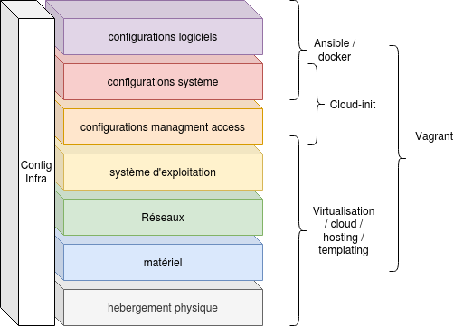

# Présentation de la gestion des configuration

* [Contexte](#contexte)
* [Enjeux](#enjeux)
* [Conceptes et definitions](./definitions.md)
* [Les niveaux de configuration](#les-niveaux-de-configuration)
* [Les principes de déploiement](#les-principes-de-déploiement)
  * [Hébergement physique](#hébergement-physique)
  * [Configuration matériel](#configuration-matériel)
  * [Configuration réseaux](#configuration-réseaux)
  * [Système d'exploitation](#système-dexploitation)
    * [Environement physique](#environement-physique)
    * [Environnement virtuel](#environnement-virtuel)
  * [Configuration de l'accès de management](#configuration-de-laccès-de-management)
  * [Configuration système](#configuration-système)
  * [Configuration logiciel](#configuration-logiciel)
* [Limites de la gestion des configuration](#limites-de-la-gestion-des-configuration)
  * [Les platformes immuables](#les-platformes-immuables)

## Contexte

Les infrastructures informatiques explosent (nombre de hosts / vm / services) et avec elles leur `entropie` respective.
Dans ce contexte en forte evolution, il convient d'appliquer les bonnes pratiques permettant de maitriser à la fois son infrastructure, sa dette technique mais aussi les coûts de gestion de celles-ci.

## Enjeux

* La maitrise du système d'information en terme de risque et de coût de la main d'oeuvre allouée à sa maintenance.
  * La réduction des actions manuelles et des erreurs humaines
  * La fiabilisation des déploiements au travers de leur automatisation
  * Un meilleur suivi de la version globale du système d'information

## Conceptes et [definitions](definitions.md)

* Plateforme de service
* Les configurations
* Le versionning des configuration
* Le contrôle de conformité des configurations
* La révocation de configuration
* L'idempotence
* La gestion des configurations

> Discussion : Comment découper sont infrastucture en platformes de services ?

## Les niveaux de configuration

__Du bas vers le haut :__

* L'hébergement physique fait partie de la configuration : le datacenter, le rack, la position. ou plus simplement le cluster ou la solution de virtualisation utilisée pour héberger la VM.
* La configueration matériel, celle que nous commandons à notre fournisseur de serveur ou la configuration de la VM sur l'outil de virtualisation.
  * cpu (modele et nombre)
  * ram (idem)
  * controleurs disque
    * configuration raid
    * les disques (modèle, taille et nombre)
  * contrôleur réseaux
    * les interface (modèle et nombre)
* La confiruration réseaux niveau 2
  * les liens physique
  * le switching (bonding/lacp/etherchannel/lan/vlan)
* Le choix du système d'exploitation
  * sa version
  * la configuration initiale (options d'installation)
* La configuration de l'accès de managemenet
  Elle à sont importance car c'est le point d'entrée pour suite de la chaine de configuration
* La configuration système
  * le stockage et les filesysteme
  * la gestion du système
    * Sauvegardes
    * Monitoring
    * Sécurité système
    * Les standard locaux
* La configuration Applicatives
  * Déploploiement des applications socle et brique logiciel (nginx/mysql/docker)
  * Déploiement des applicatifs (code/image docker)
  * Gestion de la donnée métier (localisation, sauvegarde et restoration des donnée applicatives)

__En transversal :__

Configuration sur les plateforme d'infrastructure (règle firewall, politique de sauvegarde, monitoring, enregistrement dns etc...)

## Les principes de déploiement

### Hébergement physique

C'est de la logistique et de la manutention!

* Reception de commandes matériel
* Assemblage
* Rackage et connexion réseaux (management board)
* Référencement (id, rack, position, lien electrique et réseaux)

Ce processus est manuelle mais il doit être outilé notament avec un outil du type DCAM (Data Center Asset Managment)

> Dans certaines organisation, le serveur passe par une baie de déploiement pour la gestion des déploiements système et de la configuration minimale réseaux avant d'être racker sur sa position cible.

### Configuration matériel

Cela n'est que de la spécification :

* de commande pour du matériel physique
* de vm pour de l'hébergement virtuel

> Attention : pour les serveurs physique il conviens de bien :
>  
> * verifier que la solution commandé répond bien au attente (problème de controleur disque par défaut trés peu performant et problème de connectique relativement fréquent)
> * valider tout ce qui est reçu suite à la commande, il peu y avoir des surprises ...

### Configuration réseaux

La partie liens physique est en générale géré avec l'hébergement physique.

La configuration du switching n'est pas simple à gérer, elle implique le physique et est définie en quelques ligne de conf sur la configuration globale des switchs.

Avec l'avènement des solutions de virtualisation les SDN (Software Defined Network) se développe de plus en plus et permet alors une gestion des configuration plus automatisé ou just plus maitrisé.

### Système d'exploitation

#### Environement physique

l'automatisation du déploiement du système d'exploitation peu être effectué via un boot réseau et les systèmes d'installation autoimatique des système :

* CentOS/RHEL/Ubuntu : kickstart
  * [doc CentOS](https://docs.centos.org/en-US/centos/install-guide/Kickstart2/),
  * [doc Ubuntu](https://doc.ubuntu-fr.org/kickstart)

* Debian/Ubuntu : preseed.cfg
  * [doc Debian (fr)](https://d-i.debian.org/doc/installation-guide/fr.amd64/apb.html)
  * [doc ubuntu (en)](https://help.ubuntu.com/lts/installation-guide/amd64/apb.html)
  
* Windows : le configuration manager [le boot réseaux](https://docs.microsoft.com/fr-fr/mem/configmgr/osd/deploy-use/use-pxe-to-deploy-windows-over-the-network)

> Cette étape peut-être automatisé (si le nombre d'installation physique le necessite) avec une platforme de service offrant un boot pxe d'image d'instalation et des configurations kickstart/preceed.

#### Environnement virtuel

L'utilisation de template de vm est trés largement répendu, trés simple et efficace. elle dois cependant prendre en compte la configuration réseaux minimale.

### Configuration de l'accès de management

En sortie de l'étape précedente nous avons un système installé avec une configuration minimale, le système installé dispose d'un accès réseaux, configuré en général au travers de DHCP.

Dans un environement de production statique chaque host dispose bien d'une configuration réseaux fixée. Le passage automatique de la configuration DHCP à la configuration statique est asser sensible dans la mesure ou l'"on change la branche sur laquelle nous somme assis".

Cette tache reste courament manuelle.

### Configuration système

Suivant les besoin de notre organisation et la fréquence des déploiements plusieur outils peuvent être utilisé afin de déployer la configuration système standard attendu.

* une check liste d'action manuele
* un ou des script d'initialisation de la configuration
* un outil de gestion des configuration (ansible saltstac puppet chef cfengine etc...)

Dans la mesure ou le système vivra pendant plusieurs mois et annèes. Dans les contextes actuelle ou la sécurité est une problématique de plus en plus importante. Cette configuration sera amené a évolué et devra être régulièrement controlée (conformité).

un outil de gestion des configuration est donc une option à ne surtout pas écarté sur ce point.

### Configuration logiciel

Avec l'avènement des outil et méthode agile. De plus en plus de solution de gestion de la configuration logiciel sont directement intégré dans les dévloppements (avec les container applicatifs). (c'est pour cela que j'ai décider de distinguer la configuration système de la configuration logiciel dans ce cous)

Les solution de gestion des configuration logiciel sont les suivantes :

* une check liste d'action manuele
* un ou des script d'initialisation de la configuration
* un outil de gestion des configuration (ansible saltstac puppet chef cfengine etc...)
* docker, docker compose (tous l'environement necessaire)
* les artifacts kubernetes

> Attention : tout au long des étapes de déploiement de la configuration il conviens de maintenir la documentation de référence de ces configurations et son versionning. Les solution infrastructure as code permettent de concerver ces information comme du code et donc de suivre le versionning avec les gestionaire de version de code (git).

## Limites de la gestion des configuration

* L'idempotence est en grande partie intégrée dans les modules de gestion de configuration mais elle reste incomplète. Il faut donc l'intégrer comme contrainte de développement pour l'automatisation.
* Le Rollback n'est pas intégré (la révocation de configuration)
  * En fait il n'est pas possible de gèrer cela au niveau de la gestion de conf car il faudrait connaitre précisément l'état initial. (Exemple de point bloquant : continuité de la production sur les données métier, difficulté de retour arrière sur une migration de schéma de données )
* les outils n'offrent pas non plus la gestion de la conformité (valider que l'état courrant est toujours à l'état attendu)
  * Cependant nous pouvons l'outiller en partie via l'utlisation du mode "--dry-run,--check,--dontdo" si le principe d'idempotence a bien été respectée.
* la gestion de conf et de ses limites apportent de nouvelles contraintes sur le processus de release managment ou de gestion des changements.

### Les platformes immuables

Afin de s'afranchire de ces limitations certain outils de gestion des configuration permetent le déploiement de platforme immuable. La platforme est entièrement redéployé à chaque modification. Terraform qui s'apuis sur les offres cloud ou la solution kubernetes en sont des exemples.

Dans ce cadre, le release managment peu être assister par le canary ou green/bleu deploiement qui consiste à disposer des deux versions de la plateforme puis a router l'utilisation petit à petit d'une version a l'autre.

Ces solutions sont principalement utiliser pour des solution de compute, l'infrastructure supportant ces platfromes reste complètement assujetti à la gestion des changement.

Avant d'arriver à ce niveau de maitrise de sa configuration il faut déja disposer d'une infrastructure as code.
