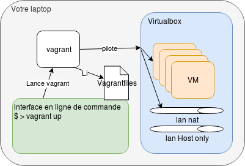

# vagrant

## Présentation

### Principe

Vagrant est un outil en ligne de commande codé en ruby permettant de gérer et de configurer automatiquement un ensemble de machines vituelles pour une solution technique.

A chaque fois que l'outil est lancé (commande vagrant), il lit le fichier de définition de la solution technique présent __dans le dossier courrant__, le `Vagrantfile` et réalise les actions demandées en argument à la commande.

L'outil va créer et installer les VM, configurer leur IP et leur hostname et enfin les "provisionner" (effectuer des actions de configuration).

Une fois la tache exécutée, l'outil s'arrete et laisse la solution technique dans l'état souhaité.



### Installation

Vagrant fonctionne avec VirtualBox (pas seulement mais pour nous maintenant c'est la meilleure solution). __Vous devez donc avoir VirtualBox installé sur votre laptop__.
Puis vous installez Vagrant en suivant la doc [officielle](https://www.vagrantup.com/docs/installation)

### Definitions

__Vagrant :__ C’est l'outil et la commande permettant de gérer et de configurer automatiquement un ensemble de machines vituelles.

__Une box :__ C’est un template de systeme d’exploitation maintenu et disponible sur l’internet. Vagrant télécharge les box à la volée en cas de besoin.

__Une VM ou le « guest » :__ c’est une machine virtuelle.

__Le provider :__ C’est la solution de virtualisation utilisée : le fournisseur de VM. Ici nous utiliserons VirtualBox en local, cependant d’autre providers peuvent être utilisés : KVM, proxmox, vmware(sous licence payante), hyperV ...

__Les provisions :__ Ce sont les actions qui seront effectuées sur les VMs.

__Les provisionneurs :__ c'est les solutions de provisions, exemple le provisioneur `file` permet de placer des fichiers sur la VM, le provisonneur `shell` permet d'exécuter des commandes, etc le provisonneur `ansible` permet de jouer des playbook ansible etc...

## Utilisation

Vous travaillez depuis __un dossier projet__ qui contiens un vagrant file et le reste du matériel nécessaire à cette solution technique.

les commandes principales :

* `vagrant up [nom-vm]` : Lance les VM qui sont définies dans le Vagrantfile ou la VM nommée. ces VM seront créées si elle ne sont pas déja existante et dans ce cas les `provisions` seront exécutées
* `vagrant halt [nom-vm]` : Arrête les VM définies dans le Vagrantfile
* `vagrant status [nom-vm]` : vous retourne le status des vm gérées
* `vagrant destroy [nom-vm]` : supprime les VM
* `vagrant provision [--provision-with provision]` : lance les actions de provisionning ou uniquement celle nommée.
* `vagrant ssh [nom-vm]` : vous connecte en ssh à la VM avec __le compte vagrant__

Pour les autres actions utilisez l'option `-h` pour avoir de l'aide :

```bash
$ vagrant -h
Usage: vagrant [options] <command> [<args>]

    -v, --version                    Print the version and exit.
    -h, --help                       Print this help.

Common commands:
     box             manages boxes: installation, removal, etc.
     destroy         stops and deletes all traces of the vagrant machine
     global-status   outputs status Vagrant environments for this user
     halt            stops the vagrant machine
     help            shows the help for a subcommand
     init            initializes a new Vagrant environment by creating a Vagrantfile
     login           log in to HashiCorps Vagrant Cloud
     package         packages a running vagrant environment into a box
     plugin          manages plugins: install, uninstall, update, etc.
     port            displays information about guest port mappings
     powershell      connects to machine via powershell remoting
     provision       provisions the vagrant machine
     push            deploys code in this environment to a configured destination
     rdp             connects to machine via RDP
     reload          restarts vagrant machine, loads new Vagrantfile configuration
     resume          resume a suspended vagrant machine
     snapshot        manages snapshots: saving, restoring, etc.
     ssh             connects to machine via SSH
     ssh-config      outputs OpenSSH valid configuration to connect to the machine
     status          outputs status of the vagrant machine
     suspend         suspends the machine
     up              starts and provisions the vagrant environment
     validate        validates the Vagrantfile
     version         prints current and latest Vagrant version

For help on any individual command run `vagrant COMMAND -h`

Additional subcommands are available, but are either more advanced
or not commonly used. To see all subcommands, run the command
`vagrant list-commands`.
```

## Fonctionnement

### les box

Ces templates de vm sont disponibles sur internet, la commande vagrant les téléchargent en cas de besoin afin que ces templates soient disponibles sur votre host.  
Si vous ne le préciser pas dans votre Vagrantfile, les box seront mise à jour automatiquement si une nouvelle version existe lors de la création de la VM.

### le dossier .vagrant

Dans __le dossier projet__, vagrant créer un dossier `.vagrant` lui permettant de conserver toutes les informations relatives aux VMs créées. Ce dossier sera ensuite utilisé comme référentiel des machines pour le projet. (sauf exception on positionnera `.vagrant` dans le .gitignore )

### l'accès ssh

Les box contiennent par avance le compte vagrant avec une clef publique authorisée (fichier authorized_keys) pour laquelle __la clef privée est connue de tous, donc non sécurisée__.
A la création de la VM, un forward de port est mis en place sur l'interface nat de la VM afin de pouvoir se connecter à la VM en ssh. La clef connue est utilisée pour une première connexion elle est immédiatement modifiée par une nouvelle qui est cette fois-ci sécurisée : Une nouvelle paire de clef est créer __par VM__ et stockée dans le dossier .vagrant/machines/$NOMMACHINE/virtualbox/ (dans le cas du provider VirtualBox)

On se connectera à la VM avec la commande :

```bash
vagrant ssh $nomvm
```

### le dossier /vagrant sur les VM

A la création et au démarrage d'une VM le contenu de votre dossier projet, le dossier courant, celui-là même contenant votre Vagrantfile, est synchronisé avec sur les VMs sur le dossier /vagrant.
Ainsi ce contenu est disponible sur les VM et utilisable pour vos actions de provisionning.

### Le Vagrantfile

Le vagrantfile est du code en ruby. En revanche il n'est pas nécessaire de comprendre le ruby pour créer et modifier les Vagrantfiles.

Lorsque vous créer un vagrant file, vous definissez les objets `vm`, `provision` et configurez les objets `box` ou `provider` afin de concevoir votre ensemble de VM.

La commande `vagrant init` permet de créer automatiquement un fichier vagrantfile.

Exemple :

```bash
$ vagrant init centos/7
A `Vagrantfile` has been placed in this directory. You are now
ready to `vagrant up` your first virtual environment! Please read
the comments in the Vagrantfile as well as documentation on
`vagrantup.com` for more information on using Vagrant.
$
```

Le fichier `Vagrantfile` ainsi créé contiens pas mal de détails en commentaire sur ce qu'il est possible de faire dans tout les cas vous avez de la doc en ligne : <https://www.vagrantup.com/docs/>

#### la configuration par défaut

la configuration par défaut des vm est définie par l'objet `config.vm` <https://www.vagrantup.com/docs/vagrantfile/machine_settings>

* `config.vm.box` : de l'os de base à utiliser
* `config.vm.provider` : les options de l'outil de virtualisation dépendront du provider utiliser, pour virtualbox : <https://www.vagrantup.com/docs/providers/virtualbox/configuration>

#### Les instanciations de VM

Nous pouvons definir plusieurs vm :

```ruby
config.vm.define "vm-name" do |obj|
   obj.vm.box = "debian/buster64"
   .../...
end
```

on défini ainsi une VM nommé "vm-name" et nous la configurons au travers du nom "obj" (c'est juste le nom utilisé dans le bloc de code entre do et end)

Nous pouvons alors surcharger les valeurs par défaut définies plus haut et préciser des valeurs spécifiques à chaque VM notament la configuration réseaux.

__le hostname :__

```ruby
obj.vm.hostname = "hostname-syst"
```

__la config ip :__

Les détails dépendent du provider utilisé (type de carte réseaux) mais vagrant propose un certains niveau d'abstraction au travers des config network

```ruby
obj.vm.network "private_network", ip: "162.168.56.32"
```

* Nous instancions ici un réseaux privé virtual dans l'hyperviseur (__il sera créé si inexitant__**__)
* Et nous definissons de façon statique l'ip de la vm (__le systeme de la vm sera configuré par vagrant__)
* il cependant possible d'utiliser DHCP : `obj.vm.network "private_network", type: "dhcp"`

__Différentes options sont possible :__

* fowarded port : <https://www.vagrantup.com/docs/networking/forwarded_ports>
* réseaux privé <https://www.vagrantup.com/docs/networking/private_network>
* réseaux Publique (bridged) <https://www.vagrantup.com/docs/networking/public_network>

> sur virtualbox et par défaut, vagrant défini un réseau nat avec un `portforward` pour offrir l'accès en ssh a la VM. Ce réseaux est celui utiliser par vagrant pour la configuration de la vm.

#### Les provisions

Les provisions permetent d'effectuer des actions spécifique sur les guest après leur configuration par vagrant.
Elles sont exécutés par défaut une fois juste après l'initialisation des VMs.

`obj.vm.provision` <https://www.vagrantup.com/docs/provisioning/basic_usage>

__De type file :__

un fichier ou un dossier `source` sera copier sur le guest dans le dossier `destination`

Exemple :

```ruby
target.vm.provision "sources", type: "file" source: "./src", destination: "/home/vagrant/src"
```

> Attention : les provision file sont effectué avec le compte vagrant, celui-ci devra disposer des droits d'accès
> documentation <https://www.vagrantup.com/docs/provisioning/file>

__De type shell :__

L'exécution d'une ou plusieur commande dans un shell root (lancé au travers d'un sudo)

Exemple :

```ruby
obj.vm.provision "prov-name", type: "shell" do |cmd|
  cmd.inline = <<-SHELL
    echo "my hostname is : "
    hostname
  SHELL
end
```

la sortie standard sera transmise à la sortie de l'exécution de vagrant.

> voir la documentation, elle contien des exemple : <https://www.vagrantup.com/docs/provisioning/shell>

__Les synced_folder :__

Les `synced_folder` ne sont pas vraiment des provisions, car ils maintiennent en permanence un dossier synchronisé entre votre host et la vm.

Par défaut le dossier courrant du vagrant file est synchronisé avec le dossier /vagrant sur le guest

Il m'arrive fréquement de désactiver cette fonctionalité qui lorsque le dossier projet est volumineux coute chère en ressources.

```ruby
config.vm.synced_folder ".", "/vagrant", disabled: true
```

> Cette fonctionalité évolué trés pratique pour outiller un environement developement dispose de beaucoup d'options de configurations qui ne sont pas détaillé ici. Documentation : <https://www.vagrantup.com/docs/synced-folders/basic_usage>

## Travaux dirigés

Le mieux pour comprendre et apprendre tout ça est de faire des [exercices](./TD-vagrant.md)

## Conclusion

L' Utilisations de cette solution est trés courante pour livrer des environements de tests / lab directement inclu dans une arboressance projet ou afin simplifier la gestion des tests du code gestion des configuration.

La solution est cependant aussi utilisée pour gèrez des déploiements sur une solution de virtualisation :

* on premise : VirtualBox, Hyper-V, Docker , vmware (<https://github.com/hashicorp/vagrant-vmware-desktop>)
* ou cloud : azure, digital ocean (<https://github.com/devopsgroup-io/vagrant-digitalocean>), aws (<https://github.com/mitchellh/vagrant-aws>)

Plusieurs sujet n'ont pas été abordé ici et peuvent faire l'objet de recherches personnelles :  

* Fabriquer ses propre box <https://www.vagrantup.com/docs/virtualbox/boxes.html> afin de disposer directement d'un box préconfiguré pour certains usage (beaucoup de box sont disponible <https://app.vagrantup.com/boxes/search>)
* Utiliser des clones lié <https://www.vagrantup.com/docs/virtualbox/configuration.html#linked-clones>
* Utiliser des provider de VM autres tel Hyperv, KVM, proxmox etc...
* Et surtout utiliser des provisions plus évoluer tel ansible, saltstack, chef, pupet, etc...
