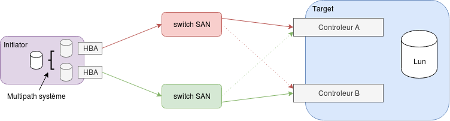

# Multipathing

le multipathing consiste en l'utilisation de plusieurs chemin réseaux SAN pour accèder au même périphérique de stockage afin de redonder l'accès à celui-ci.

le driver linux dm_multipath (dm pour device mapper) ajoute une surcouche au driver de stockage afin de gérer cette redondance.



Nous le présentons et testons ici avec un rése"aux SAN iscsi mais le principe est le même sur un SAN en fibre channel.

## Présentation iscsi

SCSI Small Computer System Interface est à la fois un format de bus physique et un protocole de communication spécialisé pour le transport de bloc de données.

l'initiator est un client ISCSI la target est le serveur de stockage.

le I de [iscsi](https://fr.wikipedia.org/wiki/ISCSI) est pour internet, c'est l'encasulation de ce protocole dans des packet IP.

## Mise en oeuvre

### Mise en place d'une target iscsi sous CentOS7

Une target est le fournisseur de périphérique de stockage

```bash
$ setenforce 0
$ systemctl disable firewalld
$ systemctl stop firewalld
$ yum install epel-release
$ yum install scsi-target-utils
$ systemctl enable tgtd
$ cat /etc/tgt/targets.conf
default-driver iscsi
<target iqn.2019-11.local.lab.sto1:node1.target1>
    backing-store /dev/sdb
    write-cache off
    initiator-address 192.168.33.11
    initiator-address 192.168.56.11
</target>
$ systemctl start tgtd
$ tgt-admin --show
```

### Configuration d'un initiator sous CentOS7

```bash
$ setenforce 0
$ systemctl disable firewalld
$ systemctl stop firewalld
$ yum install iscsi-initiator-utils
$ cat /etc/iscsi/initiatorname.iscsi
InitiatorName=iqn.1994-05.com.redhat:81cd11dd1e66
$ iscsiadm -m discovery -t sendtargets -p 192.168.56.10
$ iscsiadm -m discovery -t sendtargets -p 192.168.33.10
$ iscsiadm -m node -T iqn.2019-11.local.lab.sto1:node1.target1 -p 192.168.33.10 -l
$ iscsiadm -m node -T iqn.2019-11.local.lab.sto1:node1.target1 -p 192.168.56.10 -l
$ tail /var/log/messages
```

### Multipathing sous CentOS

Installation des prés requis :

```bash
$ yum -y -q install device-mapper-multipath
.../...
$ modprobe dm_multipath
$ modprobe dm-round-robin
$ systemctl enable multipathd
.../...
$ /sbin/mpathconf --enable
```

Configuration

```bash
$ grep -v "^#" /etc/multipath.conf | grep .
defaults {
  user_friendly_names yes
  find_multipaths yes
}
blacklist {
}
```

On pourra ajouter le user friendly name `firstdsk`

```bash
multipaths {
   multipath {
     wwid 1494554000000000078797a00000000000000000000000000
     alias firstdsk
}
```

On valide le multipath

```bash
$ systemctl start multipathd
.../...
$ multipath -ll
.../...
```

### mise en place d'une target sous debian

```bash
$ apt-get install iscsitarget-dkms iscsitarget
$ cat /etc/iet/ietd.conf
Target iqn.2013-03.debian-sto:storage.xyz
        Lun 0 Path=/dev/sdb,Type=blockio,ScsiId=xyz,ScsiSN=xyz
        Lun 1 Path=/dev/sdc,Type=blockio,ScsiId=abc,ScsiSN=abc
        MaxConnections          1               # Number of connections/session
        MaxSessions             0               # Number of sessions/target
        InitialR2T              Yes             # Wait first for R2T
        ImmediateData           Yes             # Data can accompany command
        MaxRecvDataSegmentLength 8192           # Max data per PDU to receive
        MaxXmitDataSegmentLength 8192           # Max data per PDU to transmit
        MaxBurstLength          262144          # Max data per sequence (R2T)
        FirstBurstLength        65536           # Max unsolicited data sequence
        DefaultTime2Wait        2               # Secs wait for ini to log out
        DefaultTime2Retain      20              # Secs keep cmnds after log out
        MaxOutstandingR2T       1               # Max outstanding R2Ts per cmnd
        DataPDUInOrder          Yes             # Data in PDUs is ordered
        DataSequenceInOrder     Yes             # PDUs in sequence are ordered
        ErrorRecoveryLevel      0               # We only support level 0
        HeaderDigest            None,CRC32C     # PDU header checksum algo list
service iscsitarget start
```

Configuration (man ietf.conf)

```bash
Lun <lun> Type=(fileio|blockio),Path=<device>[,ScsiId=<scsi_id>][,ScsiSN=<scsi_sn>][,IOMode=(wb|ro|wt)][,BlockSize=<size>]
```

type :

- `fileio` : utilisation du cache local et device virtuel (LVM, RAID, fichier) Path= renvois vers un fichier
- `blockio` : transmition des i/o en directe sur le device Path= renvois vers un device /dev/sdb
- `nullio[,Blocks=<count>][,BlockSize=<size>]` : device virtuel pour tests (ecriture > /dev/null   lecture < /dev/zero)

Le Pseudo Lun masking est géré dans le fichier fichier /etc/iet/targets.allow

Suprimez `ALL ALL` pour authoriser l'accès au lun pour le host.

### Configuration d'un initiator sous debian

```bash
$ apt-get install open-iscsi
.../...
$ service open-iscsi start
.../...
```

Utilisation : (découverte connexion)

```bash
$ iscsiadm -m discovery -t sendtargets -p 192.168.56.38 
$ iscsiadm  -m node  --targetname "iqn.2013-02.debian-sto:storage.xyz" --portal "192.168.56.38:3260" --login
$ dmesg ; fdisk -l ; mke2fs... mount...
dmesg
```

déconnection :

```bash
$ iscsiadm  -m node  --targetname "iqn.2013-02.debian-sto:storage.xyz" --portal "192.168.56.38:3260" --logout
.../...
```

> consultez le man de iscsiadm

Configuration du daemon : /etc/iscsi/iscsid.conf

- pour mettre le node en automatique : node.startup = automatic
- le nom du client : /etc/iscsi/$initiatorname.iscsi
- la target : /etc/iscsi/send_targets/$TARGET-IP,$PORT/
- st_config : la configuration send_target (target connue)
/etc/iscsi/nodes/$IQN/

Pour déconfigurer des disques :

```bash
$ rm -fr /etc/iscsi/nodesiqn.2013-02.debian-sto:storage.xyz
$ rm -fr /etc/iscsi/send_targets/192.168.56.102,3260
reboot
```

### Multipathing sous debian

Installer multipath sur l'initiator

```bash
$ apt-get install multipath-tools
.../...
$ reboot
.../...
```

Configurer l'interface eth2 sur les 2 hosts (initiator et target)

Redemarrer iscsitarget et open-iscsi

Sur l'initiator :

```bash
iscsiadm -m discovery -t sendtargets -p 192.168.56.38
iscsiadm -m node -T iqn.2013-02.debian-sto:storage.xyz -p 192.168.56.38 --login
iscsiadm -m node -T iqn.2013-02.debian-sto:storage.xyz -p 192.168.56.39 --login
fdisk -l
multipath -ll
```

## Tests

- Ouvrez 3 sessions ssh vers l'initiator
  - tracez les log du kernel

  ```bash
  $ tail -f /var/log/messages
  .../...
  ```

  - lancer une écriture permanent sur le device :

  ```bash
  $ cd /mnt ; while true; do date >> ./date; done
  .../...
  ```

  - suivez les changement de topologies :

  ```bash
  $ multipath -ll
  .../...
  ```

- Ouvrez 1 session ssh vers le target

  ```bash
  $ yum install sysstat
  .../...
  $ iostat 1 10
  .../...
  $ date ; ifdown eth1
  ```

  - validez sur l'initiator puis sur le target :

  ```bash
  date ; ifup eth1
  date ; ifdown eth2
  ```

  - revalidez sur l'initiator.
  - sur le target réactiver le carte eth2 :

  ```bash
  date ; ifup eth2
  ```
