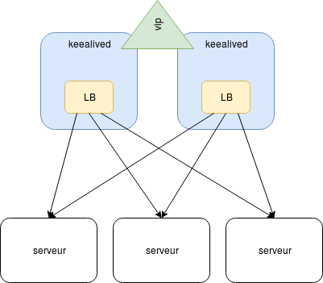
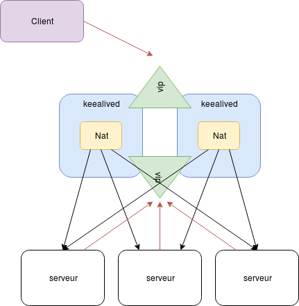
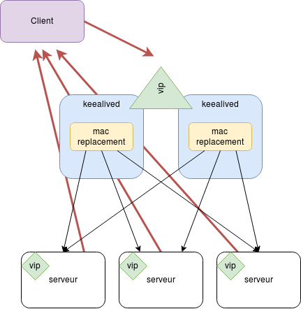

# Keepalived

## Présentation

Keepalived est une solution libre offrant une solution de haute disponibilité réseaux basé sur le protocole VRRP (Virtual Router Redundancy Protocol) et proposant aussi plusieurs solutions de load balancing.

> Read the doc ! <https://www.keepalived.org/manpage.html>

## Solutions de load balancing

### load balancing externe à keepalivd

La première, la plus simple est basé sur du load balancing externe nginx, apache ou ha_proxy.



Configuration globale :

```bash
global_defs {
   notification_email {
     root@localhost
   }
   notification_email_from bob@leponge.net
   smtp_server 127.0.0.1
   smtp_connect_timeout 30
   router_id LVS_DEVEL
}
```

Configuration d'un script health check (ici on vérifie le pid de nginx) :

```bash
vrrp_script check_lb {
    script "pidof nginx"
    interval 2
}
```

Configuration vrrp :

```bash
vrrp_instance VIP1 {
    state BACKUP        # toute les intances en BACKUP
    interface eth1
    virtual_router_id 80
    priority 100
    advert_int 1
    # inverser sur chaque hosts
    unicast_src_ip 192.166.56.101 
    unicast_peer {
        192.168.56.102
    }
    authentication {
        auth_type PASS
        auth_pass xxxxxx
    }
    track_script {
        check_lb
    }
    virtual_ipaddress {
        192.168.56.205/32
    }
}
```

Vous trouverez dans le dossier tp-keepalived un vagrantfile mettant en place cette configuration

### Loadbalancing par `NAT`

La seconde solution est basé sur LVS (Linux Virtual Server).

La VIP sera NATé vers l'une des RIP (Real IP) :



- Une deusième VIP sera activé sur un second réseaux
  
  ```bash
  vrrp_instance VIP2 {
    state BACKUP
    interface eth2         # sur l'interface back cette fois ci
    virtual_router_id 90   # c'est un autre routeur
    priority 200           # 100 sur le slave
    lvs_sync_daemon_inteface eth2  # on ajoutera aussi cette entrée sur l'autre vip
    advert_int 1
    authentication {
        auth_type PASS
        auth_pass xxxxxx
    }
    track_script {
        check_lb
    }
    virtual_ipaddress {
        192.168.33.205/32
    }
  }
  ```

- Un groupe vrrp de syncronisation (vrrp_sync_group) pour synchoniser les bascules des deux vips front et back

  ```bash
  vrrp_sync_group VG1 {
    group {
         VIP1
         VIP2
    }
  }
  ```

- Activation du routage réseaux sur les serveur keepalived (routage du kernel linux : forwarding=1 et désactivation de l'envois des packet redirect icmp send_redirects=0)

  ```bash
  echo "1" >/proc/sys/net/ipv4/ip_forward
  echo "0" >/proc/sys/net/ipv4/conf/all/send_redirects
  echo "0" >/proc/sys/net/ipv4/conf/default/send_redirects
  echo "0" >/proc/sys/net/ipv4/conf/eth0/send_redirects
  ```

- Définition de la seconde VIP comme gateway des serveurs WEB (la default gateway)
  
  ```bash
  ip route add default via 192.168.33.205 dev eth1
  ```

- Mise en place LVS dans la configuration keepalived
  
  ```bash
  virtual_server 192.168.56.205 80 {
    delay_loop 6
    lb_algo wrr         # algo de répartitions
    lb_kind NAT         # type de LB
    persistence_timeout 50
    protocol TCP
    real_server 192.168.33.1 80 {
        weight 1
        HTTP_GET {
            url {
                path /probe
            }
            connect_timeout 3
            nb_get_retry 3
            delay_before_retry 3
        }
    }
    real_server 192.168.33.2 80 {
        weight 1
        HTTP_GET {
            url {
              path /probe
            }
            connect_timeout 3
            nb_get_retry 3
            delay_before_retry 3
        }
    }
    real_server 192.168.33.3 80 {
        weight 1
        restart_service
        HTTP_GET {
            url {
              path /probe
            }
            connect_timeout 3
            nb_get_retry 3
            delay_before_retry 3
        }
    }
  }
  ```

> la commande ipvsadm permetra de suivre l'état du routage

### Le direct routing

Le direct routing consiste en le remplacement de l'adresse mac des trames éthernet puis le reroutage de celle-ci, cela necessite une configuration bien spécifique.



- les serveurs et les lb (keepalived) auront la même gateway réseaux
- Une configuration peut être nécessaire sur l'infra réseaux car nous avons plusieurs hosts qui transmettent des packets avec la même ip sources
- On paramétrera finement la gestion des requêtes arp :
  
  ```bash
  echo "0" >/proc/sys/net/ipv4/ip_forward
  echo "1" >/proc/sys/net/ipv4/conf/all/arp_ignore # ne répond que depuis l'interface portant la mac
  echo "2" >/proc/sys/net/ipv4/conf/all/arp_announce # annonce l'ip préféré pour l'interlocuetur (du même préfix)
  echo "1" >/proc/sys/net/ipv4/conf/default/arp_ignore
  echo "2" >/proc/sys/net/ipv4/conf/default/arp_announce
  echo "1" >/proc/sys/net/ipv4/conf/lo/arp_ignore
  echo "2" >/proc/sys/net/ipv4/conf/lo/arp_announce
  echo "1" >/proc/sys/net/ipv4/conf/eth0/arp_ignore
  echo "2" >/proc/sys/net/ipv4/conf/eth0/arp_announce
  ```

- Le serveur viruel sera cette fois-ci configuré avec `lb_kind DR`

  ```bash
  virtual_server 192.168.56.205 80 {
    delay_loop 6
    lb_algo wrr         # algo de répartitions
    lb_kind DR          # type de LB
    persistence_timeout 50
    protocol TCP
    real_server 192.168.33.1 80 {
        weight 1
        restart_service
        HTTP_GET {
            url {
                path /probe
                digest a635f6f309228a052994bdba46681855
            }
            connect_timeout 3
            nb_get_retry 3
            delay_before_retry 3
        }
    }
    real_server 192.168.33.2 80 {
        weight 1
        restart_service
        HTTP_GET {
            url {
              path /probe
              digest a635f6f309228a052994bdba46681855
            }
            connect_timeout 3
            nb_get_retry 3
            delay_before_retry 3
        }
    }
    real_server 192.168.33.3 80 {
        weight 1
        restart_service
        HTTP_GET {
            url {
              path /probe
              digest a635f6f309228a052994bdba46681855
            }
            connect_timeout 3
            nb_get_retry 3
            delay_before_retry 3
        }
    }
  }
  ```

> Je n'ai pas encore testé personnelement cette solution
