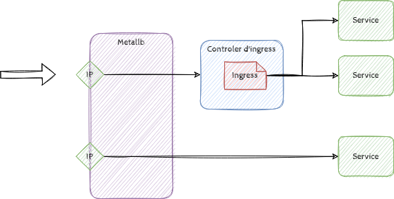

# Ingress

Un ingress est objet kubernetes représentant un sas d'entrée réseaux qui va router les requête réseaux sur plusieur services.

Très orienté http, il défini une série de règles avec des servernames et des paths pointant vers un objet de type service de kubernetes lui même routant vers le port d'un pod et donc vers un conteneur.

Définir un ingress n'apporte rien si le cluster kubernetes n'execute pas un controleur d'ingress qui effectura le routage des requete. c'est l'équivalent d'un routeur L4-L7.



Il existe plusieurs solution d'ingress controler, on retiendra Traefik, nginx et ha_proxy pour le moment.

> TL;DR Nous allons utilisez helm pour faire un poc mais consulter plutot [le user guid traefik sur kubernetes](https://doc.traefik.io/traefik/v1.7/user-guide/kubernetes/)

## déploiement d'un ingress controler

Nous deployons traefik avec helm

```bash
root@master:~# helm repo add traefik https://helm.traefik.io/traefik
root@master:~# helm repo update
Hang tight while we grab the latest from your chart repositories...
...Successfully got an update from the "traefik" chart repository
...Successfully got an update from the "stable" chart repository
Update Complete. ⎈Happy Helming!⎈

root@master:~# helm show values traefik/traefik > traefik-values.yaml
root@master:~# cp traefik-values.yaml traefik-values.orig
root@master:~# vi traefik-values.yaml
root@master:~# diff traefik-values.yaml traefik-values.orig

$ diff traefik-values.yaml traefik-values.orig
214c214
<     allowCrossNamespace: true
---
>     allowCrossNamespace: false
216c216
<     allowExternalNameServices: true
---
>     allowExternalNameServices: false
222,224c222,223
<     namespaces:
<       - "default"
<       - "admin"
---
>     namespaces: []
>     # - "default"
230c229
<     allowExternalNameServices: true
---
>     allowExternalNameServices: false
236,238c235,236
<     namespaces:
<       - "default"
<       - "admin"
---
>     namespaces: []
>     # - "default"
742,745c740
<   #annotations: {}
<   annotations:
<     metallb.universe.tf/address-pool: realpool
<     metallb.universe.tf/loadBalancerIPs: 192.168.33.20 
---
>   annotations: {}
```

Avec les anotation on choisi le pool et l'ip sur metallb

On déploie :

```bash
root@master:~# helm install traefik traefik/traefik --values ~/traefik-values.yaml --create-namespace --namespace ingress-controller
NAME: traefik
LAST DEPLOYED: Mon Mar 21 21:50:47 2022
NAMESPACE: ingress-controller
STATUS: deployed
REVISION: 1
TEST SUITE: None
```

## Deploiement d'un service avec un ingress

on utilise le manifeste suivant :

```yaml
---
apiVersion: v1
kind: ConfigMap
metadata:
  name: tst-pod-nginx-config
data:
  default.conf: |
    server {
        listen 80;
        location / {
            default_type text/plain;
            expires -1;
            return 200 'location / : $server_addr:$server_port\nServer name: $hostname\nDate: $time_local\nURI: $request_uri\nRequest ID: $request_id\n';
        }
        location /public {
            default_type text/plain;
            expires -1;
            return 200 'location /public/ : $server_addr:$server_port\nServer name: $hostname\nDate: $time_local\nURI: $request_uri\nRequest ID: $request_id\n';
        }
    }
---
apiVersion: apps/v1
kind: Deployment
metadata:
  labels:
    run: tst-ct-nginx
  name: tst-deployment
spec:
  replicas: 2
  selector:
    matchLabels:
      applicat: tst-pod-label-nginx
  strategy:
    type: RollingUpdate
    rollingUpdate:
      maxSurge: 1
      maxUnavailable: 0
  minReadySeconds: 5
  revisionHistoryLimit: 4
  template:
    metadata:
      labels:
        applicat: tst-pod-label-nginx
    spec:
      containers:
      - image: nginx:1.15
        name: tst-ct-nginx
        ports:
          - containerPort: 80
            protocol: TCP
        volumeMounts:
          - name: nginx-configs
            mountPath: /etc/nginx/conf.d
      volumes:
        - name: nginx-configs
          configMap:
            name: tst-pod-nginx-config
---
apiVersion: v1
kind: Service
metadata:
  labels:
    name: tst-svc-label-nginx
  annotations:
    traefik.ingress.kubernetes.io/affinity: "true"
    traefik.ingress.kubernetes.io/load-balancer-method: drr
  name: tst-svc-nginx
spec:
  ports:
    - port: 1080
      targetPort: 80
  selector:
    applicat: tst-pod-label-nginx
---
apiVersion: networking.k8s.io/v1
kind: Ingress
metadata:
  name: tst-ingress-svc
  annotations:
  # on specifie ici les paramettre de traefik
    kubernetes.io/ingress.class: "traefik"
    traefik.ingress.kubernetes.io/frontend-entry-points: http,https
    traefik.ingress.kubernetes.io/preserve-host: "true"
    traefik.ingress.kubernetes.io/session-cookie-name: "STICKED"
    traefik.ingress.kubernetes.io/rule-type: "PathPrefixStrip"
    ingress.kubernetes.io/whitelist-x-forwarded-for: "true"
spec:
  defaultBackend:
    service:
      name: tst-svc-nginx
      port:
        number: 1080
  rules:
  - host: "tstingress.lab.local"
    http:
      paths:
      - path: /public
        pathType: Prefix
        backend:
          service:
            name: tst-svc-nginx
            port:
              number: 1080
      - path: /
        pathType: Prefix
        backend:
          service:
            name: tst-svc-nginx
            port:
              number: 1080
```

On utilise les anotations au niveau du service ou au niveau de l'ingress et au niveau du service [doc officielle](https://doc.traefik.io/traefik/v1.7/configuration/backends/kubernetes/#general-annotations)

Déploiement :

```bash
$ kubectl create -f manifests/tst-ingress.yml
configmap/tst-pod-nginx-config created
deployment.apps/tst-deployment created
service/tst-svc-nginx created
ingress.networking.k8s.io/tst-ingress-svc created
```

Afin de tester, ajoutez le nom tstingress.lab.local dans votre fichier hoste avec l'adresse ip 192.168.33.20 et naviguez sur l'url <https://tstingress.lab.local/public>

## Conclusion

Comme dit précédament il existe d'autre ingress controler chacuns avec ses spécificités, au travers de cette démo, nous pouvons maintenant router nos requêtes https sur différents services.

Le contrôleur d'ingress peu aussi être lié à d'autres fonctionalités tel la gestion des certificats ssl avec un outil comme [cert-manager](https://cert-manager.io/docs/)
