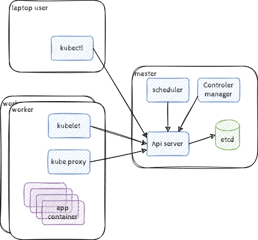

# Construction d'un cluster

* [TL;DR](#tl-dr)
* [Le cluster](#le-cluster)
  * [Configuration system de chaque noeud](#configuration-system-de-chaque-noeud)
    * [Le runtime containerd](#le-runtime-containerd)
    * [Kubernetes](#kubernetes)
  * [Config Master](#config-master)
  * [Config des workers](#config-des-workers)
* [Jouer avec le cluster](#jouer-avec-le-cluster)
  * [Client kubectl](#client-kubectl)
  * [Les Noeuds](#les-noeuds)
    * [labels](#labels)
    * [Les Taints](#les-taints)
  * [Le dashboard](#le-dashboard)
  * [Kubectl proxy](#kubectl-proxy)
* [En conclusion](#en-conclusion)

## TL;DR

Depuis le dossier tp-kubernetes lancer le Vagrantfile :

créer le fichier .env à la racine de la forme :

```bash
DockerUser=Rick
DockerPassword=killmortykillhim
export DockerUser
export DockerPassword
```

* Déployez l'environement :

  ```bash
  vagrant up
  ```

Un cluster kubernetes est déployé avec 3 noeuds un master deux worker ils utilisent containerd en runtime, on a déployé le CNI weavenet.

Vous pouvez passer au point 3 [jouer avec le cluster](#jouer-avec-le-cluster)

## Le cluster

Un ensemble de machines physique ou virtuelles



nous construisons le cluster à base de trois noeuds : Sur une distribution ubuntu server avec 1 cpu et 2 GB de ram par host, On install un runtime de container (containerd) quelques outils et les composant kubernetes.

Nous créons un cluster sur le master (config master) avec le CNI weavenet puis nous rejoignons ce cluster à partir des workers.

### Configuration system de chaque noeud

On s'assure que les hosts du lab se connaisent par leur nom :

```bash
cat >>/etc/hosts<<EOF
192.168.33.100 master.lab.local master
192.168.33.101 worker1.lab.local worker1
192.168.33.102 worker2.lab.local worker2
EOF
```

> a adapter suivant vos ip !

Désactivation du swap

```bash
sed -i '/swap/d' /etc/fstab
swapoff -a
```

Ajout des modules kernel overlay et bridge avec netfilter

```bash
cat <<EOF | sudo tee /etc/modules-load.d/containerd.conf
overlay
br_netfilter
EOF
sudo modprobe overlay
sudo modprobe br_netfilter
```

configuration des modules réseaux routage et netfilter

```bash
cat >>/etc/sysctl.d/99-kubernetes-cri.conf<<EOF
net.bridge.bridge-nf-call-ip6tables = 1
net.bridge.bridge-nf-call-iptables = 1
net.ipv4.ip_forward = 1
EOF
sysctl --system
```

Installation des dépendences pour l'installation puis des dépots necessaires :

```bash
apt-get update
apt-get install -qq -y apt-transport-https ca-certificates curl software-properties-common
curl -s https://packages.cloud.google.com/apt/doc/apt-key.gpg | apt-key add -
cat <<EOF | sudo tee /etc/apt/sources.list.d/kubernetes.list
deb https://apt.kubernetes.io/ kubernetes-xenial main
EOF
add-apt-repository -y ppa:projectatomic/ppa
apt-get update
```

#### Le runtime containerd

Packages : containerd containers-common podman docker.io

```bash
apt-get install -qq -y containerd podman containers-common
```

Configuration la registry :

```bash
cat <<EOF | sudo tee /etc/containers/registries.conf
[registries.search]
registries = ['docker.io']
EOF
```

containerd :

```bash
sudo mkdir -p /etc/containerd
cat > /etc/containerd/config.toml <<EOF
disabled_plugins = []
imports = []
oom_score = 0
plugin_dir = ""
required_plugins = []
root = "/var/lib/containerd"
state = "/run/containerd"
version = 2

[plugins]
  [plugins."io.containerd.grpc.v1.cri".containerd.runtimes]
    [plugins."io.containerd.grpc.v1.cri".containerd.runtimes.runc]
      base_runtime_spec = ""
      container_annotations = []
      pod_annotations = []
      privileged_without_host_devices = false
      runtime_engine = ""
      runtime_root = ""
      runtime_type = "io.containerd.runc.v2"

      [plugins."io.containerd.grpc.v1.cri".containerd.runtimes.runc.options]
        BinaryName = ""
        CriuImagePath = ""
        CriuPath = ""
        CriuWorkPath = ""
        IoGid = 0
        IoUid = 0
        NoNewKeyring = false
        NoPivotRoot = false
        Root = ""
        ShimCgroup = ""
        SystemdCgroup = true
  [plugins."io.containerd.grpc.v1.cri".registry.configs."registry-1.docker.io".auth]
    username = "$DockerUser"
    password = "$DockerPassword"
EOF
```

Utilisation du socket containerd pour crictl:

```bash
cat <<EOF | sudo tee /etc/crictl.yaml
runtime-endpoint: unix:///run/containerd/containerd.sock
EOF
```

Démarrage :

```bash
systemctl daemon-reload
systemctl enable containerd
systemctl restart containerd
```

#### Kubernetes

Packages:

```bash
apt-get install -qq -y  kubeadm kubectl kubelet  kubernetes-cni
```

configuration kubelet:

```bash
cat <<EOF | sudo tee /etc/default/kubelet
KUBELET_EXTRA_ARGS="--container-runtime remote --container-runtime-endpoint unix:///run/containerd/containerd.sock"
EOF
```

Démarrage:

```bash
systemctl daemon-reload
systemctl enable kubelet
systemctl start kubelet
```

#### Config Master

Initialisation du cluster

```bash
kubeadm init --apiserver-advertise-address=192.168.33.100 --pod-network-cidr=10.42.0.0/16
```

> on utilise le réseaux 10.42.0.0/16

Config kubectl:

```bash
mkdir /root/.kube
cp /etc/kubernetes/admin.conf /root/.kube/config
```

Installation du CNI weavenet:

```bash
curl -s -L "https://cloud.weave.works/k8s/net?k8s-version=$(kubectl version | base64 | tr -d '\n')" -o weavenet.yml
kubectl apply -f weavenet.yml
```

Enfin préparration de la commande pou rejoindre le cluster :

```bash
kubeadm token create --print-join-command | tee -a joinkubecluster.sh
```

la commande s'affiche et est dans le fichier joinkubecluster.sh

Installation d'un serveur NFS `alarache` pour avoir du stockage distribué de lab :

```bash
apt-get install -qq -y nfs-kernel-server
mkdir /opt/data
cat >> /etc/exports <<EOF
/opt/data 192.168.33.0/24(rw,no_root_squash)
EOF
service nfs-kernel-server reload
```

#### Config des workers

récupérer la commande générée just avant et la lancer sur chaque worker en root

Exemple :

```bash
kubeadm join 192.168.33.100:6443 --token soc59u.13l792j2fh1ftzsx --discovery-token-ca-cert-hash sha256:f3efbe09e6dd37d450c1432d1c5d7342ffd904e76b1d2500fa7e6ac6916e77fa
```

> vous adapterez avec votre commande

Montage du partage NFS :

```bash
apt-get install -qq -y nfs-common
mkdir /opt/data
cat >>/opt/fstab <<EOF
192.168.33.100:/opt/data /opt/data nfs defaults 0 2
EOF
mount /opt/data
```

## Jouer avec le cluster

### Client kubectl

Installez kubectl sur votre laptop : <https://kubernetes.io/fr/docs/tasks/tools/install-kubectl/>

Réupérez les certificat d'accès au cluster et rapatriez les sur votre laptop :

```bash
scp -i .vagrant/machines/master/virtualbox/private_key vagrant@192.168.33.100:/home/vagrant/.kube/config $HOME/.kube/config
```

> **(!)** le fichier /etc/kubernetes/admin.conf sur le master contiens les accès permettant de se connecter en admin au cluster en le copiant sur votre config kubectl : $HOME/.kube/config

Testez à la fois le cluster et le client en récupérant les noeud du cluster

```bash
$ kubectl get nodes
NAME      STATUS   ROLES                  AGE   VERSION
master    Ready    control-plane,master   13d   v1.23.3
worker1   Ready    <none>                 13d   v1.23.3
worker2   Ready    <none>                 92m   v1.23.3
```

#### Contextes kubectl

la configuration récupéré est de la forme :

```yaml
$ kubectl config  view --minify
apiVersion: v1
clusters:
- cluster:
    certificate-authority-data: DATA+OMITTED
    server: https://192.168.33.100:6443
  name: kubernetes
contexts:
- context:
    cluster: kubernetes
    namespace: default
    user: kubernetes-admin
  name: kubernetes-admin@kubernetes
current-context: kubernetes-admin@kubernetes
kind: Config
preferences: {}
users:
- name: kubernetes-admin
  user:
    client-certificate-data: REDACTED
    client-key-data: REDACTED
```

Nous avons un seul contexte et nous utilisons le compte `kubernetes-admin` sur le cluster `kubernetes`

> **a retenir:**
>
> * les chemins `/etc/kubernetes/admin.conf` serveur et `$HOME/.kube/config` coté client
> * la gestion des contexte de connection avec les commande
>   * kubectl config set-context $\$ContextName$ --cluster=$\$ClusterName$ --namespace=$\$NameSpace$ --user=$\$User
>   * kubectl config set-cluster $\$ClusterName$ --server=$\$SeverUrl$  --certificate-authority=$\$CaCertFilePath$
>   * kubectl config set-credentials $\$UserName$ --client-certificate=$\$CertFilePath$ --client-key=$\$CertKeyFilePath$
>   * kubectl config use-context $\$ContextName$
>
>     ```bash
>     $ kubectl config use-context $ContextName
>     Switched to context "$ContextName".
>     ```

### Les Noeuds

A priori on souhaites avoir des noeuds agnostiques et homogènes. Il est pourtant possible d'ajouter des labels (plutot statiques) ou des taints (Pour une approche dynamique) au noeud afin de les distinguer ou d'influer sur le scheduleur et l'orchestration.

#### labels

On ajoute le label de clef worker definissant le fait que le noeud soit du role worker et son nom.

```bash
kubectl label node worker2 node-role.kubernetes.io/worker=worker2
kubectl label node worker1 node-role.kubernetes.io/worker=worker1
```

ici on ajoute le label node-role.kubernetes.io/worker=le nom du node sur chacun des node definissant anssi le role des node worker à `worker`

En consultant l'état complet du noeud, on retrouve bien ce label parmis d'autres qui pourront être utile à l'ordonancement des pods sur les noeuds.

Exemple :

* kubernetes.io/arch=amd64
* kubernetes.io/hostname=worker2
* kubernetes.io/os=linux

```bash
$ kubectl get nodes
NAME      STATUS   ROLES                  AGE    VERSION
master    Ready    control-plane,master   13d    v1.23.3
worker1   Ready    <none>                 13d    v1.23.3
worker2   Ready    worker                 178m   v1.23.3
$ kubectl describe nodes worker2
Name:               worker2
Roles:              worker
Labels:             beta.kubernetes.io/arch=amd64
                    beta.kubernetes.io/os=linux
                    kubernetes.io/arch=amd64
                    kubernetes.io/hostname=worker2
                    kubernetes.io/os=linux
                    node-role.kubernetes.io/worker=worker2
Annotations:        kubeadm.alpha.kubernetes.io/cri-socket: /run/containerd/containerd.sock
                    node.alpha.kubernetes.io/ttl: 0
                    volumes.kubernetes.io/controller-managed-attach-detach: true
CreationTimestamp:  Sun, 13 Feb 2022 16:43:18 +0100
Taints:             <none>
.../...
```

#### Les Taints

Il sera aussi possible de catégoriser les noeuds avec des `taints`, un sorte de spécificité du noeud définie par une clef et une valeur associé a un effet.

les effets :

* NoSchedule : empèche le lancement des pods
* PreferNoSchedule : evite si possible le lancement des pods
* NoExecute : empèche l'exécution des pods (les reschedule sur un autre noeud)

Cela permetra d'influer sur l'orchestration des pod sur ce noeud en particulier en empéchant les pods qui ne **tolère** pas ce taint

```bash
$ kubectl taint nodes worker1 mykey=myvalue:NoExecute
node/worker1 tainted
$ kubectl describe nodes worker1 | grep Taints
Taints:             mykey=myvalue:NoExecute
$ kubectl taint nodes worker1 mykey=myvalue:NoExecute-
node/worker1 untainted
```

Kubernetes utilise des taints de façon à organiser l'orchestration suivant l'état d'un noeud :

* node.kubernetes.io/not-ready
* node.kubernetes.io/unreachable
* node.kubernetes.io/memory-pressure
* node.kubernetes.io/disk-pressure
.../...

On peu imaginer definir les taints :

* "maintenance=willstart:NoSchedule" pour preparrer un noeud en mode maintenance et interdir le déploiement de nouveau pod
* "maintenance=start:NoExecute" pour deplacer les pods en cours d'exécution sur un autre noeud.

### Le dashboard

Afin de le déployer on récupère son manifeste qu'on applique au cluster kubernetes

```bash
$ curl -s -L "https://raw.githubusercontent.com/kubernetes/dashboard/v2.4.0/aio/deploy/recommended.yaml" -o dashboard.yml
$ kubectl apply -f dashboard.yml
.../...
```

> Nous pourrons analyser ce manifest dans le détail un peu plus tard.

Création d'un `ServiceAccount` admin-user pour accèder au dashboard.

```bash
root@master:~# vi dashboard-access.yml
root@master:~# cat dashboard-access.yml
---
apiVersion: v1
kind: ServiceAccount
metadata:
  name: admin-user
  namespace: kubernetes-dashboard
---
apiVersion: rbac.authorization.k8s.io/v1
kind: ClusterRoleBinding
metadata:
  name: admin-user
roleRef:
  apiGroup: rbac.authorization.k8s.io
  kind: ClusterRole
  name: cluster-admin
subjects:
- kind: ServiceAccount
  name: admin-user
  namespace: kubernetes-dashboard

root@master:~# kubectl apply -f dashboard-access.yml
serviceaccount/admin-user created
clusterrolebinding.rbac.authorization.k8s.io/admin-user created
```

> **(!)** Pour se connecter, nous generrons un token :
>
> ```bash
> $ kubectl -n kubernetes-dashboard create token admin-user
> ...
> ```

### Kubectl proxy

A partir de votre client kubectl vous pouvez lancer un proxy vous permettant d'accèder à l'api kubernetes en local sur <http://localhost:8001>

```bash
tp-kubernetes$ kubectl proxy -n kubernetes-dashboard
Starting to serve on 127.0.0.1:8001
```

> Vous garderez ce processus en fonction ou vous le relancerez afin de pouvoir accèder à l'api depuis votre navigateur.

Via cette api vous vous connecter à l'application `dashboard` via l'url :

<http://localhost:8001/api/v1/namespaces/kubernetes-dashboard/services/https:kubernetes-dashboard:/proxy/>

> **a retenir :**
> L'accès a un service en test via l'api kubernetes :
> Exemple : <http://localhost:8001/api/v1/namespaces/kubernetes-dashboard/services/https:kubernetes-dashboard:/proxy/>
>
> * l'accès à l'api via le proxy : http:// localhost:8001/api/v1/
> * le namespace : namespaces/$\$NameSpace$/
> * le service derière le proxy : services/$\$Protocole$:$\$ServiceName$:$\$Port$/proxy/

## En conclusion

* Vous disposer maintenant d'un cluster kubernetes
* Vous avez connecter votre client kubectl local sur ce cluster avec les droits d'admin, vous pouvez donc :
  * le piloter.
  * accèder au applications via le proxy
* Vous avez aussi une petite interface vous permettant de visualiser ce qui est mis en place sur le cluster le dashboard

Nous allons voir dans les TPs suivants comment déployer des applications, et comment les publier sur le réseaux publique.
