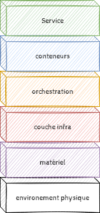
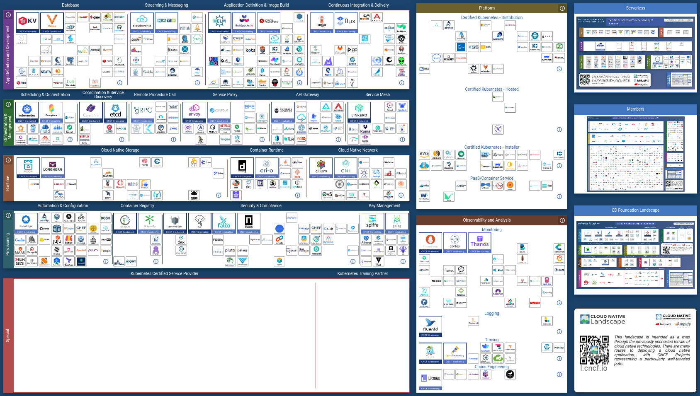

# Le cloud

## Présentation

Dans le contexte de la Digitalisation (avec le doigt) bla bla SAAS, PAAS, IAAS bla bla cloud privé, cloud public, cloud hybride voir cloud communautaire.

### Le modèle

*AAS : As A Service : abstraction des couches sous-jacentes.

La conteneurisation : l'abstraction de toutes les couches sous-jacentes à l'application.

### Avantages

* Moderne (L'offre technique est en avance sur la demande)
* Disponible à la demande
* Opex et non Capex
* Reversibilité (Changement de founisseur)

### Inconvénients

L'autonomie est restreinte par la dépendance aux fournisseurs.

Cet inconvénient est réduit par l'utilisation de solution opensource et les offres alternatives aux GAFAM.

## La CNCF

Cloud Native Computing Foundation : projet de la Linux foundation autour de la conteneurisation. Projet créé en 2015 en partenariat entre la Linux Foundation et Google qui livrait alors Kubernetes v1.0 comme première technologie.

L'Objectif de cette fondation est de faire progresser les technologies liée à la conteneurisation.

C'est une communauté des 450 acteurs du cloud (dont les acteurs majeurs tel que Google, aws, ~~RedHat~~ IBM, Cisco, Intel, VMware ...)

La CNCF recense les projets "cloud native" par niveau de maturité (Graduated, Incubating, Sandbox) et en fait la promotion.

Je vous encourage a consulter la [carte](https://landscape.cncf.io/?license=open-source&project=graduated,incubating&zoom=80) interactive.

### Les applications Cloud Native

Une application est dite cloud-native si elle est architecturée en microservices conteneurisés indépendants et faiblement couplés. Les communications entre microservices sont donc basées sur des API.

Cloud-native rejoins la culture DevOps ou c'est le contraire.

## Conclusion

En vrai, les technologies de l'information sont en perpétuelles mutations. Devops / Cloud native etc... n'est que l'adaptation organisationnelle aux dernières mutations.

On y arrive ? D'après les [prévisions du gartner](https://cloud-computing.developpez.com/actu/306758/Les-revenus-lies-a-la-gestion-des-conteneurs-connaitra-une-forte-croissance-atteignant-944-millions-de-dollars-en-2024-selon-une-prevision-de-Gartner/) :

* 75% des organisations internationales devraient faire tourner des conteneurs d'ici 2022, contre seulement 30% en 2020
* Mais seulement 15% des applications devraient être conteneurisées d'ici **2024**

Bon ben on y va doucement alors.
