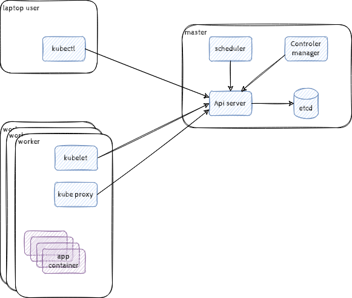
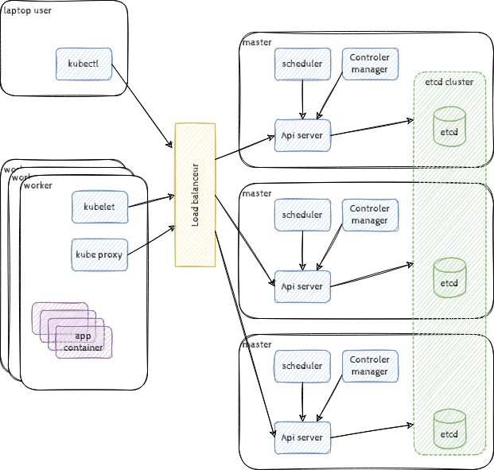
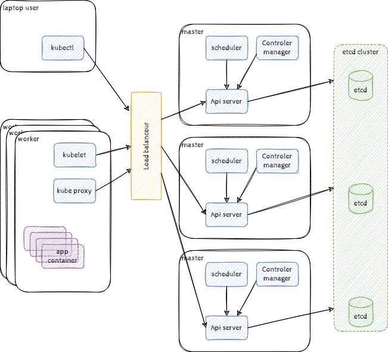
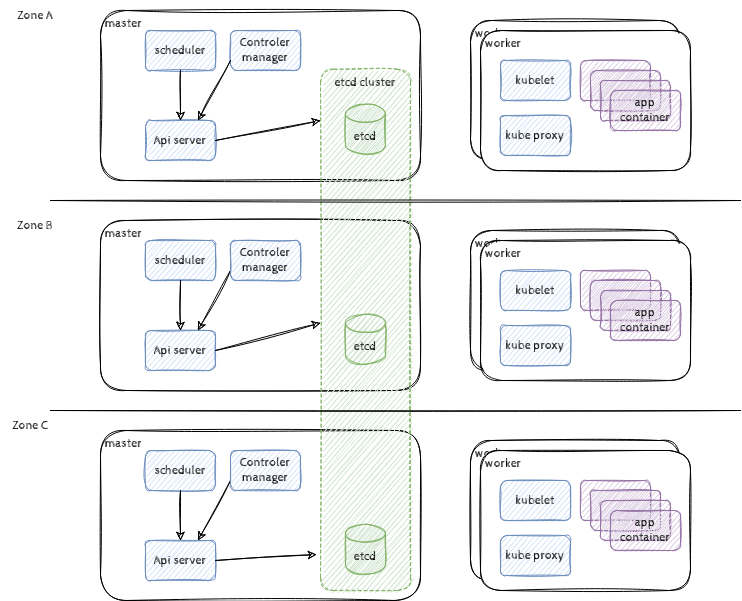
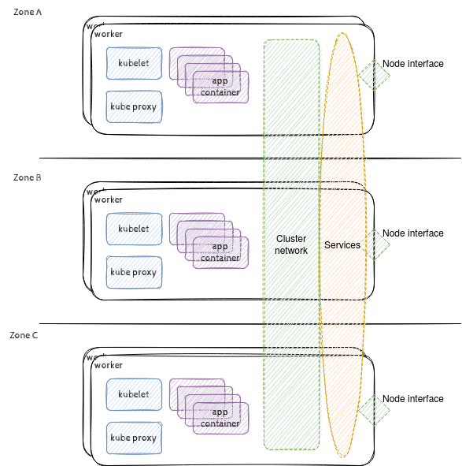
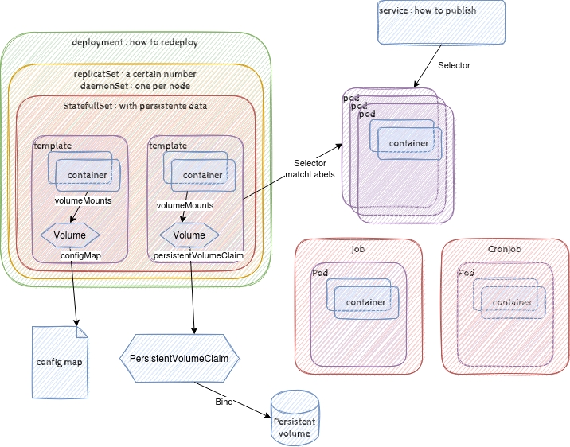
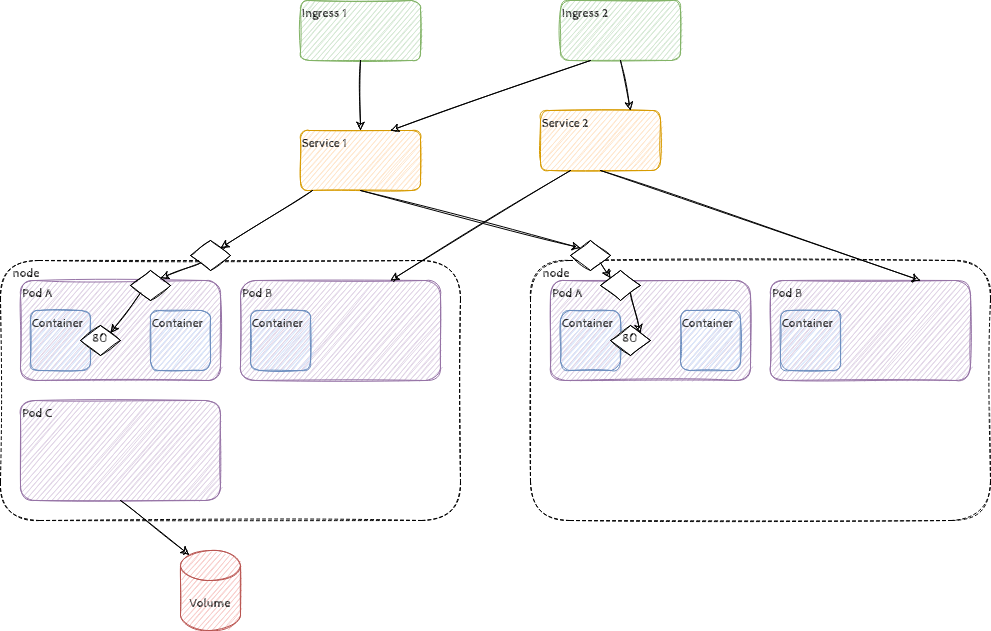

# Présentation Kubernetes

* [Présentation Kubernetes](#présentation-kubernetes)
  * [Introduction](#introduction)
  * [Architecture de l'application kubernetes](#architecture-de-lapplication-kubernetes)
    * [Rôle master](#rôle-master)
    * [Rôle worker](#rôle-worker)
    * [Le client kubectl](#le-client-kubectl)
    * [La haute disponibilité](#la-haute-disponibilité)
      * [etcd](#etcd)
      * [Topologie des Nodes Master et worker](#topologie-des-nodes-master-et-worker)
      * [Pour le Réseaux](#pour-le-réseaux)
  * [Les objets kubernetes](#les-objets-kubernetes)
    * [Les objets globaux](#les-objets-globaux)
    * [Le pod](#le-pod)
      * [Le cycle de vie du pod](#le-cycle-de-vie-du-pod)
      * [Objets de controle du pod](#objets-de-controle-du-pod)
    * [Les objets réseau](#les-objets-réseau)
      * [Le service](#le-service)
      * [L'ingress](#lingress)
  * [Conclusion](#conclusion)

## Introduction

Kubernetes veux dire Timonier celui qui tiens la barre du bateau. C'est un **orchestrateur de conteneurs**.

C'est une application développée par google gérant l'exécution de ses milliards de containers. Cette application a été reversé à la communauté open-source (via le CNCF).

Il offre une abstraction complète de l'infrastructure matérielle qui execute les applications.

Nous allons définir des applications sous forme de groupes de conteneurs, Kubernetes va assurer leur exécution et simplifier/standardiser leur gestion sur un groupe de serveurs physiques ou de VM, tout en masquant la complexité de l'infrastructure technique mise en oeuvre.

## Architecture de l'application Kubernetes

Kubernetes est une application Cloud-native donc avec une architecture microservice conteneurisée.

Pour s'exécuter, Kubernetes fonctionne sur un cluster de machines physiques (ou virtuelles) disposant d'un contrôleur de conteneurs : les **nodes**.

Les nodes peuvent avoir les rôles suivants :

* master : c'est un noeud de contrôle du cluster, il supporte la charge de Kubernetes lui-même.
* worker : C'est un noeud de ressources de calcul, il supportera la charge des applications déployées sur le cluster Kubernetes

Les utilisateurs interagissent avec le cluster au travers d'une interface CLI `kubectl`.



### Rôle master

Il exécute les services : `API serveur`, `etcd`, `scheduler` et `Controller-Manager`

L'**API serveur** expose l'API kubernetes et stocke ses données dans la base de données `etcd`.

La base **etcd** stocke les paires de clés-valeurs de l'API.

Le **scheduler** : Distribue les conteneurs à démarrer sur les workers en fonction de la charge de chacun des noeuds workers. Il démarre les applications nouvelement définies dans la base `etcd`.

Le **Controller-Manager** surveille l'état du cluster et des applications définies et remonte ces informations dans la base `etcd`. Il maintient l'état attendu de ces applications sur le cluster en assurant les fonctions suivantes :

* Node Controller : surveille l'état des noeud et réagit en fonction de leur panne.
* Replication Controller : maintient le bon nombre de réplicats de conteneur et redémarre les éventuels conteneurs qui se sont arrêtés de façon inattendue.
* Endpoints Controller : maintient les accès réseaux aux conteneurs.
* Service Account & Token Controllers : gestion des droits d'accès.
* Cloud-controller-manager : gestion de l'interface aux workers (quel que soit son type).

### Rôle worker

Il exécute les services : `kubelet`, et `kube proxy`

**Kubelet** : Agent qui s'exécute sur chaque noeud worker du cluster. Il gère la communication avec le Master et les conteneurs.

Il assure les fonctions suivantes :

* Reçoit les demandes de création de Pod
* Monte les Volumes des Pods
* Lance les conteneurs
* Il rapporte l’état des conteneurs à l’API-Server

**kube-proxy** : Agent qui maintient les réseaux du cluster et permet l'accès réseau aux conteneurs

### Le client kubectl

`kubectl` est un outil en ligne de commande gérant la communication avec l'API serveur du cluster Kubernetes et nous permettant d'interagir avec lui.

### La haute disponibilité

Afin de garantir la haute disponibilité du cluster kubernetes ; afin que celui-ci garantisse la disponibilité des applications qu'il porte. Il nous faut définir la topologie du cluster nous permettant de maintenir disponible le rôle **master** qui pilote les workers et un **nombre suffisant de workers** pour porter la charge des applications.

#### etcd

Le service etcd est le service qui maintient les données métier du cluster. C'est un service de stockage clés-valeurs distribué et hautement disponible. Il s'appuie sur l'algorithme de consensus distribué Raft qui est très bien expliqué [ici](http://thesecretlivesofdata.com/raft/).


Il nous faut donc un cluster etcd d'au moins 3 noeud.

Si celui-ci est embarqué sur le rôle master, nous déploierons alors 3 nœuds masters :



Il est bien sûr aussi possible d'utiliser un cluster etcd externe :



#### Topologie des Nodes Master et worker

Nous allons déployer un node master par zone hébergeant notre cluster, nous pourrons alors assumer la perte d'une zone sans Impact important sur nos services.

Pour les workers, tout dépend de la charge et la redondance que nous devons offrir aux applications hébergées. Comptons au début 2 par site.



#### Pour le Réseau

Kubernetes masque la complexité du réseau dans son modèle et propose une vue logique avec un réseau interne le `cluster network` et des objets `services` qui permettent la publication des applications.



Cela nécessite en interne une gestion de réseau avancée et pour ce faire, K8s s'appuie sur un plugin réseau :

Par défaut, nous avons **Kubenet** le mode le plus basique qui s'appuie sur un bridge Linux `cbr0` et deux veth, une pour le host, l'autre pour le conteneur (le pod en fait mais on en parle plus bas). Cela est très basique et est utilisé pour du test pour un single node. Cela permet d'avoir un hébergement Kubernetes local de test.

Sinon avec un plugin **CNI** (Container Network Interface) plus évolué sur notre cluster, nous disposons du réseau virtuel interne permettant la communication entre nos conteneurs (pods) quel que soit le noeud sur lequel ils s'exécutent. Il en existe un grand nombre dans le cas d'un cluster on premise, on retiendra :

* Flanel : Qui propose un vxlan ipv4 par cluster.
* Calico : Qui propose plusieurs réseaux ipv4 ou ipv6 par cluster, il fonctionne en s'appuyant sur un underlay à base de BGP et IPinIP
* Cilium : Qui propose un sous-réseau par noeud (niveau 3) en overlay vxlan ou en routage natif (l'underlay est complexe à gérer), il utilise le filtrage réseau BPF (Berkley Packet Filter) plus performant que iptables.
* WeaveNet : Qui propose un sous-réseau par noeud (niveau 3) ou un overlay vxlan.

Chacun dispose d'avantages et d'inconvénients, il faudra les étudier avant de choisir celui qui sera déployé sur le cluster. Certains sont prêts pour la prod, d'autres moins. À voir, la [présentation dans la doc Kubernetes](https://kubernetes.io/docs/concepts/cluster-administration/networking/)

## Les objets kubernetes

Kubernetes propose un modèle pour les objets que nous gérons lorsque nous déployons des applications.

Pour chacun de ces objets, nous aurons une entrée dans la base etcd qui le représente et assure sa rémanence dans le cluster.

Afin de manipuler ces objets, nous les décrirons en yaml.

Exemple :

```yaml
apiVersion: v1
kind: ObjectType
metadata:
  name: unique-name
  namespace: the-namespace
spec:
  Key: Value
```

On notera la version de l'API utilisée, le type d'objet défini, ses métadonnées pour l'identifier et ses spécifications du type clé: valeur.

Ci dessous une présentation succinte des objets principaux a conaitre.

### Les objets globaux

Ces objets sont visibles sur l'ensemble du cluster physique quel que soit le namespace

* Le node: C'est un host du cluster
* Le namespace : C'est un espace de nommage, c'est un cluster virtuel sur notre cluster physique. C'est une façon de regouper des objets logiquement (par équipe projet ou par environnement ...)
* Le volume persistant : c'est la définition d'un espace de stockage rémanent sur le cluster

### Le pod

Le pod est un groupe de conteneurs (souvent un seul) vu comme une seule entité, un pod est associé à une et une seule adresse IP, les conteneurs qu'il contient voient tous les mêmes volumes.

#### Le cycle de vie du pod

Le pod peu prendre tour à tour les statuts suivant :

* **Pending** : Le Pod a été accepté par Kubernetes, il est soit en cours d'affectation sinon le pod est en train de télécharger les images puis de créer les conteneurs qu'il contient.
* **Running** : Le pod a été affecté à un nœud et tous les conteneurs ont été créés. Au moins un est en cours d'exécution.
* **Succeeded** : Tous les conteneurs du pod ont terminé avec succès (rc code 0) et ne seront pas redémarrés.
* **Failed** : Tous les conteneurs d'un pod ont terminé, et au moins un conteneur a terminé en échec.
* **Unknown** : l'état du pod ne peut pas être obtenu.

#### Objets de controle du pod

* Le `ReplicaSet` : Cet objet définit le fait qu'un pod doit être répliqué un certain nombre de fois.
* Le `StatefulSet` : Cet objet lie un **pod**, un **ReplicatSet** ou un **Deployment** à un `volume` (conservant l'état du pod : stateful).
* Le `Deployment` : Cet objet définit comment le **ReplicatSet** doit être re-déployé.
* Le `DaemonSet` : Cet objet définit le fait qu'un pod doit exister sur chacun (certains) des noeuds du cluster.
* Le `Job` : **le job est une sorte de pod** qui effectue une tâche puis s'arrête, Kubernetes ne s'assure pas que celui-ci fonctionne en permanence mais qu'il s'est exécuté avec succès
* Le `cronjob` : **le job est une sorte de pod** qui est planifié via une ligne de crontab mais dans kubernetes



### Les objets réseau

De base chaque pod dispose d'une adresse IP et éventuellement d'un nom DNS. Le pod est donc disponible sur le réseau interne du cluster (pour d'autres pods par exemple) mais n'est pas accessible à l'utilisateur.

L'accès aux applications est défini par les objets `service` et `ingress`.

#### Le service

Le service : le service est l'objet publiant le service réseau fourni par une application (un groupe de pods)

Il peut être publié sur :

* une `ClusterIP` une adresse IP interne accessible uniquement depuis l'intérieur du cluster Kubernetes.
* un `NodePort` un port réseau `<Node_IP>:<NodePort>` est réservé sur tous les noeuds du cluster. Chaque noeud écoute sur ce port et redirige le trafic qui arrive vers le service concerné. Le service est alors accessible depuis l'extérieur du cluster.
* un `LoadBalancer` configuration évoluée qui, suivant la configuration d'un loadbalanceur sur votre cluster Kubernetes ou chez votre opérateur cloud, va interagir avec l'API de celui-ci afin de répartir les connexions sur les pods qui portent le service.

#### L'ingress

Un Ingress est un objet évolué permettant de définir des route d'accès en général en https (`https://<server-name>/<url-route>/`) aux services.

Il s'appuis sur un **IngressController** qu'il faudra definir et déployer sur le cluster afin qu'il agisse comme un proxy offrant l'accès aux applications.

Suivant l'IngressController déployé, il pourra offrir des fonctionnalités supplémentaires telles que la commande de certificat **Let's Encrypt** ou le maintien des sessions sur le même pod, etc...



## Conclusion

Vous l'aurez compris, il s'agit de revoir notre méthode d'intégration d'applications afin de coller au modèle Kubernetes. Toute la gestion de l'infrastructure d'exécution est masquée par le modèle et l'API Kubernetes. Nous ne parlons plus que d'ingress, service, déploiement, pod, conteneur, volumes et plus jamais de VM, système, packages, etc... car tout ceci est géré par les admins Kubernetes.
