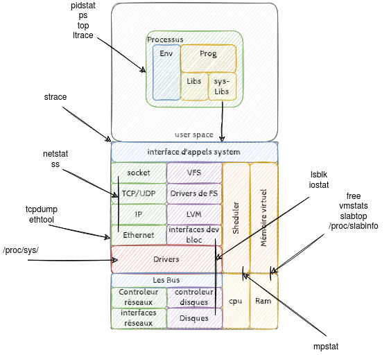

# Configuration serveur linux

Dans le cadre d'une infrastructure privée ou en tant que fournisseur cloud, suivant le besoin, il peut être necessaire de mettre en place des configurations spécifiques lié à la gestion du matériel et de l'environement.

## Context matériel et environemental

### L'hébergement physique

Les contraintes de sécurité physique et anti incendie, de disponibilité de l'énergie et du système de refroidissement font que, suivant le niveau de service requis, il est souvent plus simple de faire appel à un opérateur de centre de données. Celui-ci offre dans le meilleur des cas :

* Une sécurité d'accès physique multifacteur dont biométrique...
* Une sécurité anti incendie (extinction automatique a gaz)
* Plusieurs approvisionements electriques
  * Pour le datacenter
  * Dans chaque baie
* Une solution de fourniture electrique de sauvegarde (groupe electrogènes, batterie) permettant de tenir la charge pendant quelques minutes/heures.
* Des systemes de climatisations redondés
* Des interconnection réseaux
  * interdatacenter
  * opérateurs
  * de peering

Il subsite dans certaines entreprise des hébergements en salle blanche. Les contraites de sécurité devront alors être traitées spécifiquement.

Afin d'assurer suffisament de dispobilité, la redondance élèctrique est à traiter de bout en bout, aussi, les composants matériels cité plus bas suporteront une double alimentation élèctrique.

### Le réseaux

Le matériel est bien sûr propriétaire. La configuration réseaux apportera au niveau des autres composants des accès redondés.

> Sur un site distant les composant réseaux dispose d'un réseaux autonome de managment de façon a disposer des accès en cas de perte du réseaux (Out Of Band Network managment)

### Les servers

L'architecture matériel est construite autour de standard (cpu amd64, bus PCI etc..). Il existe des produits OEM et des assembleurs de serveurs. Certain opérateur cloud assemble eux même leur chassis; On utilise des standard mais il n'existe pas de solution matériel réelement open source. Dans le cadre d'une intégration de système d'information, on utilise en général du matériel propriétaire HP/dell/IBM/...

Ceux-ci disposeronts donc de doubles allimentations, et une ou deux interfaces réseaux par réseaux à interconnecter de façon indépendante.

> On retrouvera en particulier sur les système qui le nécessitent une interconnection pour les réseaux de managment et de sauvegarde, et deux interfaces pour les flux de production et le cas écheant de stockage.

### Les solutions de stockage

Le SAN s'appuie sur le matériel suivant:

* Une baies matériel de stockage (Netapp, hp 3par/msa, EMC datadomain, Pure storage FlashArray, ... )
* Un réseaux dédié basé sur un protocole de stockage (FC,iscsi,SAS)
* Des interfaces serveurs (cartes HBA,CNA,NIC) connectés au réseau

les baie de stockage réseaux(SAN) sont elles aussi propriétaires. Elle intègre les besoin de hautes disponibilité :

* double alimentations
* double controleur
* bus de stockage doublé (les deux bus accéssible au deux controleur)
* double interconnection au réseaux SAN

> Le réseaux de stockage est en général indépendant du réseau de production et souvant doublé (2 switchs par baie)

#### Principes de fonctionnement

* Sur la baie, les disques sont regroupés en grappes (RAID 1-6 dp , ou un pool de stockage logique)
* Des volumes de stockage logique (LUN) sont alors créé dans ces pool de stockage, présenté sur le réseaux SAN et rendu visible à certain servers identifié sur le réseau (Lun masking,le zonning FC,)
* Les carte HBA découvre les volume sur le SAN et les présente sur le bus comme du stockage locale.

> certaine carte HBA permettent de booter sur les disques distant, les serveurs ne disposent alors d'aucun disque interne. Cela permet de rendre les serveur comme des unité de calcul pure. La configuration les fait booter sur tel ou tel disque système.

#### Principe de configuration

Afin de simplifier sa gestion, le pool de stockage est découper en unités de stockage de même taille, celle-ci sera l'unité d'alocation minimum.

* Pour un stockage dédié à une infrastrsucture de virtualisation des volumes de 8TB peuvent être créé.
* Pour un stockage dédié à des unité de stockage non spécialisé (base de donnée, stockage de fichier, etc... ) les unité de volumes peuvent être d'une ou plusieurs disaine de GB.

> L'adminsitration du stockage consiste, en plus de la maintenance des baie de stockage et du réseaux SAN, tout simplement en l'attribution des volumes à des serveurs.

## configuration Linux

### Configuration/matrise du Kernel

Comme indiqué dans le document [rappel-linux](./rappels-linux.md), le Kernel est au centre du système.

Dans le schéma ci dessou on retrouve les commandes principale permettant de consulter l'état des différente 'briques' du noyau linux

### TP sur la pile réseau

* [tp compilation de driver](./tp-config-linux/compile-driver/README.md)
  * les pilotes de périphérique physiques et les paramètre de modules. Dans le document [rappel-linux](./rappels-linux.md#paramétrage-du-kernel) vous retrouverez des éléments pouvant vous aider.
* [tp config réseaux](./tp-config-linux/config-net/config-net-advanced.md) et avec systemd [tp networkd](./tp-config-linux/config-net/systemd-net.md)
  * Le Bondig/lacp : l'utilisation du module bonding et du standard 802.ab
  * Les vlan avec le module 802.1q
  * Le module bridge du noyau.

> Document : <https://www.kernel.org/doc/Documentation/networking/ip-sysctl.txt> : Description des paramètres de la stack réseaux du kernel : IP, TCP, UDP, ICMP, ARP
> **exemple** : le sysctl net.ipv4.conf.default.rp_filter = 0 pour ne plus filtrer les packets en cas de routage asymétriques et en fonction de leur interface d'arrivée (reverse path filtering)...

### TP Configuration stockage

* [les schedulers d'I/O](./tp-config-linux/config-stockage/scheduler-io.md)
* [tp multi pathing](./tp-config-linux/config-stockage/iscsi-mutlipath.md)
  * mise en oeuvre d'un mini san sur la base d'une debian et du serveur open-iscsi
  * mise en place du module dm_multipath et configuration de stockage SAN
* [tp lvm](./tp-config-linux/config-stockage/tp-lvm.md)
  * utilisation de lvm afin de permettre une gestion des volumes SAN au niveau du système local.

> Document un schema représentant la stack I/O du kernel <https://www.thomas-krenn.com/de/wikiDE/images/b/ba/Linux-storage-stack-diagram_v4.0.png>
