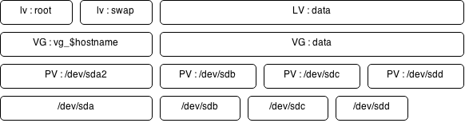

# LVM

Un bref rappel sur lvm, nous mettons en place un filesystème sur un volume logique et mettons en évidence la possibilté de migrer des données d'un disque physique à un autre. J'usqua supprimer le disque ainsi libéré.

En conclusion nous somme capable dans un environement SAN de migrer les données d'une application d'une baie de stockage vers une autre de façon totalement transparente pour l'application est ses utilisateurs.

[toc]

## Présentation

LVM pour *Logical Volume Manager* permet de définir des volumes logiques indépendants des volumes physiques. Il offre un grand nombre de fonctionalités sur la gestion des volumes (*mirroring*, *snapshot*, redimensionnement, etc.).

Les **volumes physiques (PV)** sont regroupés dans un **Volume Group (VG)**, puis découpés en blocs de données appelés **Physical Extent (PE)**.

A la création d'un volume physique, un label unique est écrit en début de disque. Un espace est réservé juste après, en fin de disque, afin d'écrire l'ensemble des données relatives à LVM.

Un **PV** :


Un **volume logique (LV)** est défini comme un ensemble de ces blocs de données. Ansi un volume logique (LV) peut être stocké sur plusieurs volumes physiques PV).
En cas de *mirroring* chaque bloc est stocké en plusieurs copies ; chacune sur un volume physique (PV) différent.



### Intérêt

Pour toute configuration matériel de production en datacenter ou vrituel **il faut mettre en place du LVM**.

* Pour la gestion des changement et des évolution
  * cas du changement de SAN
* Afin d'optimiser l'espace disque en de répliquant que ce qui est necessaire d'être répliqué
* Afin de gerer une surcossomation de stockage et un besoin d'agrandissement de volume.

### Commandes LVM

Les volumes physiques (PV), les Volume Groups (VG) et les volumes logiques (LV) sont gérés par les commandes LVM :

* `[pv|vg|lv]display` : affiche les caractéristiques d'un PV, VG ou LV
* `[pv|vg|lv]create` : crée un des objets LVM
* `[pv|vg|lv]remove` : supprime un des objets LVM
* `vgextend` : ajoute un volume physique (PV) à un Volume Group (VG)
* `vgreduce` : enlève un disque d'un Volume Group (VG)
* `pvmove` : déplace les blocs de données d'un volume physique (PV) vers un autre
* `lvconvert` : modifie la répartition des blocs
* `lvchange` : modifie les attributs d'un volume logique (LV)
* `lvresize` : redimensionne un volume logique (LV)

La pratique est encore le meilleur moyen de comprendre alors voici un TD

## Mise en place

### Environement

Utilisez un système linux avec 4 disque de 50MB supplémentaire ou à partir du [tp multipath](./iscsi-mutlipath.md) vous ajoutez 4 disques de 50MB sur la target iscsi que vous récupèrer sur l'initiator

```bash
root@target:~# targetcli
targetcli shell version 2.1.53
Copyright 2011-2013 by Datera, Inc and others.
For help on commands, type 'help'.

/> cd backstores/fileio/
/backstores/fileio> create filed1 /var/lib/iscsi_disks/filed1.img 50M
Created fileio filed1 with size 52428800
/backstores/fileio> create filed2 /var/lib/iscsi_disks/filed2.img 50M
Created fileio filed2 with size 52428800
/backstores/fileio> create filed3 /var/lib/iscsi_disks/filed3.img 50M
Created fileio filed3 with size 52428800
/backstores/fileio> create filed4 /var/lib/iscsi_disks/filed4.img 50M
Created fileio filed4 with size 52428800
/backstores/fileio> 
/backstores/fileio> 
/backstores/fileio> cd /iscsi/iqn.2023-02.local.lab:thetarget/tpg1/acls/iqn.2023-02.local.lab:theinitiator
/iscsi/iqn.20...:theinitiator> create mapped_lun=1 tpg_lun_or_backstore=/backstores/fileio/filed1
Created LUN 1.
Created Mapped LUN 1.
/iscsi/iqn.20...:theinitiator> create mapped_lun=2 tpg_lun_or_backstore=/backstores/fileio/filed2
Created LUN 2.
Created Mapped LUN 2.
/iscsi/iqn.20...:theinitiator> create mapped_lun=3 tpg_lun_or_backstore=/backstores/fileio/filed3
Created LUN 3.
Created Mapped LUN 3.
/iscsi/iqn.20...:theinitiator> create mapped_lun=4 tpg_lun_or_backstore=/backstores/fileio/filed4
Created LUN 4.
Created Mapped LUN 4.
```

récupération des disque sur l'initiator :

```bash
root@initiator:~# lsblk
NAME             MAJ:MIN RM  SIZE RO TYPE  MOUNTPOINT
sda                8:0    0   20G  0 disk  
└─sda1             8:1    0   20G  0 part  /
sdb                8:16   0  256M  0 disk  
└─mpatha         254:0    0  256M  0 mpath 
  └─mpatha-part1 254:1    0  252M  0 part  /mnt/iscsidisk
sdc                8:32   0  256M  0 disk  
└─mpatha         254:0    0  256M  0 mpath 
  └─mpatha-part1 254:1    0  252M  0 part  /mnt/iscsidisk
root@initiator:~# iscsiadm -m session -R
Rescanning session [sid: 13, target: iqn.2023-02.local.lab:thetarget, portal: 192.168.56.10,3260]
Rescanning session [sid: 15, target: iqn.2023-02.local.lab:thetarget, portal: 192.168.33.10,3260]
root@initiator:~# lsblk
NAME             MAJ:MIN RM  SIZE RO TYPE  MOUNTPOINT
sda                8:0    0   20G  0 disk  
└─sda1             8:1    0   20G  0 part  /
sdb                8:16   0  256M  0 disk  
└─mpatha         254:0    0  256M  0 mpath 
  └─mpatha-part1 254:1    0  252M  0 part  /mnt/iscsidisk
sdc                8:32   0  256M  0 disk  
└─mpatha         254:0    0  256M  0 mpath 
  └─mpatha-part1 254:1    0  252M  0 part  /mnt/iscsidisk
sdd                8:48   0   50M  0 disk  
└─mpathb         254:2    0   50M  0 mpath 
sde                8:64   0   50M  0 disk  
└─mpathb         254:2    0   50M  0 mpath 
sdf                8:80   0   50M  0 disk  
└─mpathd         254:4    0   50M  0 mpath 
sdg                8:96   0   50M  0 disk  
└─mpathd         254:4    0   50M  0 mpath 
sdh                8:112  0   50M  0 disk  
└─mpathc         254:3    0   50M  0 mpath 
sdi                8:128  0   50M  0 disk  
└─mpathc         254:3    0   50M  0 mpath 
sdj                8:144  0   50M  0 disk  
└─mpathe         254:5    0   50M  0 mpath 
sdk                8:160  0   50M  0 disk  
└─mpathe         254:5    0   50M  0 mpath 
root@initiator:~# 
```

### Création d'un volume logique

* Création des volumes physiques (PV) avec la commande `pvcreate` à appliquer sur deux des nouveaux disques
* Consultation des volumes physiques (PV) avec la commande `pvdisplay`
* Création du Volume Groups `vgdata` (VG) avec la commande `vgcreate` (sur les deux premiers PV)
* Création et test d'un volume logique (LV) `lv1` sur le Volume Group (VG) `vgdata`
* Avec la commande `pvdisplay` vérifier l'usage des PE (*Physical Extent*) sur les différents volumes physiques (PV)
* Le volume est alors visible au travers du *"device mapper"* :

```bash
root@initiator:~# apt-get install lvm2
.../...
root@initiator:~# ls /dev/mapper/
control  mpatha-part1  mpathc  mpathe
mpatha   mpathb        mpathd
root@initiator:~# pvcreate /dev/mapper/mpathb
  Physical volume "/dev/mapper/mpathb" successfully created.
root@initiator:~# pvcreate /dev/mapper/mpathc
  Physical volume "/dev/mapper/mpathc" successfully created.
root@initiator:~# vgcreate vgdata /dev/mapper/mpathb /dev/mapper/mpathc 
  Volume group "vgdata" successfully created
root@initiator:~# lvcreate -L 40M vgdata
  Logical volume "lvol0" created.
root@initiator:~# ls /dev/mapper/vgdata-lvol0 
/dev/mapper/vgdata-lvol0
```

### Création et montage du filesystem

```bash
root@initiator:~# mke2fs -t ext3 /dev/mapper/vgdata-lvol0
mke2fs 1.46.2 (28-Feb-2021)
Creating filesystem with 40960 1k blocks and 10240 inodes
Filesystem UUID: 5f049ca5-760e-4912-9180-522844752ea9
Superblock backups stored on blocks: 
 8193, 24577

Allocating group tables: done                            
Writing inode tables: done                            
Creating journal (4096 blocks): done
Writing superblocks and filesystem accounting information: 0done

root@initiator:~# mkdir /mnt/lvm
root@initiator:~# mount /dev/mapper/vgdata-lvol0 /mnt/lvm
```

## Migration de stockage à chaud

le filesystème est entièrement stocké sur le disque mpathb:

```bash
root@initiator:~# pvs
  PV                 VG     Fmt  Attr PSize  PFree 
  /dev/mapper/mpathb vgdata lvm2 a--  40.00m     0 
  /dev/mapper/mpathc vgdata lvm2 a--  40.00m 40.00m
```

On produit des i/o sur le filesystème pour suivre un peu les latence induites

```bash
root@initiator:/mnt/lvm# while true; do date >> ./date; done
^C
root@initiator:/mnt/lvm# 
```

Avec la commande `pvmove` :

```bash
root@initiator:~# date ; pvmove /dev/mapper/mpathb /dev/mapper/mpathb ; date 
Sun Feb 26 14:52:01 UTC 2023
  /dev/mapper/mpathb: Moved: 10.00%
  /dev/mapper/mpathb: Moved: 100.00%
Sun Feb 26 14:52:32 UTC 2023
root@initiator:~# pvs
  PV                 VG     Fmt  Attr PSize  PFree 
  /dev/mapper/mpathb vgdata lvm2 a--  40.00m     0 
  /dev/mapper/mpathc vgdata lvm2 a--  40.00m 40.00m
```

On constate quelques faible latence induite au début de la migration des block :

```text
root@initiator:/mnt/lvm# awk '$0!=prev {print $0" "count;prev=$0;count=0}; $0==prev {count++}' /mnt/lvm/date
Sun Feb 26 14:52:00 UTC 2023 835
Sun Feb 26 14:52:01 UTC 2023 820
Sun Feb 26 14:52:02 UTC 2023 804
Sun Feb 26 14:52:03 UTC 2023 160
Sun Feb 26 14:52:04 UTC 2023 179
Sun Feb 26 14:52:05 UTC 2023 561
Sun Feb 26 14:52:06 UTC 2023 822
Sun Feb 26 14:52:07 UTC 2023 829
Sun Feb 26 14:52:08 UTC 2023 832
Sun Feb 26 14:52:09 UTC 2023 832
Sun Feb 26 14:52:10 UTC 2023 772
Sun Feb 26 14:52:11 UTC 2023 813
Sun Feb 26 14:52:12 UTC 2023 846
Sun Feb 26 14:52:13 UTC 2023 849
Sun Feb 26 14:52:14 UTC 2023 820
Sun Feb 26 14:52:15 UTC 2023 770
Sun Feb 26 14:52:16 UTC 2023 824
Sun Feb 26 14:52:17 UTC 2023 823
Sun Feb 26 14:52:18 UTC 2023 665
Sun Feb 26 14:52:19 UTC 2023 827
Sun Feb 26 14:52:20 UTC 2023 799
Sun Feb 26 14:52:21 UTC 2023 810
Sun Feb 26 14:52:22 UTC 2023 812
Sun Feb 26 14:52:23 UTC 2023 812
Sun Feb 26 14:52:24 UTC 2023 822
Sun Feb 26 14:52:25 UTC 2023 794
Sun Feb 26 14:52:26 UTC 2023 820
Sun Feb 26 14:52:27 UTC 2023 820
Sun Feb 26 14:52:28 UTC 2023 827
Sun Feb 26 14:52:29 UTC 2023 825
Sun Feb 26 14:52:30 UTC 2023 790
Sun Feb 26 14:52:31 UTC 2023 820
Sun Feb 26 14:52:32 UTC 2023 824
Sun Feb 26 14:52:33 UTC 2023 743
Sun Feb 26 14:52:34 UTC 2023 803
.../...
```

Nous utilisons la commande `vgreduce` pour sortie un disque d'un volume groupe un fois que les bloc de données de celui-ci ont été migré sur un autre physical volume.

```bash
root@initiator:~# pvs
  PV                 VG     Fmt  Attr PSize  PFree 
  /dev/mapper/mpathb vgdata lvm2 a--  40.00m     0 
  /dev/mapper/mpathc vgdata lvm2 a--  40.00m 40.00m
root@initiator:~# vgreduce vgdata /dev/mapper/mpathc
  Removed "/dev/mapper/mpathc" from volume group "vgdata"
root@initiator:~# pvs
  PV                 VG     Fmt  Attr PSize  PFree 
  /dev/mapper/mpathb vgdata lvm2 a--  40.00m     0 
  /dev/mapper/mpathc        lvm2 ---  50.00m 50.00m
root@initiator:~# 
```

## Conclusion

Il est donc possible avec LVM de déplacer nos donnée de façon transprente.

Il existe beaucoup d'autre fontionalités comme les snapshot, le miroring permettant une gestion plus fine de notre stockage.
