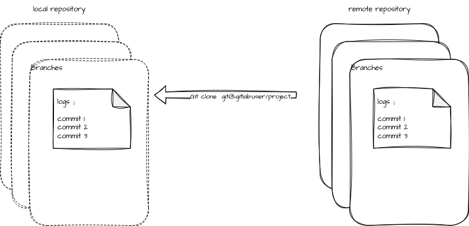
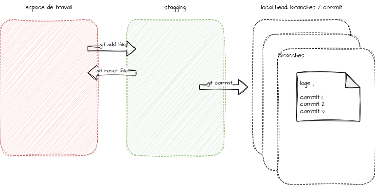
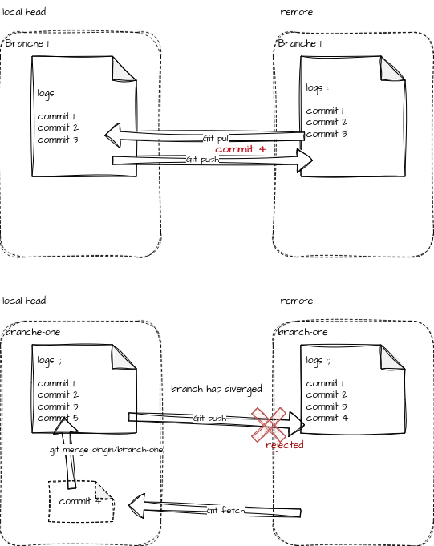
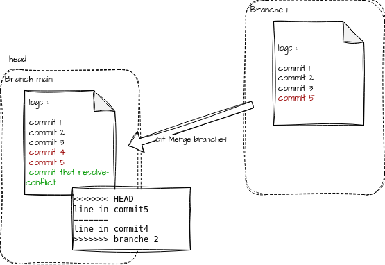

# Git

Git est un outils de gestion de versions de code source trés répandu. Il devient la référence en la matière.

Plusieurs ressources intéressantes :

[la doc git](https://git-scm.com/doc) : le référentiel documentaire sur git avec notamment le chapitre sur [l'intégration de git a votre environnement](https://git-scm.com/book/fr/v2/D%C3%A9marrage-rapide-Installation-de-Git)

[cours open classroom sur git](https://openclassrooms.com/fr/courses/1233741-gerez-vos-codes-source-avec-git) : Un tutoriel pour bien débuter.

[Ho shit git](https://ohshitgit.com/) : ou comment se dépatouiller de certaine situations courantes en quelques commandes git.

[LearnGitBranching](https://learngitbranching.js.org/): apprendre à utiliser les branches git pour les projets collaboratifs.

## Definitions

Un `dépot` git (repository) est une sous arborescence avec plusieurs fichiers (texts principalement) versionnés avec l'outil git.

Une `branche` (branch) est un container de versions du dépot. En changeant de branche, on change de container de versions, `git commit` met à jour le container courant (HEAD).

Un `commit` représente une version de la sous arborescence de la branche courante.

`HEAD` est une référence au dernier commit de la branche courante.

L'espace de preparation du commit (`staging space`) contient l'ensemble des modifications de fichiers à inclure dans le prochain commit c'est celui que l'on modifie avec `git add fichier`

`remote` désigne le serveur git distant.

`origin` désigne votre copie locale du dépot, avec `git fetch` vous mettez à jour origin

`upstream` désigne la copie distante de la branche courante, là ou l'on `push` et depuis là ou on `pull`

## Principe

Un serveur git dispose de toutes les versions courantes et publiées du repository

### Une modification simple de code

On clone le repository pour en disposer localement :

```bash
git clone git@gitlab.com:alsim/opensource.git
```



On effectue des modifications de fichiers dans l'arborescence locale :

* `git status` permet de voir comment git vois ces modifications :
  * les modifications en rouge sont le travail courant
  * les modification en vert sont l'espace de staging : la version en cours de préparation pour le prochain commit
* `git checkout fichier` permet d'annuler tout les modifications effectuées localement sur le fichier fichier (en reprenant la version HEAD)
* `git checkout branch` permet de modifier la branche courante HEAD
* `git add fichier` permet d'ajouter les modifications du fichier fichier dans l'espace de staging (prêtes pour être commité)
* `git rm --cached fichier` permet de retirer les modification sur le fichier fichier de l'espace de staging de la branche courante.
* `git commit` Permet d'ajouter une nouvelle version à la branche courante



### Interaction avec remote

On peut publier une nouvelle version de la branche sur le serveur distant :

```bash
git push 
```

Ou récupérer les modifications effectuées sur la branche distante en local

```bash
git pull
```



Mais dans le cas ou la branche sur le serveur et la branche local divergent, il vous faudra vous remettre en cohérence avec la branche distante avant du `push` votre commit :

* vous metter a jour `origin` avec `git fetch`
* puis vous devrez `merge` la branche remote dans votre branche local : `git merge origin/branche`

### Les workflows

L'outil ne définit pas la méthode!

L'objectif de git est de maitriser l'ensemble des modifications du code. Le fait est que plusieurs personnes travaillent sur le code en même temps et on ne permet pas à tous de modifier la version officielle du code source (la branche appelée main ancienement master) on passe donc par des branches intermédiaires contenants un ensemble de commits que l'on souhaite `merger` au répository officiel via une `pull request` ou une `merge request` suivant les cas.

#### gestion des branches

* `git branch` : permet de lister les branche connues
* `git checkout BrAnCh` : permet de changer de branche, ici on rejoins la branche BrAnCh
* `git checkout -b BrAnCh` : permet de créer une nouvelle branche **en partant de la branche courante** (les versions antérieurs sont conservées)
* `git push --set-upstream origin BrAnCh` : permet de pousser la nouvelle branche sur le serveur. (--set-upstream n'est utile que la première fois car cela défini l'upstream de la branche)

Le `merge` est une opération qui vise à intégrer les modifications effectuées sur une branche dans une autre.
Attention cette opération n'est pas bijective! (merge A dans B n'est la meme chose que merge B dans A) le merge viens créer un nouveau commit sur la branche courante en intégrant les modifications de l'autre branche.  



Un `conflit` est un point de bloquage d'une opération de merge. une même ligne d'un fichier à été modifiée dans deux versions dans chacune des branches source et destination du merge. Git ne peut pas décider de la modification qui prévaut sur l'autre. L'opération de merge automatique échoue nous devons alors résoudre le conflit  

Pour résoudre un conflit il convient d'éditer les fichier en conflit (voir git status) et de modifier les ligne conprise entre  "<<<<<<< HEAD" et ">>>>>>> [l'autre/branche]" afin de garder ce que l'on souhaites retrouver en sortie du merge (la chaine de caractères "=======" sépare les deux versions). Enfin on commit la nouvelle version issue du merge.  

commandes utiles :

* `git merge --abort` : annulation du merge en cours
* `git reset HEAD~` : permet d'annuler le dernier commit localement (donc le merge si s'en est un).

Maintenant plusieurs méthodes/workflow existent et chaque équipe projet définit sa méthode.

Voici une ressources externe qui présente [les pricipaux workflow git](https://medium.com/@OVHUXLabs/la-puissance-des-workflows-git-12e195cafe44)

Je vous recommande le github flow, simple et efficace : une modification de code = une branche.
Chaque branche contient alors une feature ou un fix, le release manager viendra merger l'ensemble des modifications dans une release qui sera déployée ou publiée.
