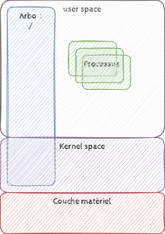
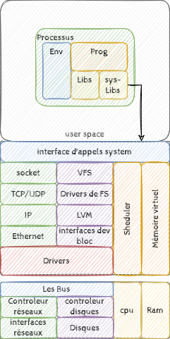

# Rappels GNU/Linux

[toc]

## presentation

Linux est le noyau de système d'exploitation open source le plus utilisé : **GNU/Linux**.
C'est un noyau Unix libre et exécutable sur les architectures x86 et x86_64 (entre autres) alors que les Unix étaient destinés aux ordinateurs professionels (powerPC, SPARCS, Z/system, etc...).

Tout comme GNU, il se base sur les spécifications d'Unix : la norme POSIX

## Quelques principes

* Tout est fichier de l'arborescence
* Tout les fichiers et tout les processus sont associés à un compte utilisateur (et un groupe)
* Tout processus est le fils d'un autre processus (à part le premier : "Init", on en reparlera
* Une aproche modulaire [Faire une seule chose mais la faire bien (et complètement).](https://fr.wikipedia.org/wiki/Philosophie_d%27Unix)
* et enfin : **"UNIX was not designed to stop its users from doing stupid things, as that would also stop them from doing clever things."** En clair vous pouvez faire n'importe quoi quitte à tout casser.

## Un système



On retrouve au dessus la couche matérielle :

* un noyau qui s'exécute en permanence et qui gère toute la couche matérielle
* une arborescence unique contenant tout car tout est fichier.
* un ensemble d'outils dont le shell, init(systemd) et les commandes de la cli

Le noyau c'est Linux, l'ensemble des outils de base est fourni par le projet GNU de RMS et l'arborescance correspond au standard [FHS](./normes.md#FHS)

> le système d'exploitation c'est "**GNU/Linux**" et pas seulement "**Linux**".

## Les bibliothèques partagées

Une grande partie des fonctions exécutés par les commandes et logiciels utilisée sous linux sont identique d'un programme à l'autre, par exemple l'ouverture d'un fichier, la lecture sur l'entrée standard, la gestion des arguments de commandes, ou les algorythmes de compressions etc... Ainsi il n'est pas nécessaire de répèter ces fonctions dans chaque programme. Celle-ci sont compilés et disponible dans des bibliothèques partagés.

Une bibliothèque partagé est un exécutable qui ne dispose pas de fonction "main" : de fonctions d'exécution.

A l'exécution d'une commande, le kernel recherche les bibliothèques paratgées necessaire dans son cache et si absent dans /lib, /usr/lib et dans les dossiers pointé par la variable $LD_LIBRARY_PATH. Ces bibliothèques sont chargées en mémoire leurs API sont alors disponible pour tout les exécutable qui les solicite au travers du kernel et donc bien sur pour la commande initialement lancée.


Nous pouvons distinguer les bibliothèques système qui contiennent les fonctions d'apels système et les autres bibliothèques qui offrent simplement des fonctionalités exemple la bibliothèque `zlib` qui contiens des fonction de compression de données.

### Gestion du cache

La commande `ldconfig` (à passer en tant que  root) permet de mettre à jour le cache de bibliothèques systèmes et les liens syboliques vers les bibliothèques.

Fichiers : /etc/ld.so.cache (donnée binaire), /etc/ld.so.conf : configuration du cache, /etc/ld.so.conf.d/* configuration du cache déposé par les packets

La commande `ldd` inspecte les liaisons sur les programmes exécutables et liste les bibliothèques utilisées par celui-ci ainsi que leurs adresses mémoires, là où celles-ci sont situées pour cet exécutable.

```bash
$ ldd /bin/ls
linux-vdso.so.1 =>  (0x00007ffea7dea000)
libselinux.so.1 => /lib64/libselinux.so.1 (0x00007f97e0238000)
libcap.so.2 => /lib64/libcap.so.2 (0x00007f97e0033000)
libacl.so.1 => /lib64/libacl.so.1 (0x00007f97dfe2a000)
libc.so.6 => /lib64/libc.so.6 (0x00007f97dfa5d000)
libpcre.so.1 => /lib64/libpcre.so.1 (0x00007f97df7fb000)
libdl.so.2 => /lib64/libdl.so.2 (0x00007f97df5f7000)
/lib64/ld-linux-x86-64.so.2 (0x00007f97e045f000)
libattr.so.1 => /lib64/libattr.so.1 (0x00007f97df3f2000)
libpthread.so.0 => /lib64/libpthread.so.0 (0x00007f97df1d6000)
```

## Le kernel

Le kernel gére le matériel offre les api standard utilisé par les interfaces utilisateur. Il est necessaire de choisir du matériel compatible linux, certains composant ne le sont pas (délibérément).

Le kernel est un exécutable modulaire. certains module sont statique (intègré dans le noyau) d'autre sont dit dynamique : le noyau est capable de les charger en mémoire ou de les supprimer si non utilisé. Les drivers matériel sont chargé dynamiquement au boot lors de la découverte du matériel par le noyau.



Chaque composant réprésenté ci dessus est un ou un groupe de modules.

> * A l'initialisation du système le fichier **initrd (init  Ram Disk)** contiens une image minimum de l'arboscence /  contenant les drivers necessaire à l'initialisation.
>   Exemple : les drivers permettant l'accès aux stockage sur disques permettant au kernel de monter l'arborescence '/' au dessus de l'image initrd.
> * Les sources du kernel linux sont disponibles sur <https://www.kernel.org/> et contiennent beaucoup de documentation.

### Paramétrage du kernel

La configuration de run, rémanente (chargée au boot) est situé dans le fichier `/etc/sysctl.conf` mais la configuration courante est visible et modifiable sur l'arboescence dans /proc/sys/.... (avec cat fichier et echo 1 > fichier)

> /proc est accessible via le mountage d'un pseudo filsystem de type `proc` au boot du noyaux et offrant un accès directe a certaine information et fonction du noyau et des drivers
>
> ```bash
> $ mount | grep "/proc "
> proc on /proc type proc (rw,nosuid,nodev,noexec,relatime)
> ```

La configuration statique, les paramètre de compilation  peu en général être consulté dans le fichier config-version_du_noyau du dossier de boot :

```bash
cat /boot/config-`uname -r`
```

### Les modules

Les modules sont des drivers chargeable dans le noyau. ce sont des fichier **Kernel Objects** : `module.ko`

on les retrouve dans l'arbo :

```bash
/lib/modules/`uname -r`/kernel/drivers/*/*
/lib/modules/`uname -r`/update/*/*
```

Commandes de gestion des modules:

* lsmod : liste les modules chargés (/proc/modules)
* insmod : charge un module
* rmmod : supprime un module
* modinfo : retourne les infos sur le module donnée en arguement : Fichier, licences, dépendances, paramètrages

Le fichier /etc/modules et les fichier de /etc/modules.d : listents les modules devant être chargé au démarrage avec leur paramétrage respectifs

> Les kernel headers sont les API du kernel nécessaire à la compilation des modules. Les drivers matériel sont des modules.

### Les devices

Les périphériques matériel sont visible dans l'arborescence /dev, il s'agit là encore d'un pseudo filesystème, cette fois de type devtmpfs

```bash
$ mount | grep "/dev "
udev on /dev type devtmpfs (rw,nosuid,relatime,size=3995144k,nr_inodes=998786,mode=755)
```

Cette arborescence et peuplé durant le boot et contiens les devices découvert par le kernel dans l'ordre de leur découverte.

```bash
$ ls -al /dev/mem /dev/sd* /dev/null /dev/random /dev/console /dev/tty1 /dev/tty2 | sort -r
crw--w---- 1 root tty  4, 2 févr.  8 13:11 /dev/tty2
crw--w---- 1 root tty  4, 1 févr.  8 13:11 /dev/tty1
crw-rw-rw- 1 root root 1, 8 févr.  8 13:11 /dev/random
crw-rw-rw- 1 root root 1, 3 févr.  8 13:11 /dev/null
crw-r----- 1 root kmem 1, 1 févr.  8 13:11 /dev/mem
crw------- 1 root root 5, 1 févr.  8 13:11 /dev/console
brw-rw---- 1 root disk 8, 5 févr.  8 13:11 /dev/sda5
brw-rw---- 1 root disk 8, 2 févr.  8 13:11 /dev/sda2
brw-rw---- 1 root disk 8, 1 févr.  8 13:11 /dev/sda1
brw-rw---- 1 root disk 8, 0 févr.  8 13:11 /dev/sda
```

Le premier caratère, le type de fichier :

* c pour device en mode caratère, périphérique série,
* b pour device en mode bloc pour périphérique en mode parallèle, périphérique de bus.

Aprés les droits le owner et le groupe nous retrouvons le **major number** suivi du **minor number**. La major number défini l'id du driver utilisé, le minor number et le numéro de périphérique découvert sur ce driver.

> les droits sur les fichiers device permettent d'ouvrir ou restreindre les accès à certains périphérique (exemple le groupe audio sur les distribution issues de Debian)

## Une distribution Linux

Une distribution GNU/Linux est conçu par un éditeur logiciel qui intègre une version adapté et compilé du noyau, des outils d'installation et de maintenance et tout un ensemble de logiciel libre ou non en général précompilé. Pour les logiciels libre les code sources est aussi disponible sous forme de package comprenant à la fois les outils de compilation et de packaging.

### Coposants

> Les composant étant en générale compilés, ils ne sont disponibles que pour certaines architectures de processeurs (x86, x86_64, arm, ). On utilise donc une version de la distribution adaptée à l'architecture matériel.

#### Le noyau linux

Il est construit à partir des sources vanilla, souvent ajustée mais surtout avec une configuration spécifique de compilation (en intégrant ou pas certains modules et fonctionalités).
Sur certaine distribution, plusieurs version de kernel sont proposé : faible latence, obtimisée pour une solution de virtualisation, etc ...

#### Un ensemble d'applications

* Les commandes : de la suite logiciel gnu ou de busybox
* Une suite de bibliothèques partagé **compatible**
* des logiciels parfaois interdependants et intégré enbtre eux

#### Les outils **intégré** à la distribution

* Un outil facilitant l'installation du système (pas systématique)
* Un gestionaire de packages logiciel permettant la gestion des logiciels intégrés (installation, désinstallation, mise à jour) et gérant les dépendances et incopatibilités entre les packages
  * dpkg et apt

    ```bash
    $ dpkg -S /bin/ls
    coreutils: /bin/ls
    ```

  * rpm et yum ou dnf

    ```bash
    $ rpm -qf /etc/sudoers
    sudo-1.6.9p13-8.fc9.x86_64
    ```

#### La documentation

La plupart des distributions ajoutent aussi de la documentation en ligne des forums d'échange des dépôt de logiciel en ligne (open source ou non) et un manuel de contribution (comment ajouter des packages)

## Conclusion

Le système GNU linux est un pillier de l'offre technologique "open source".
Savoir gérer un système ou un parc de server sous GNU/linux est aujourd'hui un compétence presque incontournable dans notre métier (l'IT).

Malgré la progression du cloud dans les architectures moderne et la disponibilité de ressources partagés et collaborative en ligne qui répondent au question courantes ; l'administration/l'ingénieurie système reste un poste clef dans la maitrise des infrastructure des système d'information.
