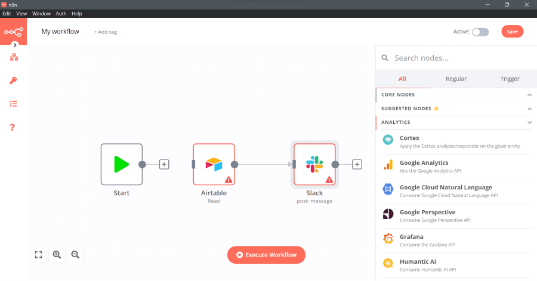

<!-- headingDivider: 3 -->
<!-- paginate: true -->
<!-- colorPreset: sunset -->

# Software delivery life cycle

[TOC]

## Objectif du module
- Aborder les méthodes de software delivery life cycle
- Comprendre l’intérêt de la CICD
- Mesurer la performance de sa CICD
- Connaitre des bases d’architectures de CICD
- Savoir coder une base de CICD

# Introduction à la CICD

[Wooclap](https://app.wooclap.com/events/TKDUTX/questions/64f705f004e2def8ae4011d0)

## Définitions:

### Software delivery life cycle

Le SDLC (Software Development Life Cycle) est un processus qui permet de produire des logiciels de la plus haute qualité et au moindre coût dans les délais les plus courts.

En francais Cycle de développement logiciel

**cadre:**
- agile
- devops

### CI
La CI (Continuous Integration) consiste à intégrer régulièrement et automatiquement le code source des développeurs dans un référentiel commun. À chaque modification du code, des tests automatisés sont exécutés pour détecter les erreurs le plus tôt possible.

---
- Automatisation des tests
- Automatisation de la supply chain
- Automatisation de la revue de code

### Supply chain
Code pour construire un logicel
- [`Taskfile`](https://taskfile.dev)
- [`nix`](https://nixos.org/)
- `cmake`/`make`

### CD
- automatisation du delivery
- automatisation du déploiement

---

Dans le Continuous Delivery, les versions sont prêtes à être déployées, mais elles ne le sont pas automatiquement.

### Une image vaut mieux que milles mots:


## QQOQCCP

| Quoi | La CICD est une approche d'automatisation des processus de développement logiciel. |
| --- | --- |
| Qui | Elle implique les développeurs, les testeurs, et des outils automatisés. |
| Où | Elle peut être utilisée dans tout environnement de développement. |
| Quand | Elle est appliquée tout au long du cycle de développement. |
| Comment | Elle automatise les tâches de compilation, de tests, de déploiement, et de gestion des retours. |
| Pourquoi | Elle vise à améliorer la qualité, à accélérer le développement, à réduire les erreurs, à favoriser la collaboration, et à permettre des déploiements fréquents. |

## 5 Pourquoi de la CICD

- Méthode gestion de projet qui permet de trouver des solutions radicales à un problème.
- La CICD est une solution radicale.

### Stabilité

**Problème : Les déploiements échouent fréquemment en production.**

1. Pourquoi les déploiements échouent-ils en production ?

### Sécurité

**Problème : Nous avons trop de failles de sécurité en production.**

## Aussi

- Automatiser le labeur: `#DEVOPS` 🌻
- Faire des économies d’échelles 🪜
- Réduire le stress 🧘‍♂️

## Les entités

- Culture: Devops
- Managment agile: Train des releases
- Code: Software Development Life Cycle
- Platforme: Forge logicielle (gitlab ou l’autre)
- Artisanat: `Humains + Outils = 🤟`

# DEVOPS 💓 CICD

- Une pratique profondément devops
- Automatiser le labeur: #DEVOPS 🌻
- Gestion collective du non fonctionnel
- Tester tout ce qui peut être testé

## Le non fonctionnel
- Une spécification: RFC ISO 25 010
- ISQTB 


## KPIs

> Ça marche pas, ça va pas assez vite, c’est cassé.

---


[source](https://www.youtube.com/watch?v=bxDsQ6LlNDE)

---

- Les chefs ne savent pas ce qui est bon pour le non fonctionnel
- Une alternative à ces injonctions non factuelles
- ⚠️ les KPIs peuvent devenir un outil de pressions sur les équipes:
  Les faits, ne sont pas des objectifs.

### Mes KPIs prefs 🔑

- Facteur d’automation
- Dette technique
- Couverture de code
- Taux de CVE
- Taux d'échec aux tests automatisés

### DORA metrics

1. Fréquence de déploiement
2. Délai d’exécution des changements
3. Temps moyen de récupération
4. Taux d’échec des changements

[Use Four Keys metrics like change failure rate to measure your DevOps performance | Google Cloud Blog](https://cloud.google.com/blog/products/devops-sre/using-the-four-keys-to-measure-your-devops-performance?hl=en)

---


# Architecture d’une CICD 🏗️

## Géographie de la CICD 🗺️

- local à votre machine de dev (sur linux, ou autre)
- Forge logicielle: gitlab, et les autre…
- Outils externes: sonarqube, argo-cd,

## Temporalité de la CICD 🕐

*Software Development Life Cycle (SDLC)*


[CI/CD — 10000ft flight height - The Standard Documentation](https://std.divnix.com/patterns/ci-cd-10000-feet.html)

### 4 Steps


---

1. Linting:
    La phase de linting permet de s'assurer que la base de code est en bon état. Cela peut impliquer la vérification du formatage, du style et du code généré automatiquement.
 ---
2. Building
    Les builds doivent a mon sens respecter ces propriétés:    
    - Idempotence
    - Économe
    - Rapide
---

3. Deployment:
    - **[Push vs Pull Workflows](https://std.divnix.com/patterns/ci-cd-10000-feet.html#push-vs-pull-workflows):**
        
        
        | Outil | méthode | Description |
        | --- | --- | --- |
        | Ansible | ⬇️ | Le code et les opérations sont envoyées en production depuis une machine cliente utilisant ssh |
        | ArgoCD | ⬆️ | Le server ARGO CD vient écouter votre forge logicielle affin  |
---

4. **[Probing & Attestation Phase](https://std.divnix.com/patterns/ci-cd-10000-feet.html#probing--attestation-phase):**

## Monorepo vs polyrepo

- L’organisation des repos, est un points crucial de votre CICD.
- En découpant ou non des projets, vous allez vous faciliter ou pas la mise en place de certain*e*s outils, pratiques…

### Polyrepo

- Avantages:    
    1. Isolation et indépendance entre les projets.
    2. Gestion facilitée des référentiels individuels.
    3. Performances et évolutivité améliorées, mais maintenance complexe.
- Inconvénients :
    1. Coordination entre les projets plus difficile.
    2. Risque d'incohérence, de divergence.
    3. Maintenance fastidieuse avec plusieurs référentiels.

## Monorepo
- Avantages
    1. Facilité de collaboration et partage de code.
    2. Gestion centralisée des versions et de la sécurité.
    3. Possibilité de conflits de fusion et de dépendances complexes.
- Inconvenants:
    1. Risque de conflits de fusion fréquents.
    2. Les erreurs dans un projet peuvent affecter l'ensemble.
    3. Gestion plus complexe avec une taille croissante.

### Comment découper ?

- [Team topology](https://teamtopologies.com/)
    - Les projets ressembles aux équipes:
       - Si CICD est une responsabilité partagé ➡️ monorepo
       - Si chaque équipe possède ses propres devops *(dev ou ops)* ➡️ alors polyrepo

### Et pour la CICD

- Monorepo de CICD:    
    
---

- Pratique pour commencer le travail de normalisation de la CICD.
- Rien n’est spécial, ou spécifique (du moins au début)
- Permet d’économiser du temps et de factoriser le code de CI
- Attention au couplage

---

- Polyrepo de CICD:
    
---
- Les 2:
    

## Versiong flow 🏷️

### Gitlab flow 🦊


### Github flow 🤖


### ~~Git flow 💀~~

- Branche de versions, branches de hotfix, cherry-pick
- Celui la il est cancel
- C’était historiquement une bonne pratique, mais il est cependant lourd et incompatible avec l’intégration continue.

# Méthodes 📚

## Agilité

- CICD est profondément agile et permet de rentre souple évident et chiffrable le coût de la qualité d’un logiciel

[Rôle Du RTE (Release Train Engineer) Dans Le Framework SAFe - Blog Du Scrum Master](https://scrum-master.org/role-rte-release-train-engineer-safe/)

## Nommage

> *****Mal nommer un objet, c’est ajouter au malheur de ce monde.
Albert Camus*****
> 

---

- Un nom pour une chose

---

- Discours:
    
    | Type de mots | Type de concepts | Exemples |    
    | Noms communs | Objets et Valeurs primitives. | user, accountNumber, customerEmail |
    | --- | --- | --- |
    | Verbes | Fonctions, méthodes | user.login(), shutDown() |
    | Adjectifs | booléens | allowed, disabled |
---

- Ne pas faire d’abréviations

---

- Doit être prononçable

---

- Le faire à plusieurs: bi-nommage

---

- Ne pas réutiliser de noms

## Gitops

[gitops](https://about.gitlab.com/topics/gitops/)

---

- Gestions des environnements d’exploitation depuis git

---

- Entités
    - IAC
    - Merge requests
    - CICD
---



## Revue de code par les paires

### Merge request 🎓 vs pull request

- merge request:
    - gitlab
- pull request:
    - github

---




### Commentaires de merge request

- Structure de commentaire de revue de code (c’est cool)

[Conventional Comments](https://conventionalcomments.org/)

### Environnement de review

- Environnements d’exploitation à la demande
- Vide ou avec de la donnée
- Les containers et kubernetes sont des outils parfait pour en faire !

## Releases

### Commits

- conventional commits: Soyez fier de vos commits:

[Conventional Commits](https://www.conventionalcommits.org/en/v1.0.0/)


### Versions

- semver 💕: `v1.2.3`
- il marche avec des outils de l’écosystème libre
- Il indique un état du logiciel: breaking change/majeur/minueur

[Semantic Versioning 2.0.0](https://semver.org/)

### Changelogs

- Conventional changelog: `CHANGELOG.md`

### Releases

- Conventional releases ❤️‍🔥
    - Changelog automatique
    - tag git automatique
    - Publication automatique de vos:
        - containers
        - packages

## Release train


### RACI

**Tableau RACI possible pour l'Environnement Localhost développement :**

| Tâche / Responsabilité | Responsable (R) | Responsable de Validation (A) | Consulté (C) | Informé (I) |
| --- | --- | --- | --- | --- |
| Coding | Développeur |  | Hook |  |
| Linting | Développeur | Hook |  |  |
| Building | Développeur | Hook |  |  |
| Deploying | Développeur | Hook |  |  |
| Probing | Développeur | Hook |  |  |
| Commiting | Développeur | Hook |  |  |

---

**Tableau RACI possible pour l'Environnement Review:**

| Tâche / Responsabilité | Responsable (R) | Responsable de Validation (A) | Consulté (C) | Informé (I) |
| --- | --- | --- | --- | --- |
| Linting | Développeur | Pipeline | Ops |  |
| Building | Ops, Développeur | Pipeline | Ops |  |
| Deploying | Ops, Développeur | Pipeline | Équipe Produit, Équipe Qualité, Ops |  |
| Probing | Manager, Équipe Qualité, Équipe Produit | Manager, Équipe Qualité, Équipe Produit | Opérations, Développeurs, Ops |  |

---

**Tableau RACI possible pour l'Environnement Staging:**

| Tâche / Responsabilité | Responsable (R) | Responsable de Validation (A) | Consulté (C) | Informé (I) |
| --- | --- | --- | --- | --- |
| Linting | Ops | Pipeline |  |  |
| Building | Ops, Développeur | Pipeline |  |  |
| Deploying | Ops, Développeur | Pipeline | Équipe Produit, Équipe Qualité |  |
| Probing | Opérations, Chefs Techniques, Équipe Produit | Ops, Chefs 
Techniques, Équipe Qualité, Équipe Produit | Développeurs |  |

---

**Tableau RACI possible pour l'Environnement Production:**

| Tâche / Responsabilité | Responsable (R) | Responsable de Validation (A) | Consulté (C) | Informé (I) |
| --- | --- | --- | --- | --- |
| Linting | Développeur, Ops | Pipeline | Équipe Qualité | Tous les membres de l'équipe |
| Building | Ops, Développeur | Pipeline | Équipe Qualité | Tous les membres de l'équipe |
| Deploying | Ops, Développeur | Pipeline | Équipe Produit, Équipe Qualité | Tous les membres de l'équipe |
| Probing | Opérations, Chefs Techniques, Équipe Qualité, Équipe Produit | Opérations, Chefs Techniques, Équipe Qualité, Équipe Produit | Pipeline | Tous les membres de l'équipe |

---

- **Shift left**: Ramener la pipeline le plus à gauche possible

## Votre rôle dans tout ça

- Promouvoir les bonnes pratiques
- Développer des automatisations à intégrer dans les hooks, pipelines
- Maintenir les existants

# Shell

- Un pti rappel
- Utilisez `bash`, c'est une bonne glue

## Bases

```bash
if [[ "${VARIABLE}" == "true" ]]; then
else
	printf "You disabled option: %s\n" "${VARIABLE}"
fi
```

## Mes bonnes pratiques `shell`

- ranger vos scripts dans le dossier `./scripts`
- ne mettez pas d’extensions `.sh` sur les fichiers exécutables
    
    ```bash
    chmod +x ./script/build-translations.sh
    mv ./script/build-translations.sh ./script/build-translations
    ```
    

### Les `set`

```bash
set -o errexit # NOTE: abort on nonzero exitstatus
set -o nounset # NOTE: abort on unbound variable
set -o pipefail # NOTE: don't hide errors within pipes

#NOTE: Permet de debug vos 
set -x
```

### Les variables

globales:

- `SNAKE_CASE_CAPITAL`
- `read only`
- utilisez le mot clef `declare`
- Utilisez la syntaxe `"${1}"`

```bash
#NOTE: read only, global, exported
declare -rgx MY_VARIABLE=''
```

### Shebang

```bash
#!/usr/bin/env bash
```

### Fonctions

- Faites des fonctions
- et un `main`: permet de vérifier que le code est valide avant de exécuter
- Utilisez des variables locales

```bash
enable_debug() {
  set -x
}

main() {
	local -r is_debug="${1}"

  if [[ is_debug == "true" ]]; then
		enable_debug
	fi
}

main "${@}"
```

## Un exemple de script cool

- non, la flemme, faites une contribution au repo

### Styleguide et bonnes documentations

- [Google Best practices](https://google.github.io/styleguide/shellguide.html)
- [bash good practices](https://bertvv.github.io/cheat-sheets/Bash.html)
- [Good Documentation](https://tldp.org/LDP/abs/html/abs-guide.html%29)

### Ma stack de dev `shell`

- https://github.com/koalaman/shellcheck: linter
- https://github.com/bats-core/bats-core: des tests avec du shell
- https://github.com/mvdan/sh: formater de code shell
- https://github.com/go-task/task: une alternative moderne aux `Makefile`
    - parallélisation des taches de scripts
    - cache
    - lecture de configurations
- https://github.com/dotenv-linter/dotenv-linter: linter de fichiers `dotenv` (`.env`, `.env.local`)

# Outils

## git 🏷️

Un indispensable.

---
- En cas de trous de mémoire

```bash
tldr git commit

  Commit files to the repository.
  More information: <https://git-scm.com/docs/git-commit>.

  Commit staged files to the repository with a message:

      git commit --message "message"

  Commit staged files with a message read from a file:

      git commit --file path/to/commit_message_file
...
```

[`tldr`](https://github.com/dbrgn/tealdeer)

---

En cas de besoin 🤮:

- https://github.com/nirvdrum/svn2git

## git hooks 🪝

1. [lefthook](https://github.com/evilmartians/lefthook): **agnostique**
2. [pre-commit](https://github.com/pre-commit/pre-commit): **agnostique mais compliqué**

## gitlab-ci 🦊

- Travaux pratiques

## nix ❄️

[Flakes - NixOS Wiki](https://nixos.wiki/wiki/Flakes)

Il y a eu docker 🐋, maintenant c’est nix ❄️

## Renovate bot

[Mend Renovate: Automated Dependency Updates](https://www.mend.io/renovate/)

## Semantic release

- gestion des releases automatiques

https://github.com/semantic-release/semantic-release

## Review dog


https://github.com/reviewdog/reviewdog

## Fuid attack Sast

[SAST | Products | Fluid Attacks](https://fluidattacks.com/product/sast/)

## Aqua security - trivy

https://github.com/aquasecurity/trivy

- Scan CVE pour les containers
- Scan de cluster kubernetes

## Hors sujet *(vraiment ?)*

- ⚠️ Attention certains de ces services sont partiellement libre (*autrement dit pas du tout*)
    - Généralisation des méthodes de CICD

### Chromatic:


https://github.com/chromaui/chromatic-cli

### Bitebase


https://github.com/bytebase/bytebase

### Lokalise


https://github.com/lokalise/lokalise-cli-2-go


### n8n et le `#NOCODE`
- open source
- outil permettant décrire des automatisations graphiquement

---


https://n8n.io/

---

- nouveau nom pour un truc qui existe déjà
- Moyen de palier au manque de développeurs
- standardisation des APIs
- S'appuie sur des lambdas

---

- Facile à mettre en place
- Attention à la sécurité 🔐

# Bonnes pratiques à la con 🤯

- Dans vos scripts `shell` utilisez les flags en complet:
  `-h` *moins bien que* `--help`

---

- Immuable ❤️ (rust, nix, containers, read only):
    - n’utilisez que des constantes autant que possible (`declare -r SECRET=toto`)

---

- Se méfier de ceux qui aiment la performance
    - Contexte formel à la perf, faire du code obscur pour justifier la perf c’est de obscurantiste

---

- Shift left
- Automatisez # Devops

---

- qui quoi quand: personne rien jamais
    - containers
    - kube
    - Les lamdbas
    - wasm
    - processus
---

- Ne codez pas vous meme vos parsers:
    - Les Injections SQL
    - Les buffer overflows

---

- Ne codez pas vous meme vos chiffrements:
    - Parler de la faille openSSL de noel

---

- Codez vous même

---

- Ne faites pas de C de manière non pédagogique

---

- Buy, install, or build

---

- faites du `rust`/`GO`
