# Monitoring & Observability

<!-- vale off -->

- auto-gen TOC;
  {:toc}

<!-- vale on -->

______________________________________________________________________

## Module Objective

<!-- header: 'Monitoring & Observability Course' -->

<!-- footer: 'Julien Dauliac -- ynov.casualty925@passfwd.com' -->

<!-- headingDivider: 3 -->

<!-- colorPreset: sunset -->

<!-- paginate: true -->

- Understand the difference between monitoring and observability
- Master the three pillars: logs, metrics, traces
- Learn OpenTelemetry as the industry standard
- Know how to write actionable errors and structured logs
- Discover modern tooling: Vector, new compression, columnar formats
- Design a production-grade observability stack

## Monitoring vs Observability

### Monitoring

> Monitoring tells you **when** something is wrong.

- Predefined dashboards and alerts
- Known-unknowns: you know what to watch
- Reactive: fires alerts after thresholds are breached

### Observability

> Observability tells you **why** something is wrong.

- Explore any dimension of your system on the fly
- Unknown-unknowns: you can ask new questions without deploying new code
- Proactive: enables debugging without prior instrumentation for every case

______________________________________________________________________

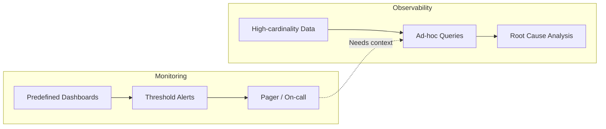
```mermaid
graph LR
    subgraph Monitoring
        A[Predefined Dashboards] --> B[Threshold Alerts]
        B --> C[Pager / On-call]
    end
    subgraph Observability
        D[High-cardinality Data] --> E[Ad-hoc Queries]
        E --> F[Root Cause Analysis]
    end
    C -.->|Needs context| E
```

______________________________________________________________________

### You Always Need Observability

A common misconception is that simple systems only need monitoring. In reality, **every production system benefits from observability** -- the difference is the depth required.

| System type | Observability depth | Why |
| --- | --- | --- |
| Monolith, single DB | Logs + metrics + basic traces | Even monoliths have slow queries, memory leaks, and unexpected user behavior. "Few moving parts" doesn't mean "no unknowns". |
| Microservices | Full stack (logs, metrics, traces, profiling) | Requests fan out, failures cascade, latency compounds across hops |
| Event-driven / async | Full stack + message tracing | No single request path to follow, messages can be lost or reprocessed silently |
| Serverless / FaaS | Full stack + cold start tracking | Ephemeral, distributed, cold starts, vendor-specific failure modes |

> **The question is never "do I need observability?" -- it's "how deep does my observability need to go?"** A monolith that handles payments needs the same rigor as a microservices platform. The architecture doesn't determine the need; the **business criticality** does.

## The Three Pillars

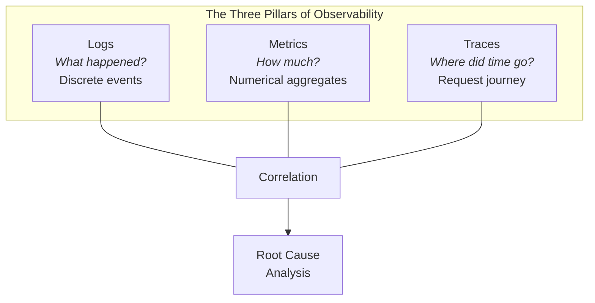
```mermaid
graph TB
    subgraph Observability["The Three Pillars of Observability"]
        direction LR
        L["Logs<br/><i>What happened?</i><br/>Discrete events"]
        M["Metrics<br/><i>How much?</i><br/>Numerical aggregates"]
        T["Traces<br/><i>Where did time go?</i><br/>Request journey"]
    end
    L --- C[Correlation]
    M --- C
    T --- C
    C --> R["Root Cause<br/>Analysis"]
```

______________________________________________________________________

### Quick Comparison

| Aspect | Logs | Metrics | Traces |
| --- | --- | --- | --- |
| **Data model** | Timestamped text/JSON event | Numeric time series | DAG of spans |
| **Cardinality** | Very high | Low to medium | High |
| **Storage cost** | Expensive | Cheap | Medium |
| **Best for** | Debugging, audit trails | Alerting, dashboards, SLOs | Latency, dependencies |
| **Retention** | Days to weeks | Months to years | Days |
| **Sampling** | Rarely | N/A | Almost always |

# Logs

## What Makes a Good Log?

A good log is:

1. **Structured**: machine-parseable (JSON, not free text)
2. **Contextual**: carries correlation IDs, user IDs, request IDs
3. **Leveled**: uses the right severity
4. **Actionable**: helps a human or machine take the next step
5. **Safe**: never leaks secrets, PII, or tokens

______________________________________________________________________

### Log Levels: Use Them Right

| Level | When to use | Example |
| --- | --- | --- |
| `TRACE` | Framework internals, never in prod | `Entering parser state HEADER_VALUE` |
| `DEBUG` | Developer troubleshooting | `Cache miss for key user:42` |
| `INFO` | Normal business events | `Order 123 created, 3 items, total=59.90` |
| `WARN` | Degraded but recoverable | `Retry 2/3 for payment gateway timeout` |
| `ERROR` | Failed operation, needs attention | `Payment failed: card declined, orderId=123` |
| `FATAL` | Process cannot continue | `Database connection pool exhausted, shutting down` |

______________________________________________________________________

### Structured vs Unstructured

**Bad** (unstructured):

```
2024-03-15 10:23:45 ERROR Failed to process order 42 for user john@example.com
```

Problems: hard to parse, contains PII (email), no correlation ID, no stack trace.

**Good** (structured JSON):

```json
{
  "timestamp": "2024-03-15T10:23:45.123Z",
  "level": "ERROR",
  "logger": "com.app.OrderService",
  "message": "Order processing failed",
  "correlationId": "abc-123-def",
  "orderId": 42,
  "userId": "usr_k8x2p",
  "error": {
    "type": "PaymentDeclinedException",
    "message": "Card declined by issuer",
    "code": "CARD_DECLINED"
  },
  "spanId": "7a3f2b1c",
  "traceId": "4bf92f3577b34da6a3ce929d0e0e4736"
}
```

## How to Write Good Errors

> An error message should answer: **What happened, why, and what can the user/operator do about it?**

### Why This Matters: The Alert Fatigue Death Spiral

Bad error messages are not just annoying -- they **directly cause incidents**. Here's the mechanism:

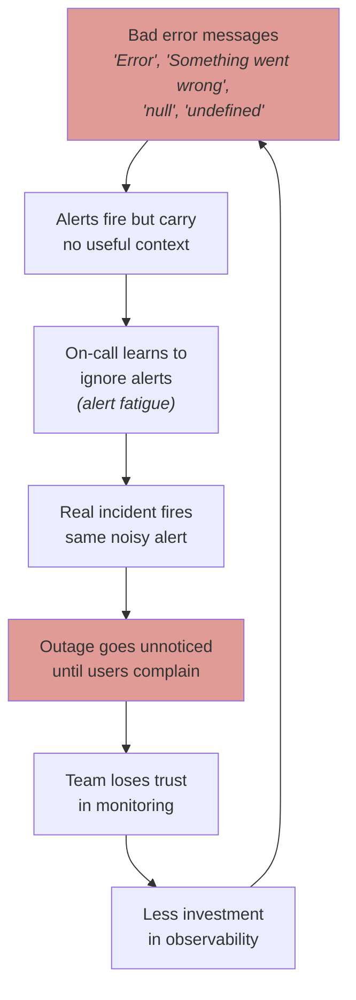
```mermaid
graph TB
    BAD["Bad error messages<br/><i>'Error', 'Something went wrong',<br/>'null', 'undefined'</i>"] --> NOISE["Alerts fire but carry<br/>no useful context"]
    NOISE --> IGNORE["On-call learns to<br/>ignore alerts<br/><i>(alert fatigue)</i>"]
    IGNORE --> MISS["Real incident fires<br/>same noisy alert"]
    MISS --> OUTAGE["Outage goes unnoticed<br/>until users complain"]
    OUTAGE --> TRUST["Team loses trust<br/>in monitoring"]
    TRUST --> LESS["Less investment<br/>in observability"]
    LESS --> BAD

    style BAD fill:#e09b96
    style OUTAGE fill:#e09b96
```

**Alert fatigue** is the #1 killer of on-call effectiveness. Studies show that when more than 30% of alerts are non-actionable, engineers start ignoring **all** alerts -- including the real ones.

The fix starts at the source: **every error message must be clear enough that the person reading it at 3 AM knows exactly what to do.** If your error says `"Error"`, the on-call engineer has to investigate from scratch every time. If it says `"Payment gateway timeout after 5s, circuit breaker open, check stripe status page"`, they know what to do in seconds.

| Error quality | On-call experience | Result |
| --- | --- | --- |
| `"Error"` | Investigate 20 min, find nothing, dismiss | Alert fatigue builds |
| `"Connection refused"` | Investigate 10 min, narrow it down | Slow but works |
| `"DB 'orders' at db.internal:5432 connection refused: pool exhausted (20/20), all busy >30s. Scale pool or check slow queries."` | Read, act, resolve in 2 min | Trust in alerts grows |

> **Good errors reduce mean time to recovery (MTTR). Bad errors increase mean time to acknowledge (MTTA) -- because nobody wants to look at them anymore.**

### The Three Laws of Error Messages

______________________________________________________________________

**1. State what happened (fact)**

```
BAD:  "Error"
BAD:  "Something went wrong"
GOOD: "Failed to connect to database 'orders' at db.internal:5432"
```

______________________________________________________________________

**2. Explain why (context)**

```
BAD:  "Connection refused"
GOOD: "Connection refused: max pool size (20) reached, all connections busy for >30s"
```

______________________________________________________________________

**3. Suggest what to do (action)**

```
BAD:  "Timeout"
GOOD: "Request to payment-service timed out after 5s. Check payment-service health at /healthz or increase timeout via PAYMENT_TIMEOUT_MS"
```

### Error Anatomy

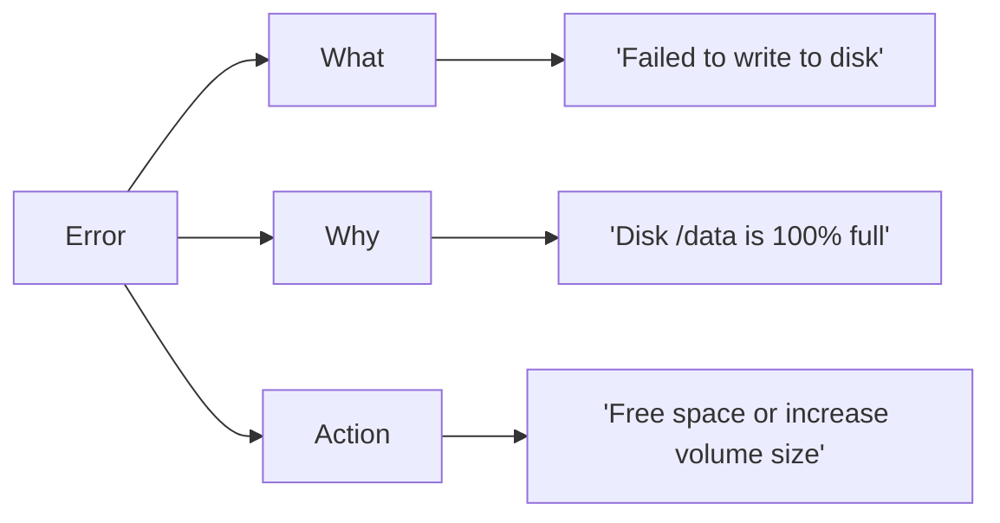
```mermaid
graph LR
    E[Error] --> W[What]
    E --> Y[Why]
    E --> A[Action]
    W --> W1["'Failed to write to disk'"]
    Y --> Y1["'Disk /data is 100% full'"]
    A --> A1["'Free space or increase volume size'"]
```

______________________________________________________________________

### Error Patterns by Audience

| Audience | What they need | Example |
| --- | --- | --- |
| End user | Friendly, no internals | `"We couldn't process your payment. Please try again or use a different card."` |
| API consumer | Machine-readable, error code | `{"error": "INSUFFICIENT_FUNDS", "message": "...", "retryable": false}` |
| Operator / SRE | Full context, correlation IDs | `"PaymentGateway.charge failed: HTTP 503 from stripe.com, traceId=abc, retry 3/3 exhausted"` |
| Developer | Stack trace, local state | Full exception with stack trace in DEBUG logs |

### Error Anti-patterns

- **Swallowing exceptions**: catching errors and doing nothing
- **Logging and throwing**: creates duplicate noise
- **Generic messages**: `"An error occurred"` tells nobody anything
- **Leaking internals to users**: stack traces in API responses
- **Missing error codes**: forces consumers to parse human text
- **Not distinguishing retryable vs permanent failures**

### Rust: Error Handling Done Right

Rust takes a radically different approach to errors: **no exceptions**. Every fallible function returns `Result<T, E>` where `T` is the success type and `E` is an error enum. This makes errors **explicit, typed, and exhaustively handled** at compile time.

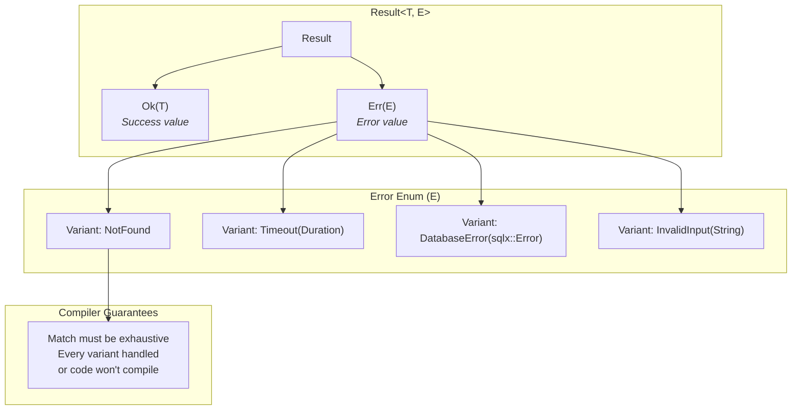
```mermaid
graph TB
    subgraph "Result&lt;T, E&gt;"
        R["Result"] --> OK["Ok(T)<br/><i>Success value</i>"]
        R --> ERR["Err(E)<br/><i>Error value</i>"]
    end

    subgraph "Error Enum (E)"
        ERR --> V1["Variant: NotFound"]
        ERR --> V2["Variant: Timeout(Duration)"]
        ERR --> V3["Variant: DatabaseError(sqlx::Error)"]
        ERR --> V4["Variant: InvalidInput(String)"]
    end

    subgraph "Compiler Guarantees"
        V1 --> CG["Match must be exhaustive<br/>Every variant handled<br/>or code won't compile"]
    end
```

______________________________________________________________________

#### The `Result<T, E>` Pattern

```rust
// Every error variant is an explicit, documented possibility
enum OrderError {
    NotFound(OrderId),
    PaymentDeclined { reason: String, retryable: bool },
    InsufficientStock { product_id: u64, available: u32, requested: u32 },
    DatabaseError(sqlx::Error),
    Timeout { service: String, duration: std::time::Duration },
}

// The function signature tells you EXACTLY what can go wrong
fn create_order(request: CreateOrderRequest) -> Result<Order, OrderError> {
    let stock = check_stock(&request.items)
        .map_err(|e| OrderError::InsufficientStock {
            product_id: e.product_id,
            available: e.available,
            requested: e.requested,
        })?;  // ? propagates errors up the call chain

    let payment = charge_card(&request.payment)
        .map_err(|e| OrderError::PaymentDeclined {
            reason: e.to_string(),
            retryable: e.is_retryable(),
        })?;

    Ok(Order::new(stock, payment))
}
```

______________________________________________________________________

#### Exhaustive Matching: The Compiler as Safety Net

```rust
// The compiler FORCES you to handle every variant.
// Add a new variant? Every match in the codebase must be updated.
fn handle_order_error(err: OrderError) -> HttpResponse {
    match err {
        OrderError::NotFound(id) =>
            HttpResponse::not_found(format!("Order {id} not found")),

        OrderError::PaymentDeclined { reason, retryable } => {
            if retryable {
                HttpResponse::service_unavailable("Payment failed, please retry")
            } else {
                HttpResponse::bad_request(format!("Payment declined: {reason}"))
            }
        }

        OrderError::InsufficientStock { product_id, available, requested } =>
            HttpResponse::conflict(
                format!("Product {product_id}: {available} available, {requested} requested")
            ),

        OrderError::DatabaseError(e) => {
            tracing::error!(?e, "Database error"); // log internals
            HttpResponse::internal_error("Internal error") // hide from user
        }

        OrderError::Timeout { service, duration } => {
            tracing::warn!(%service, ?duration, "Service timeout");
            HttpResponse::gateway_timeout(
                format!("{service} did not respond within {duration:?}")
            )
        }
    }
    // Try commenting out any arm above: the compiler refuses to build.
}
```

______________________________________________________________________

#### [`thiserror`](https://docs.rs/thiserror): Derive Error Boilerplate Away

[`thiserror`](https://github.com/dtolnay/thiserror) auto-generates `Display` and `Error` trait implementations from your enum, keeping error definitions concise:

```rust
use thiserror::Error;

#[derive(Debug, Error)]
enum OrderError {
    #[error("Order {0} not found")]
    NotFound(OrderId),

    #[error("Payment declined: {reason}")]
    PaymentDeclined { reason: String, retryable: bool },

    #[error("Insufficient stock for product {product_id}: {available} available, {requested} requested")]
    InsufficientStock {
        product_id: u64,
        available: u32,
        requested: u32,
    },

    #[error("Database error")]
    DatabaseError(#[from] sqlx::Error),  // auto-converts sqlx::Error via From trait

    #[error("{service} timed out after {duration:?}")]
    Timeout {
        service: String,
        duration: std::time::Duration,
    },
}
```

The `#[from]` attribute auto-implements `From<sqlx::Error>` for `OrderError`, so `?` converts automatically.

______________________________________________________________________

#### Error Composition Across Layers

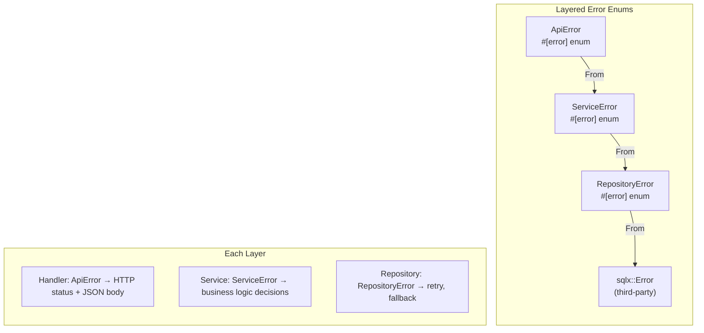
```mermaid
graph TB
    subgraph "Layered Error Enums"
        direction TB
        API["ApiError<br/>#[error] enum"] -->|"From"| SVC["ServiceError<br/>#[error] enum"]
        SVC -->|"From"| REPO["RepositoryError<br/>#[error] enum"]
        REPO -->|"From"| DB["sqlx::Error<br/>(third-party)"]
    end

    subgraph "Each Layer"
        direction TB
        L1["Handler: ApiError → HTTP status + JSON body"]
        L2["Service: ServiceError → business logic decisions"]
        L3["Repository: RepositoryError → retry, fallback"]
    end

    API ~~~ L1
    SVC ~~~ L2
    REPO ~~~ L3
```

Each layer defines its **own error enum** and converts from the layer below using `#[from]`. This gives each layer the right abstraction level: the HTTP handler doesn't know about `sqlx::Error`, it knows about `ApiError::InternalError`.

______________________________________________________________________

#### Why This Pattern Matters for Observability

| Benefit | How it helps |
| --- | --- |
| **No hidden failures** | Every error path is visible in the type signature |
| **Structured by default** | Error variants carry typed fields, not free-text |
| **Retryable vs permanent** | Model it as a field on the variant |
| **Easy to log** | `#[derive(Debug)]` + `tracing::error!(?err)` gives structured output |
| **Easy to metric** | Match on variant to increment the right counter |
| **Compile-time exhaustiveness** | Add a new failure mode, compiler shows every place to update |

> **Takeaway**: Rust's `Result` + enum errors + `thiserror` is the gold standard for error handling. Even in other languages, **model your errors as typed variants, not exception hierarchies or string messages**.

# Metrics

## Types of Metrics

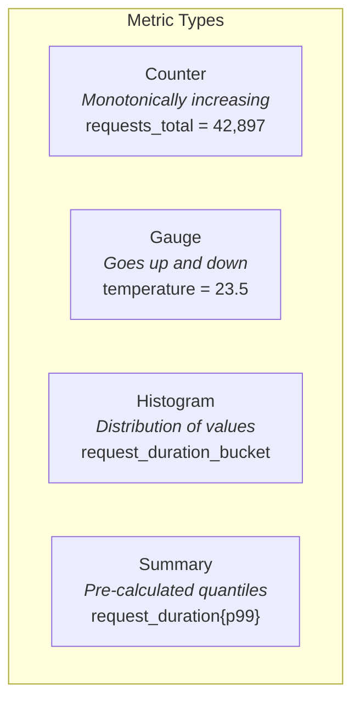
```mermaid
graph TB
    subgraph "Metric Types"
        direction LR
        C["Counter<br/><i>Monotonically increasing</i><br/>requests_total = 42,897"]
        G["Gauge<br/><i>Goes up and down</i><br/>temperature = 23.5"]
        H["Histogram<br/><i>Distribution of values</i><br/>request_duration_bucket"]
        S["Summary<br/><i>Pre-calculated quantiles</i><br/>request_duration{p99}"]
    end
```

______________________________________________________________________

### When to Use What

| Type | Use case | Example |
| --- | --- | --- |
| Counter | Cumulative events | `http_requests_total`, `errors_total` |
| Gauge | Current state | `cpu_usage`, `queue_depth`, `active_connections` |
| Histogram | Latency distribution, server-side aggregation | `http_request_duration_seconds` |
| Summary | Latency quantiles, client-side calculation | `rpc_duration_seconds{quantile="0.99"}` |

### The Four Golden Signals (Google SRE)

> If you can only measure four things, measure these.

1. **Latency**: How long requests take (distinguish success vs error latency)
2. **Traffic**: How much demand (requests/sec, messages/sec)
3. **Errors**: Rate of failed requests (explicit 5xx, implicit wrong results)
4. **Saturation**: How "full" is the system (CPU, memory, queue depth)

______________________________________________________________________

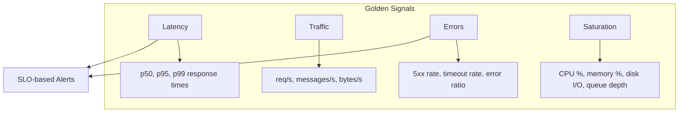
```mermaid
graph TB
    subgraph "Golden Signals"
        direction TB
        LA[Latency] --> D1["p50, p95, p99 response times"]
        TR[Traffic] --> D2["req/s, messages/s, bytes/s"]
        ER[Errors] --> D3["5xx rate, timeout rate, error ratio"]
        SA[Saturation] --> D4["CPU %, memory %, disk I/O, queue depth"]
    end
    LA --> ALERT[SLO-based Alerts]
    ER --> ALERT
```

### RED and USE Methods

**RED** (for request-driven services):

- **R**ate: requests per second
- **E**rrors: failed requests per second
- **D**uration: latency percentiles

**USE** (for resources like CPU, disk, network):

- **U**tilization: % time the resource is busy
- **S**aturation: queue depth (extra work waiting)
- **E**rrors: error event count

### SLIs, SLOs, SLAs

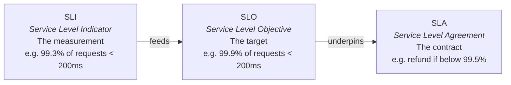
```mermaid
graph LR
    SLI["SLI<br/><i>Service Level Indicator</i><br/>The measurement<br/>e.g. 99.3% of requests < 200ms"]
    SLO["SLO<br/><i>Service Level Objective</i><br/>The target<br/>e.g. 99.9% of requests < 200ms"]
    SLA["SLA<br/><i>Service Level Agreement</i><br/>The contract<br/>e.g. refund if below 99.5%"]
    SLI -->|"feeds"| SLO
    SLO -->|"underpins"| SLA
```

______________________________________________________________________

- **SLI**: What you measure (latency, availability, throughput)
- **SLO**: What you promise internally (99.9% availability over 30 days)
- **SLA**: What you promise externally with consequences (contractual)
- **Error budget**: `100% - SLO` = how much failure you can tolerate

> Alert on SLO burn rate, not on raw thresholds. A brief spike is fine if you're within budget.

# The Math You Need for Monitoring

You don't need a PhD, but you need a handful of concepts to understand what your dashboards actually show and why cardinality blows up your bill.

## Rates and Derivatives

### What is a Rate?

A **rate** is the derivative of a counter over time. Counters only go up (e.g., `http_requests_total = 142,857`). The raw number is useless -- what matters is *how fast* it changes.

```
rate = delta(counter) / delta(time)
```

______________________________________________________________________

**Counter: always goes up** (total requests over time)

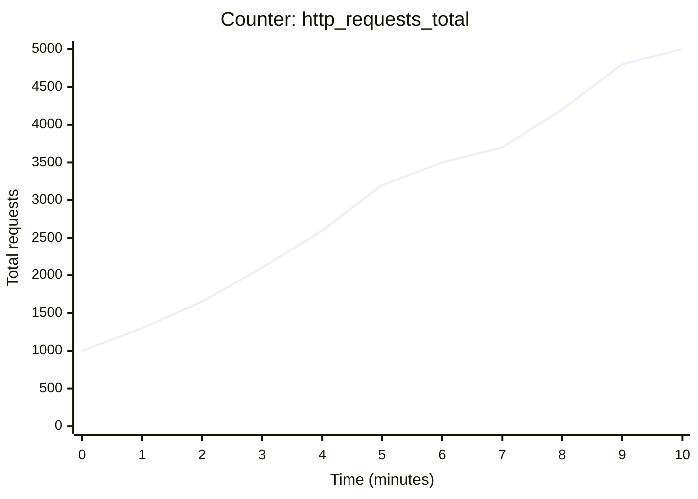
```mermaid
xychart-beta
    title "Counter: http_requests_total"
    x-axis "Time (minutes)" [0, 1, 2, 3, 4, 5, 6, 7, 8, 9, 10]
    y-axis "Total requests" 0 --> 5000
    line [1000, 1300, 1650, 2100, 2600, 3200, 3500, 3700, 4200, 4800, 5000]
```

**Rate: the derivative** (how fast the counter changes = requests/second)

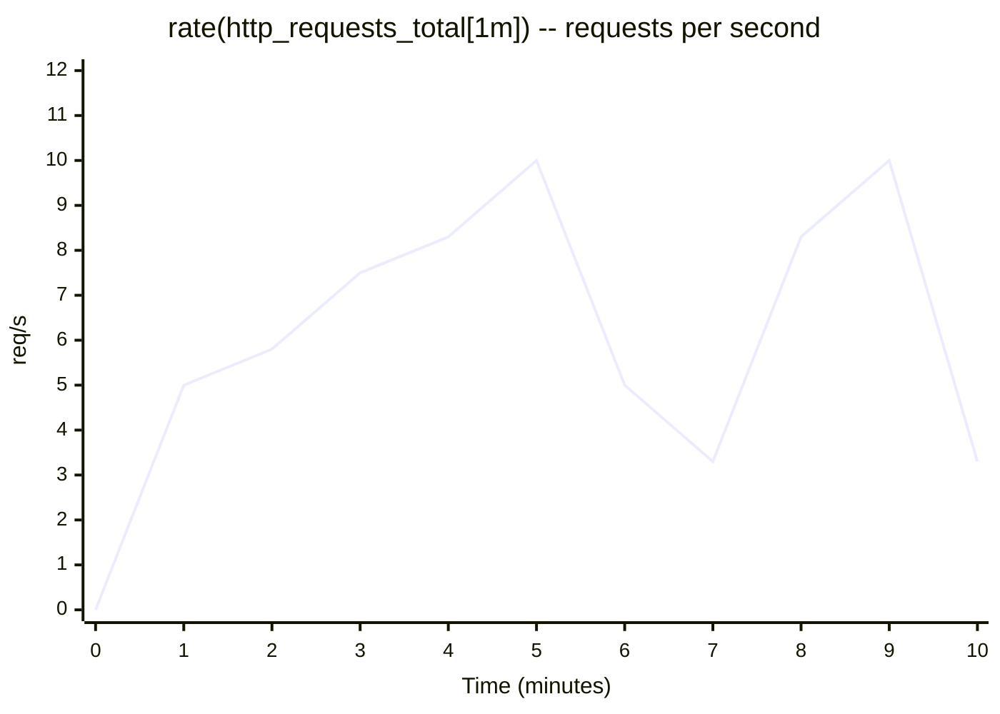
```mermaid
xychart-beta
    title "rate(http_requests_total[1m]) -- requests per second"
    x-axis "Time (minutes)" [0, 1, 2, 3, 4, 5, 6, 7, 8, 9, 10]
    y-axis "req/s" 0 --> 12
    line [0, 5, 5.8, 7.5, 8.3, 10, 5, 3.3, 8.3, 10, 3.3]
```

> Notice: the counter always climbs, but the **rate** shows the actual behavior -- a spike at t=5, a dip at t=6-7, then recovery. This is what you dashboard and alert on.

______________________________________________________________________

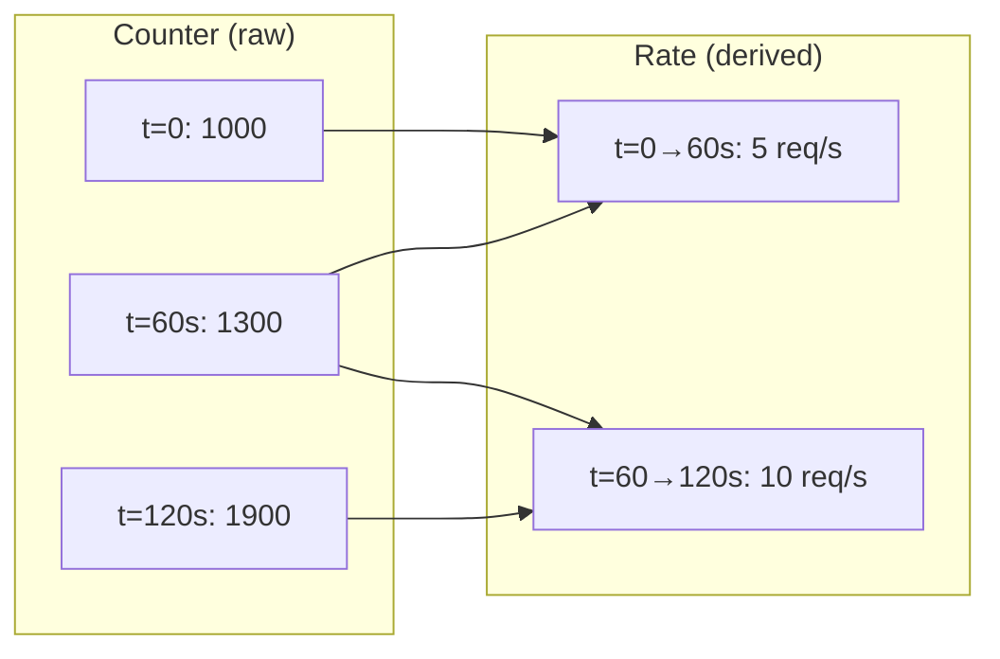
```mermaid
graph LR
    subgraph "Counter (raw)"
        C1["t=0: 1000"]
        C2["t=60s: 1300"]
        C3["t=120s: 1900"]
    end
    subgraph "Rate (derived)"
        R1["t=0→60s: 5 req/s"]
        R2["t=60→120s: 10 req/s"]
    end
    C1 --> R1
    C2 --> R1
    C2 --> R2
    C3 --> R2
```

______________________________________________________________________

In Prometheus/PromQL:

```promql
# rate() computes per-second increase averaged over a window
rate(http_requests_total[5m])

# irate() uses only the last two data points (more spiky, more reactive)
irate(http_requests_total[5m])
```

**Why it matters**: You never alert on a counter value. You alert on its **rate** (derivative). "1 million total errors" is meaningless. "500 errors/second right now" is actionable.

### Derivative: Seeing the Trend of a Trend

The **derivative of a rate** tells you if things are getting worse or better.

```
rate       = how fast errors are happening
deriv(rate) = is the error rate increasing or decreasing?
```

**Stable rate** (derivative = 0): flat line, nothing to worry about.

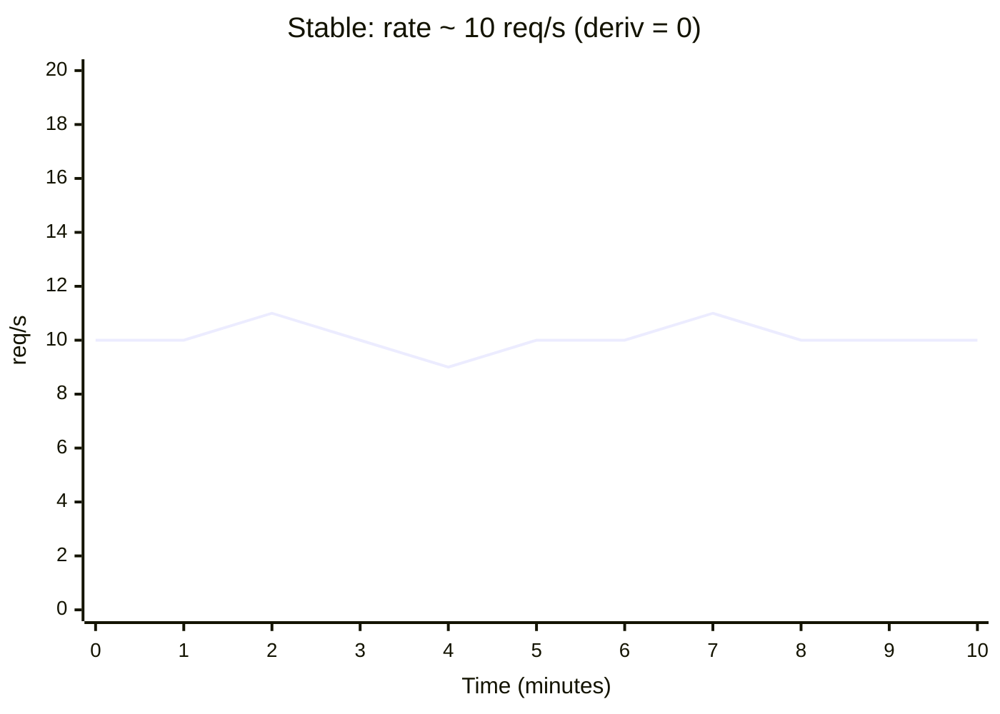
```mermaid
xychart-beta
    title "Stable: rate ~ 10 req/s (deriv = 0)"
    x-axis "Time (minutes)" [0, 1, 2, 3, 4, 5, 6, 7, 8, 9, 10]
    y-axis "req/s" 0 --> 20
    line [10, 10, 11, 10, 9, 10, 10, 11, 10, 10, 10]
```

**Increasing rate** (derivative > 0): getting worse, something is going wrong.

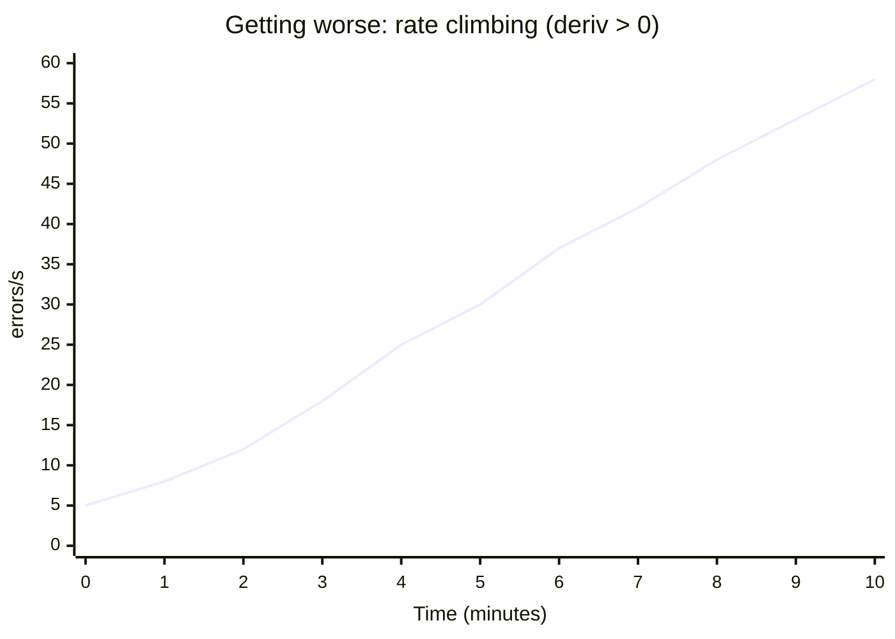
```mermaid
xychart-beta
    title "Getting worse: rate climbing (deriv > 0)"
    x-axis "Time (minutes)" [0, 1, 2, 3, 4, 5, 6, 7, 8, 9, 10]
    y-axis "errors/s" 0 --> 60
    line [5, 8, 12, 18, 25, 30, 37, 42, 48, 53, 58]
```

**Decreasing rate** (derivative < 0): recovering, the fix is working.

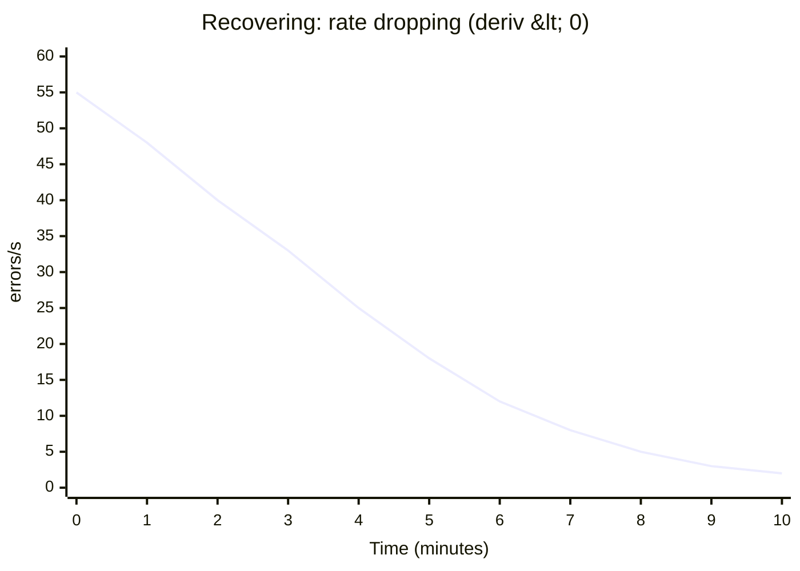
```mermaid
xychart-beta
    title "Recovering: rate dropping (deriv < 0)"
    x-axis "Time (minutes)" [0, 1, 2, 3, 4, 5, 6, 7, 8, 9, 10]
    y-axis "errors/s" 0 --> 60
    line [55, 48, 40, 33, 25, 18, 12, 8, 5, 3, 2]
```

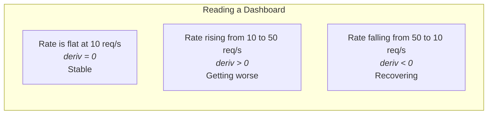
```mermaid
graph TB
    subgraph "Reading a Dashboard"
        direction TB
        FLAT["Rate is flat at 10 req/s<br/><i>deriv = 0</i><br/>Stable"]
        UP["Rate rising from 10 to 50 req/s<br/><i>deriv > 0</i><br/>Getting worse"]
        DOWN["Rate falling from 50 to 10 req/s<br/><i>deriv < 0</i><br/>Recovering"]
    end
```

In Prometheus:

```promql
# Is the error rate accelerating?
deriv(rate(http_errors_total[5m])[30m:1m])
# Positive = getting worse. Negative = recovering. Zero = stable.
```

> **Pro tip**: Alert on sustained positive derivatives, not on spikes. A brief spike that self-heals is fine. A slow, steady increase is the real danger.

## Percentiles and Histograms

### Why Averages Lie

The **average** hides the worst experience. If 99 requests take 10ms and 1 request takes 10 seconds, the average is 109ms -- looks fine, but 1% of users had a terrible experience.

| Metric | Value | What it tells you |
| --- | --- | --- |
| **p50** (median) | 10ms | Half of requests are faster than this |
| **p95** | 50ms | 95% of requests are faster. 5% are slower. |
| **p99** | 500ms | 1 in 100 requests is this slow or worse |
| **p99.9** | 2000ms | 1 in 1,000 requests. Your worst users. |
| **average** | 109ms | Meaningless blend -- hides the tail |

______________________________________________________________________

**Latency distribution**: most requests are fast, but a "long tail" of slow requests exists. The average (dashed line in your head) sits at ~109ms and tells you nothing about the 0.5% of users waiting 10 seconds.

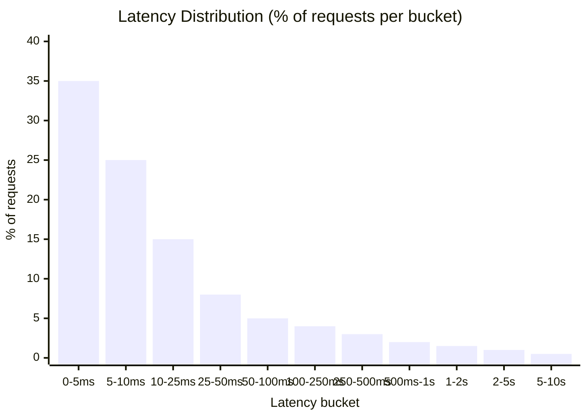
```mermaid
xychart-beta
    title "Latency Distribution (% of requests per bucket)"
    x-axis "Latency bucket" ["0-5ms", "5-10ms", "10-25ms", "25-50ms", "50-100ms", "100-250ms", "250-500ms", "500ms-1s", "1-2s", "2-5s", "5-10s"]
    y-axis "% of requests" 0 --> 40
    bar [35, 25, 15, 8, 5, 4, 3, 2, 1.5, 1, 0.5]
```

> The tall bars on the left are the "happy path". The short bars on the right are the **long tail** -- invisible to averages, painful for real users.

**Percentile lines on the same data**:

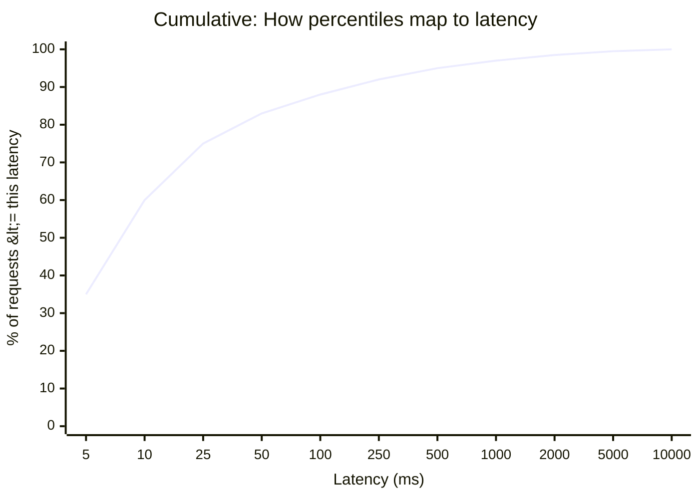
```mermaid
xychart-beta
    title "Cumulative: How percentiles map to latency"
    x-axis "Latency (ms)" [5, 10, 25, 50, 100, 250, 500, 1000, 2000, 5000, 10000]
    y-axis "% of requests <= this latency" 0 --> 100
    line [35, 60, 75, 83, 88, 92, 95, 97, 98.5, 99.5, 100]
```

Read it like this: find 95 on the Y-axis, trace right to the curve, drop down to the X-axis --> p95 is ~500ms. Find 99 --> p99 is ~5000ms.

______________________________________________________________________

In Prometheus, percentiles come from **histograms** (buckets):

```promql
# p95 latency
histogram_quantile(0.95, rate(http_request_duration_seconds_bucket[5m]))

# p99 latency
histogram_quantile(0.99, rate(http_request_duration_seconds_bucket[5m]))
```

> **Rule**: Always monitor p95 and p99, never the average. SLOs should be defined on percentiles.

### Histogram Buckets

A histogram doesn't store every value. It counts how many observations fell into predefined **buckets**:

```yaml
# Typical bucket boundaries for HTTP latency (seconds)
buckets: [0.005, 0.01, 0.025, 0.05, 0.1, 0.25, 0.5, 1, 2.5, 5, 10]
```

| Bucket `le` | Count | Meaning |
| --- | --- | --- |
| 0.01 | 4,521 | 4,521 requests took <= 10ms |
| 0.05 | 8,903 | 8,903 requests took <= 50ms |
| 0.1 | 9,412 | 9,412 requests took <= 100ms |
| 1.0 | 9,890 | 9,890 requests took <= 1s |
| +Inf | 10,000 | 10,000 total requests |

The `histogram_quantile()` function **interpolates** within buckets to estimate the actual percentile. More buckets = more accuracy, but also more time series (cost).

**Histogram buckets are cumulative counters** (each bucket includes all requests faster than it):

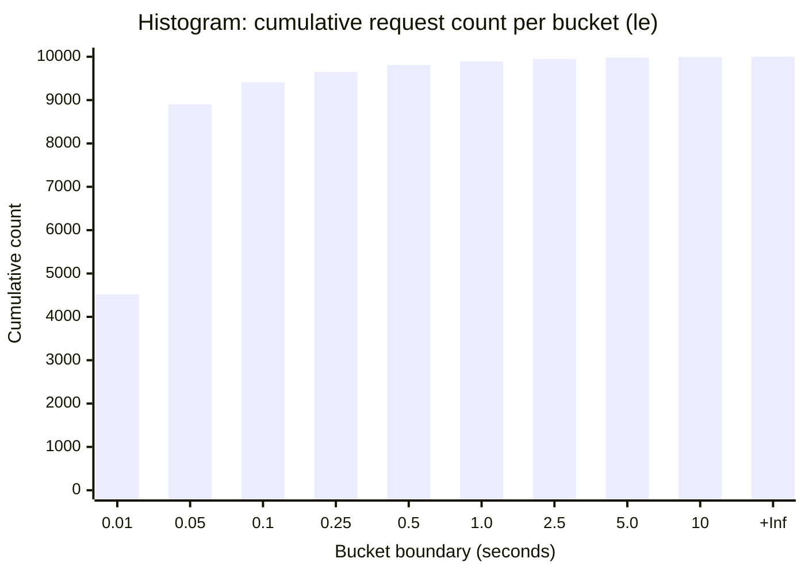
```mermaid
xychart-beta
    title "Histogram: cumulative request count per bucket (le)"
    x-axis "Bucket boundary (seconds)" ["0.01", "0.05", "0.1", "0.25", "0.5", "1.0", "2.5", "5.0", "10", "+Inf"]
    y-axis "Cumulative count" 0 --> 10000
    bar [4521, 8903, 9412, 9650, 9810, 9890, 9950, 9980, 9995, 10000]
```

> Each bar includes **all** previous bars. The jump between bars tells you how many requests landed in that specific bucket. The flatter the curve gets on the right, the fewer outliers you have.

## Cardinality: The Silent Budget Killer

### Cardinality in Mathematics

In set theory, the **cardinality** of a set is simply the number of distinct elements it contains.

```
Set A = {red, green, blue}         → |A| = 3
Set B = {small, medium, large}     → |B| = 3
```

The **cartesian product** `A x B` is the set of all possible pairs:

```
A x B = {(red,small), (red,medium), (red,large),
         (green,small), (green,medium), (green,large),
         (blue,small), (blue,medium), (blue,large)}

|A x B| = |A| x |B| = 3 x 3 = 9
```

This is exactly what happens with metric labels: each label is a set, and every unique combination creates a new time series.

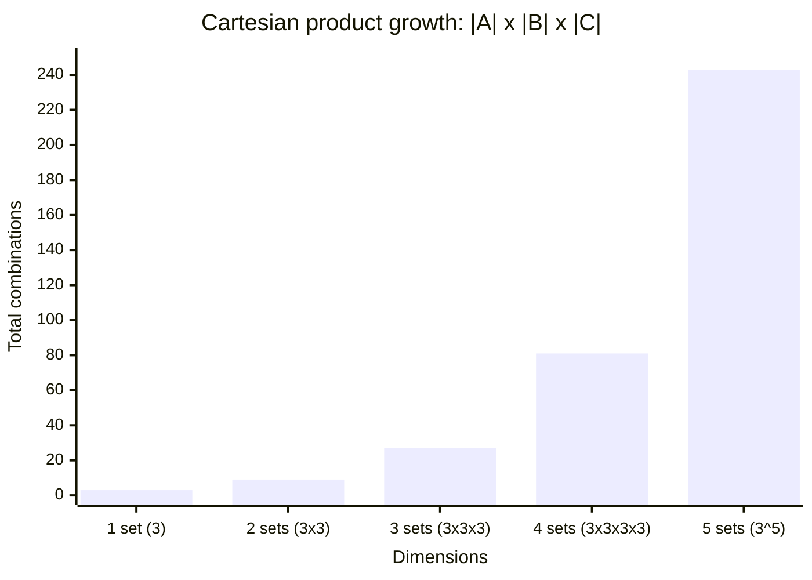
```mermaid
xychart-beta
    title "Cartesian product growth: |A| x |B| x |C|"
    x-axis "Dimensions" ["1 set (3)", "2 sets (3x3)", "3 sets (3x3x3)", "4 sets (3x3x3x3)", "5 sets (3^5)"]
    y-axis "Total combinations" 0 --> 250
    bar [3, 9, 27, 81, 243]
```

> With just 3 values per dimension, 5 dimensions already produce 243 combinations. Now imagine a dimension with 100,000 values (user IDs)...

### What is Cardinality in Monitoring?

**Cardinality** = the number of **unique time series** a metric produces. Each unique combination of label values creates a new time series.

```
http_requests_total{method="GET", status="200", endpoint="/api/orders"}
```

This is **one** time series. The total cardinality of this metric is:

```
cardinality = |methods| x |statuses| x |endpoints|
```

______________________________________________________________________

```mermaid
graph TB
    subgraph "Safe: Low Cardinality"
        S1["method: GET, POST, PUT, DELETE<br/><i>4 values</i>"]
        S2["status: 2xx, 3xx, 4xx, 5xx<br/><i>4 values</i>"]
        S3["region: eu, us, ap<br/><i>3 values</i>"]
        S4["Total: 4 x 4 x 3 = <b>48 series</b>"]
    end

    subgraph "Dangerous: High Cardinality"
        D1["user_id: usr_001 ... usr_999999<br/><i>1M values</i>"]
        D2["request_id: uuid<br/><i>infinite values</i>"]
        D3["url: /users/123, /users/456...<br/><i>unbounded</i>"]
        D4["Total: <b>millions of series</b><br/>= OOM + $$$"]
    end
```

______________________________________________________________________

### The Cardinality Explosion Formula

Cardinality grows as the **cartesian product** (multiplication) of all label values:

```
Total series = |label_1| x |label_2| x ... x |label_n|
```

| Scenario | Labels | Cardinality | Risk |
| --- | --- | --- | --- |
| `method` x `status` | 4 x 5 | **20** | Safe |
| + `endpoint` (10 routes) | 4 x 5 x 10 | **200** | Fine |
| + `customer_id` (100K) | 4 x 5 x 10 x 100K | **20,000,000** | Prometheus OOM |
| + `request_id` (unique) | 4 x 5 x 10 x infinity | **infinity** | Disaster |

> **Rule of thumb**: < 50 unique values per label = safe. > 300 = almost never what you want. Never use user IDs, request IDs, IPs, or emails as metric labels.

**Cardinality explosion visualized**: adding one high-cardinality label destroys everything.

```mermaid
xychart-beta
    title "Time series count as labels are added"
    x-axis "Labels added" ["method (4)", "+ status (5)", "+ endpoint (10)", "+ region (3)", "+ customer_id (1K)", "+ request_id"]
    y-axis "Number of time series" 0 --> 700000
    bar [4, 20, 200, 600, 600000, 600000]
```

> The first four labels: 600 series. Manageable. Add `customer_id`: 600,000 series. Your Prometheus instance is now on fire. The chart can't even show `request_id` because it would be infinite.

### What to Do Instead of High-Cardinality Labels

| Want to track | Wrong approach | Right approach |
| --- | --- | --- |
| Per-user latency | `{user_id="..."}` label | Log with userId, query in Loki/ClickHouse |
| Per-URL metrics | `{url="/users/123"}` | Use route templates: `{route="/users/:id"}` |
| Per-request tracing | `{request_id="..."}` label | Put it in traces (spans), not metrics |
| Error details | `{error_message="..."}` label | Use `{error_type="timeout"}` (bounded enum) |

## Moving Averages and Smoothing

### Why Raw Metrics Are Noisy

Raw metrics fluctuate constantly. A CPU gauge might read 23%, 87%, 12%, 95%, 30% across 5 seconds. Which is the "real" value?

**Moving averages** smooth the noise to reveal the trend.

**Raw signal** (1-second resolution): noisy, hard to read.

```mermaid
xychart-beta
    title "CPU % -- raw 1s samples (noisy)"
    x-axis "Time (seconds)" [0, 1, 2, 3, 4, 5, 6, 7, 8, 9, 10, 11, 12, 13, 14, 15, 16, 17, 18, 19]
    y-axis "CPU %" 0 --> 100
    line [23, 87, 12, 95, 30, 78, 15, 88, 42, 91, 25, 82, 18, 90, 35, 85, 50, 92, 28, 80]
```

**Smoothed signal** (5-point moving average): the trend emerges -- CPU is hovering around 55-60%.

```mermaid
xychart-beta
    title "CPU % -- 5-point moving average (trend visible)"
    x-axis "Time (seconds)" [0, 1, 2, 3, 4, 5, 6, 7, 8, 9, 10, 11, 12, 13, 14, 15, 16, 17, 18, 19]
    y-axis "CPU %" 0 --> 100
    line [23, 55, 41, 49, 49, 60, 46, 61, 49, 63, 54, 62, 48, 61, 50, 62, 56, 66, 57, 64]
```

> Same data, two views. The raw chart causes panic. The smoothed chart shows reality: CPU is busy but stable. **Always smooth before alerting.**

```promql
# Simple moving average: average the rate over 5 minutes
avg_over_time(rate(cpu_usage[1m])[5m:1m])

# Exponentially Weighted Moving Average (EWMA)
# Recent values count more than old values
# Used internally by many tools (Prometheus recording rules, Datadog)
```

```mermaid
graph LR
    subgraph "Signal Processing"
        RAW["Raw signal<br/><i>Noisy, spiky</i>"] -->|"Moving average"| SMOOTH["Smoothed signal<br/><i>Trend visible</i>"]
        SMOOTH -->|"Derivative"| TREND["Trend direction<br/><i>Up / Down / Stable</i>"]
    end
```

### Window Size Trade-off

| Window | Effect | Use case |
| --- | --- | --- |
| **1m** | Very reactive, still noisy | Real-time debugging |
| **5m** | Good balance | Standard dashboards and alerts |
| **15m** | Smooth, slow to react | SLO tracking, capacity planning |
| **1h** | Very smooth, delayed | Trend analysis, weekly reports |

> Choose the window based on your **time to act**. If your team can respond in 5 minutes, a 5m window is right. If response time is hours, use a longer window.

**Same incident, different windows**: a latency spike at t=5 seen through different smoothing windows.

```mermaid
xychart-beta
    title "1-minute window (reactive, noisy)"
    x-axis "Time (min)" [0, 1, 2, 3, 4, 5, 6, 7, 8, 9, 10, 11, 12, 13, 14]
    y-axis "Latency (ms)" 0 --> 600
    line [50, 48, 55, 52, 45, 520, 480, 200, 80, 55, 50, 48, 52, 50, 49]
```

```mermaid
xychart-beta
    title "5-minute window (balanced)"
    x-axis "Time (min)" [0, 1, 2, 3, 4, 5, 6, 7, 8, 9, 10, 11, 12, 13, 14]
    y-axis "Latency (ms)" 0 --> 600
    line [50, 49, 51, 50, 50, 144, 230, 259, 265, 187, 113, 87, 57, 51, 50]
```

```mermaid
xychart-beta
    title "15-minute window (smooth, delayed)"
    x-axis "Time (min)" [0, 1, 2, 3, 4, 5, 6, 7, 8, 9, 10, 11, 12, 13, 14]
    y-axis "Latency (ms)" 0 --> 600
    line [50, 50, 50, 50, 50, 70, 95, 120, 140, 145, 140, 130, 110, 90, 75]
```

> The 1m window catches the spike instantly but shows false spikes too. The 15m window barely shows it. The 5m window is the sweet spot for most alerting.

## Aggregation Functions Cheat Sheet

When combining metrics across instances or time, the function matters:

| Function | Use with | Example | Gotcha |
| --- | --- | --- | --- |
| `sum` | Counters, rates | Total requests across all pods | Never sum gauges like CPU% |
| `avg` | Gauges | Average CPU across pods | Hides outliers |
| `max` | Gauges | Hottest pod | Good for saturation alerts |
| `min` | Gauges | Coldest pod (underutilized) | Rarely used for alerting |
| `count` | Any | How many pods are reporting | Useful for fleet health |
| `quantile` | Histograms | p99 latency | Quantiles are not addable: you cannot average p99s across pods |

______________________________________________________________________

### The Quantile Aggregation Trap

> **You cannot average percentiles.** The p99 of averaged p99s is mathematically meaningless.

```
Pod A p99 = 100ms (1000 requests)
Pod B p99 = 500ms (10 requests)

Average of p99s = 300ms  <-- WRONG
True p99 = ~100ms        <-- almost all requests came from Pod A
```

Always aggregate **histograms** (the raw bucket counts), then compute the percentile on the aggregated result:

```promql
# CORRECT: aggregate buckets first, then compute percentile
histogram_quantile(0.99,
  sum(rate(http_request_duration_seconds_bucket[5m])) by (le)
)

# WRONG: compute percentile per pod, then average
avg(histogram_quantile(0.99,
  rate(http_request_duration_seconds_bucket[5m]) by (le, pod)
))
```

## Math Summary

| Concept | What it is | Why you need it |
| --- | --- | --- |
| **Rate (derivative)** | Change per second of a counter | Turn raw counters into actionable req/s |
| **Derivative of rate** | Is the rate increasing or decreasing? | Detect acceleration of problems |
| **Percentiles (p50/p95/p99)** | Value below which X% of observations fall | Measure real user experience, not averages |
| **Cardinality** | Number of unique label combinations (cartesian product) | Predict cost and prevent OOM |
| **Moving average** | Smoothed value over a time window | Separate signal from noise |
| **Aggregation** | Combining values across dimensions | `sum` for counters, `max` for gauges, never avg percentiles |

# Traces

## Distributed Tracing Concepts

A **trace** represents a single request's journey through a distributed system. It's composed of **spans** organized as a tree (or DAG).

______________________________________________________________________

```mermaid
gantt
    title Trace: POST /api/orders (traceId: 4bf92f)
    dateFormat X
    axisFormat %L ms

    section API Gateway
    gateway.handleRequest       :0, 350

    section Order Service
    order.createOrder           :20, 300
    order.validateRequest       :25, 50
    order.saveToDatabase        :80, 80

    section Payment Service
    payment.charge              :170, 120
    payment.callStripeAPI       :180, 90

    section Notification Service
    notification.sendEmail      :300, 40
```

______________________________________________________________________

### Span Anatomy

Each span contains:

| Field | Description | Example |
| --- | --- | --- |
| `traceId` | Unique ID for the entire request | `4bf92f3577b34da6` |
| `spanId` | Unique ID for this span | `7a3f2b1c` |
| `parentSpanId` | Parent span (builds the tree) | `00f067aa` |
| `operationName` | What this span represents | `order.saveToDatabase` |
| `startTime` | When the span started | `2024-03-15T10:23:45.123Z` |
| `duration` | How long it took | `80ms` |
| `attributes` | Key-value metadata | `db.system=postgresql` |
| `events` | Timestamped annotations | `exception`, `retry` |
| `status` | OK, ERROR, UNSET | `ERROR` |

### Context Propagation

How does a trace cross service boundaries?

```mermaid
sequenceDiagram
    participant Client
    participant ServiceA
    participant ServiceB
    participant ServiceC

    Client->>ServiceA: POST /orders<br/>traceparent: 00-traceId-spanA-01
    Note over ServiceA: Extract context<br/>Create child span
    ServiceA->>ServiceB: gRPC CreatePayment<br/>traceparent: 00-traceId-spanB-01
    Note over ServiceB: Extract context<br/>Create child span
    ServiceB->>ServiceC: HTTP GET /fraud-check<br/>traceparent: 00-traceId-spanC-01
    ServiceC-->>ServiceB: 200 OK
    ServiceB-->>ServiceA: Payment confirmed
    ServiceA-->>Client: 201 Created
```

______________________________________________________________________

The **W3C Trace Context** header `traceparent` carries:

```
traceparent: 00-<traceId>-<parentSpanId>-<flags>
             |   |          |              |
             v   v          v              v
          version  32 hex   16 hex     sampled?
```

### Sampling Strategies

You **cannot** trace 100% of production traffic. Sampling controls what gets recorded.

| Strategy | How it works | Pros | Cons |
| --- | --- | --- | --- |
| **Head-based** | Decide at the start of the request | Simple, consistent | May miss interesting requests |
| **Tail-based** | Decide after the request completes | Captures errors/slow requests | Requires buffering all spans |
| **Rate-based** | Fixed % of requests | Predictable cost | Misses rare events |
| **Adaptive** | Adjust rate based on traffic | Cost-effective | Complex to configure |

> Best practice: Use **tail-based sampling** to always capture errors and slow requests, combined with a low base rate (1-5%) for normal traffic.

# OpenTelemetry (OTel)

## What is OpenTelemetry?

OpenTelemetry is the **CNCF standard** for collecting telemetry data (logs, metrics, traces). It provides:

- **APIs**: Instrument your code
- **SDKs**: Process and export data
- **Collector**: Vendor-agnostic pipeline for receiving, processing, and exporting
- **Semantic Conventions**: Standard attribute names

______________________________________________________________________

```mermaid
graph LR
    subgraph "Your Application"
        A[OTel SDK] -->|OTLP| B
    end
    subgraph "OTel Collector"
        B[Receiver] --> C[Processor]
        C --> D[Exporter]
    end
    D -->|"Traces"| E[Jaeger / Tempo]
    D -->|"Metrics"| F[Prometheus / Mimir]
    D -->|"Logs"| G[Loki / Elasticsearch]
```

______________________________________________________________________

### Why OTel Matters

- **Vendor-neutral**: Switch backends without changing code
- **Unified**: One SDK for logs, metrics, and traces
- **Correlation**: Logs, metrics, and traces share `traceId`
- **Industry standard**: Supported by every major vendor (Datadog, Grafana, New Relic, Dynatrace...)
- **Auto-instrumentation**: Libraries for HTTP, DB, gRPC out of the box

### OTel Collector Architecture

The Collector is the **heart** of a production OTel deployment. It decouples applications from backends.

```mermaid
graph TB
    subgraph "Applications"
        App1[Service A<br/>OTel SDK]
        App2[Service B<br/>OTel SDK]
        App3[Service C<br/>OTel SDK]
    end

    subgraph "OTel Collector Pipeline"
        direction TB
        subgraph "Receivers"
            R1[OTLP gRPC :4317]
            R2[OTLP HTTP :4318]
            R3[Prometheus :8888]
        end
        subgraph "Processors"
            P1[Batch]
            P2[Memory Limiter]
            P3[Attributes]
            P4[Tail Sampling]
        end
        subgraph "Exporters"
            E1[OTLP/gRPC]
            E2[Prometheus Remote Write]
            E3[Loki]
        end
    end

    App1 --> R1
    App2 --> R1
    App3 --> R2
    R1 --> P1
    R2 --> P1
    R3 --> P1
    P1 --> P2
    P2 --> P3
    P3 --> P4
    P4 --> E1
    P4 --> E2
    P4 --> E3

    E1 --> Tempo[Grafana Tempo]
    E2 --> Mimir[Grafana Mimir]
    E3 --> Loki[Grafana Loki]
```

______________________________________________________________________

### Collector Configuration Example

```yaml
# otel-collector-config.yaml
receivers:
  otlp:
    protocols:
      grpc:
        endpoint: 0.0.0.0:4317
      http:
        endpoint: 0.0.0.0:4318

processors:
  batch:
    timeout: 5s
    send_batch_size: 1024
  memory_limiter:
    check_interval: 1s
    limit_mib: 512
  attributes:
    actions:
      - key: environment
        value: production
        action: upsert

exporters:
  otlp/tempo:
    endpoint: tempo:4317
    tls:
      insecure: true
  prometheusremotewrite:
    endpoint: http://mimir:9009/api/v1/push
  loki:
    endpoint: http://loki:3100/loki/api/v1/push

service:
  pipelines:
    traces:
      receivers: [otlp]
      processors: [memory_limiter, batch]
      exporters: [otlp/tempo]
    metrics:
      receivers: [otlp]
      processors: [memory_limiter, batch]
      exporters: [prometheusremotewrite]
    logs:
      receivers: [otlp]
      processors: [memory_limiter, attributes, batch]
      exporters: [loki]
```

### OTel Semantic Conventions

Standard attribute names so that all tools understand each other.

| Convention | Attributes | Example |
| --- | --- | --- |
| HTTP | `http.method`, `http.status_code`, `http.url` | `http.method=GET` |
| Database | `db.system`, `db.statement`, `db.name` | `db.system=postgresql` |
| Messaging | `messaging.system`, `messaging.destination` | `messaging.system=kafka` |
| RPC | `rpc.system`, `rpc.method`, `rpc.service` | `rpc.system=grpc` |
| Cloud | `cloud.provider`, `cloud.region` | `cloud.provider=aws` |

# Modern Observability Stack

## Architecture Overview

```mermaid
graph TB
    subgraph "Data Sources"
        Apps[Applications<br/>OTel SDK]
        Infra[Infrastructure<br/>node_exporter, cAdvisor]
        K8s[Kubernetes<br/>kube-state-metrics]
    end

    subgraph "Collection Layer"
        OTelCol[OTel Collector]
        Vec[Vector]
        Alloy[Grafana Alloy]
    end

    subgraph "Storage Layer"
        subgraph "Metrics"
            Prom[Prometheus]
            Mimir2[Mimir / Thanos]
        end
        subgraph "Logs"
            Loki2[Loki]
            ES[OpenSearch]
        end
        subgraph "Traces"
            Tempo2[Tempo]
            Jaeger2[Jaeger]
        end
        subgraph "Profiles"
            Pyro[Pyroscope]
        end
    end

    subgraph "Visualization"
        Graf[Grafana]
    end

    Apps --> OTelCol
    Apps --> Vec
    Infra --> OTelCol
    K8s --> OTelCol
    OTelCol --> Prom
    OTelCol --> Mimir2
    OTelCol --> Loki2
    OTelCol --> Tempo2
    Vec --> Loki2
    Vec --> ES
    Alloy --> Mimir2
    Alloy --> Loki2
    Alloy --> Tempo2
    Alloy --> Pyro
    Prom --> Graf
    Mimir2 --> Graf
    Loki2 --> Graf
    Tempo2 --> Graf
    Pyro --> Graf
```

## Vector: The Modern Data Pipeline

[Vector](https://vector.dev) is a high-performance observability data pipeline built in **Rust**.
It replaces Fluentd, Logstash, Filebeat, and Telegraf with a single binary.

### Why Vector?

| Feature | Vector | Fluentd | Logstash | Filebeat |
| --- | --- | --- | --- | --- |
| **Language** | Rust | Ruby/C | JVM | Go |
| **Memory usage** | ~10 MB | ~40 MB | ~500 MB | ~20 MB |
| **Throughput** | ~10 GB/s | ~1 GB/s | ~0.5 GB/s | ~2 GB/s |
| **Config language** | TOML/YAML | XML-like | Ruby DSL | YAML |
| **Logs + Metrics** | Both | Logs only | Logs only | Logs only |
| **End-to-end acks** | Yes | Partial | No | Yes |

______________________________________________________________________

### Vector Pipeline Architecture

```mermaid
graph LR
    subgraph "Vector Pipeline"
        direction LR
        S1[Source:<br/>file, kafka,<br/>syslog, OTLP] --> T1[Transform:<br/>remap VRL,<br/>filter, aggregate]
        T1 --> SK1[Sink:<br/>Loki, S3,<br/>Elasticsearch, OTLP]
    end
```

### Vector Configuration Example

```toml
# vector.toml
[sources.app_logs]
type = "file"
include = ["/var/log/app/*.log"]

[sources.kubernetes]
type = "kubernetes_logs"

[transforms.parse_json]
type = "remap"
inputs = ["app_logs"]
source = '''
  . = parse_json!(.message)
  .timestamp = parse_timestamp!(.timestamp, format: "%+")
  # Redact PII
  if exists(.email) {
    .email = "REDACTED"
  }
  # Enrich with environment
  .environment = get_env_var("ENVIRONMENT") ?? "unknown"
'''

[transforms.filter_errors]
type = "filter"
inputs = ["parse_json"]
condition = '.level == "ERROR" || .level == "WARN"'

[sinks.loki]
type = "loki"
inputs = ["parse_json"]
endpoint = "http://loki:3100"
encoding.codec = "json"
labels.app = "{{ app_name }}"
labels.level = "{{ level }}"

[sinks.error_alerts]
type = "http"
inputs = ["filter_errors"]
uri = "https://alerts.internal/webhook"
encoding.codec = "json"
```

### VRL (Vector Remap Language)

Vector's transformation language is **purpose-built** for observability data:

```coffee
# Parse, transform, and enrich in one pipeline
. = parse_json!(.message)

# Type-safe coercion
.duration_ms = to_float!(.duration)

# Pattern matching
.severity = if .status_code >= 500 {
    "critical"
} else if .status_code >= 400 {
    "warning"
} else {
    "info"
}

# Redact sensitive data
.headers = redact(.headers, filters: ["pattern"], redactor: {"type": "text", "replacement": "[REDACTED]"})
```

## New Compression and Storage Technologies

### Why Compression Matters for Observability

Observability data is **massive**: a medium-sized microservices platform generates:

- **Logs**: 1-10 TB/day
- **Metrics**: 100M+ active time series
- **Traces**: billions of spans/day

Storage cost dominates observability budgets. Modern compression is a game-changer.

______________________________________________________________________

### Compression Algorithms Compared

| Algorithm | Ratio | Speed (compress) | Speed (decompress) | Best for |
| --- | --- | --- | --- | --- |
| **gzip** | ~6x | Moderate | Moderate | General purpose, legacy |
| **lz4** | ~3x | Very fast | Very fast | Real-time streaming |
| **zstd** (Zstandard) | ~7x | Fast | Very fast | Best all-rounder, logs |
| **snappy** | ~2.5x | Very fast | Very fast | Kafka, low-latency |
| **brotli** | ~8x | Slow | Fast | Static content, HTTP |

______________________________________________________________________

### Zstandard (zstd): The New Default

Created by Yann Collet (Facebook), zstd offers:

- **Better ratio than gzip** at **faster speed**
- **Dictionary compression**: train on your log patterns for 2-5x better ratio on small payloads
- **Adaptive compression levels**: 1 (fast) to 22 (max compression)
- **Widely adopted**: Linux kernel, HTTP/3, Kafka, ClickHouse, Parquet

```mermaid
quadrantChart
    title Compression: Speed vs Ratio
    x-axis "Low Compression Ratio" --> "High Compression Ratio"
    y-axis "Slow" --> "Fast"
    lz4: [0.25, 0.95]
    snappy: [0.20, 0.90]
    zstd: [0.70, 0.80]
    gzip: [0.55, 0.45]
    brotli: [0.85, 0.30]
    zstd-fast: [0.45, 0.90]
```

### Columnar Formats for Observability

Traditional row-based storage (JSON lines, CSV) is inefficient for analytical queries.
Modern observability backends use **columnar formats**.

| Format | Description | Used by |
| --- | --- | --- |
| **Parquet** | Columnar, compressed, schema-aware | Snowflake, Spark, Grafana Tempo |
| **Arrow** | In-memory columnar format | DataFusion, InfluxDB IOx |
| **ORC** | Optimized Row Columnar | Hadoop ecosystem |

______________________________________________________________________

Why columnar matters for logs:

```mermaid
graph TB
    subgraph "Row Storage (JSON Lines)"
        R1["{ts, level, msg, svc, trace}"]
        R2["{ts, level, msg, svc, trace}"]
        R3["{ts, level, msg, svc, trace}"]
        R4["Read ALL fields to filter by level"]
    end

    subgraph "Columnar Storage (Parquet)"
        C1["ts: [t1, t2, t3, ...]"]
        C2["level: [INFO, ERROR, WARN, ...]"]
        C3["msg: [m1, m2, m3, ...]"]
        C4["Read ONLY level column to filter"]
    end

    R4 -->|"Reads 5x more data"| SLOW[Slow]
    C4 -->|"Reads 1/5 of data"| FAST[Fast]
```

______________________________________________________________________

### Notable Modern Storage Backends

- **Grafana Loki**: Log aggregation, labels-based indexing (like Prometheus for logs), uses object storage (S3/GCS) with compacted chunks
- **Grafana Tempo**: Trace storage on object storage, no index needed (search by traceId), Parquet-based
- **Grafana Mimir**: Horizontally-scalable Prometheus, long-term metrics storage
- **ClickHouse**: Columnar OLAP database, excellent for logs and traces at scale
- **VictoriaMetrics**: High-performance Prometheus-compatible time-series DB
- **[Quickwit](https://quickwit.io/)**: Search engine built in Rust on object storage, designed for logs and traces. Sub-second search on Parquet/tantivy, directly competes with Elasticsearch at a fraction of the cost
- **[OpenObserve](https://openobserve.ai/)**: Lightweight Elasticsearch alternative, built in Rust, stores on S3, ~140x lower storage cost
- **[SigNoz](https://signoz.io/)**: Open-source alternative to Datadog, unified logs/metrics/traces UI on top of ClickHouse

## Grafana Alloy

[Grafana Alloy](https://grafana.com/docs/alloy/) is Grafana's **distribution of the OTel Collector** with added capabilities:

- Native Prometheus scraping
- Loki log collection (replaces Promtail)
- Tempo trace collection
- Pyroscope continuous profiling
- **Single agent** for all telemetry types

```mermaid
graph LR
    subgraph "Before: Many Agents"
        PA[Promtail] --> L[Loki]
        PE[Prometheus] --> M[Mimir]
        OC[OTel Collector] --> T[Tempo]
        PY[Pyroscope Agent] --> P[Pyroscope]
    end

    subgraph "After: One Agent"
        AL[Grafana Alloy] --> L2[Loki]
        AL --> M2[Mimir]
        AL --> T2[Tempo]
        AL --> P2[Pyroscope]
    end
```

# Continuous Profiling: The Fourth Pillar

Beyond logs, metrics, and traces, **continuous profiling** shows exactly which code paths consume CPU, memory, or I/O.

```mermaid
graph TB
    subgraph "Four Pillars"
        direction LR
        L2["Logs<br/><i>Events</i>"]
        M2["Metrics<br/><i>Aggregates</i>"]
        T2["Traces<br/><i>Request flow</i>"]
        P2["Profiles<br/><i>Code-level perf</i>"]
    end
    P2 --> Q1["Where is CPU spent?"]
    P2 --> Q2["Which function allocates most memory?"]
    P2 --> Q3["Why is this endpoint slow?"]
```

______________________________________________________________________

- **Pyroscope** (Grafana): Continuous profiling with flame graphs
- **pprof** (Go): Built-in profiling
- **async-profiler** (JVM): Low-overhead Java/Kotlin profiling
- **eBPF-based**: Kernel-level profiling without code changes (Parca, Pixie)

# Alerting Best Practices

## Alert on Symptoms, Not Causes

```mermaid
graph LR
    subgraph "Bad: Cause-Based"
        CPU["CPU > 80%"] --> ALERT1["Page on-call"]
    end
    subgraph "Good: Symptom-Based"
        SLO["Error budget burn rate > 2x"] --> EVAL["Is user impacted?"]
        EVAL -->|Yes| ALERT2["Page on-call"]
        EVAL -->|No| TICKET["Create ticket"]
    end
```

______________________________________________________________________

### Alert Fatigue is a Real Problem

| Problem | Impact | Solution |
| --- | --- | --- |
| Too many alerts | On-call ignores them | Reduce to SLO-based alerts |
| Noisy thresholds | False positives | Use burn-rate windows |
| No runbook | Slow response | Every alert links to a runbook |
| Missing context | Wastes investigation time | Include dashboard links, recent changes |

### Good Alert Anatomy

```yaml
# Every alert should contain:
alert: OrderServiceHighErrorRate
annotations:
  summary: "Order Service error rate above SLO"
  description: |
    Error rate is {{ $value | humanizePercentage }} (SLO: 0.1%)
    Dashboard: https://grafana.internal/d/order-svc
    Runbook: https://wiki.internal/runbooks/order-svc-errors
    Recent deploys: https://cd.internal/order-service/releases
  impact: "Users cannot place orders"
  action: "Check order-service logs, verify database connectivity"
```

# Service Tiers: Not All Services Are Equal

Not every error deserves the same response. A bug in the recommendation engine is not the same as a bug in the payment service. **Service tiering** classifies services by business criticality to determine the right observability depth, alerting severity, and incident response.

## Tier Definitions

```mermaid
graph TB
    subgraph "Tier 0 -- Revenue Critical"
        T0["Payment, Checkout, Auth<br/><i>If this breaks, the company loses money NOW</i>"]
    end
    subgraph "Tier 1 -- Core Experience"
        T1["Search, Catalog, Cart, Orders<br/><i>Major user impact, but workarounds may exist</i>"]
    end
    subgraph "Tier 2 -- Important"
        T2["Recommendations, Reviews, Notifications<br/><i>Degraded experience, users can still complete tasks</i>"]
    end
    subgraph "Tier 3 -- Internal / Best Effort"
        T3["Back-office tools, Analytics pipelines, Dev tooling<br/><i>No direct user impact</i>"]
    end

    T0 ~~~ T1 ~~~ T2 ~~~ T3
```

______________________________________________________________________

## Tier Matrix

| | Tier 0 -- Revenue Critical | Tier 1 -- Core Experience | Tier 2 -- Important | Tier 3 -- Internal |
| --- | --- | --- | --- | --- |
| **Examples** | Payment, Checkout, Auth, Login | Search, Catalog, Cart, Orders | Recommendations, Reviews, Notifications | Back-office, Analytics, Batch jobs |
| **SLO target** | 99.99% (4.3 min downtime/month) | 99.9% (43 min/month) | 99.5% (3.6 h/month) | 99% (7.3 h/month) |
| **Error response** | Page on-call immediately, 24/7 | Page on-call during business hours + 15 min after-hours | Slack alert + ticket | Ticket next business day |
| **Response time** | < 5 min | < 15 min | < 1 hour | Next business day |
| **Observability depth** | Full: logs, metrics, traces, profiling, synthetic monitoring | Full: logs, metrics, traces | Logs + metrics + sampled traces | Logs + basic metrics |
| **Alerting** | Multi-window burn rate, synthetic checks, canary alerts | Burn rate + threshold alerts | Threshold alerts | Batch job success/failure |
| **Runbook required?** | Yes, tested quarterly | Yes | Recommended | Optional |
| **Post-mortem required?** | Yes, within 24h | Yes, within 2 business days | If SLO breached | No |
| **Dashboards** | Dedicated + golden signals + business KPIs | Golden signals + business KPIs | Golden signals | Basic health |

______________________________________________________________________

## How to Classify Your Services

```mermaid
graph TB
    Q1["Does the service directly<br/>handle money or auth?"]
    Q1 -->|Yes| T0["Tier 0"]
    Q1 -->|No| Q2["Can users complete their<br/>primary task without it?"]
    Q2 -->|No| T1["Tier 1"]
    Q2 -->|Yes| Q3["Would users notice<br/>if it was down?"]
    Q3 -->|Yes| T2["Tier 2"]
    Q3 -->|No| T3["Tier 3"]
```

______________________________________________________________________

### Tier Determines the Response to Errors

The same error type triggers very different responses depending on the tier:

| Error | Tier 0 response | Tier 1 response | Tier 2 response | Tier 3 response |
| --- | --- | --- | --- | --- |
| **5xx error rate > 1%** | Page on-call immediately | Page if sustained > 5 min | Slack alert | Ticket |
| **Latency p99 > 2s** | Page on-call | Alert if sustained > 10 min | Investigate next sprint | Ignore unless extreme |
| **Pod OOMKilled** | Page + auto-rollback | Alert + investigate | Ticket | Fix when convenient |
| **Dependency timeout** | Page + activate circuit breaker | Alert + graceful degradation | Log + retry silently | Log |
| **Deployment failed** | Auto-rollback + page | Auto-rollback + alert | Manual rollback | Retry next day |

______________________________________________________________________

### Cascading Tier Elevation

A Tier 2 service can become **temporarily Tier 0** if a Tier 0 service depends on it in the critical path.

```mermaid
graph LR
    subgraph "Normal"
        RECO["Recommendations<br/><b>Tier 2</b>"]
    end
    subgraph "During Checkout"
        CHECKOUT["Checkout<br/><b>Tier 0</b>"] -->|"calls"| RECO2["Recommendations<br/><b>Tier 0 (elevated)</b>"]
    end
```

> If your Tier 0 checkout service calls recommendations synchronously to display upsells, then recommendations is **effectively Tier 0** for that code path. Either decouple it (async, circuit breaker, cached fallback) or treat it with Tier 0 rigor.

### Rules for Tier Assignment

1. **Tier is based on worst-case business impact**, not technical complexity
2. **Review tiers quarterly** -- services evolve, dependencies change
3. **Dependencies inherit the caller's tier** in the critical path (or must be decoupled)
4. **Every service must have an assigned tier** -- untiered services are invisible during incidents
5. **Tier determines budget**: Tier 0 gets the observability investment, Tier 3 gets the minimum

# Observability Anti-Patterns

| Anti-pattern | Why it's bad | What to do instead |
| --- | --- | --- |
| Log everything at DEBUG in prod | Storage explosion, noise | Use INFO default, enable DEBUG per-service via config |
| Metrics with unbounded cardinality | Prometheus OOM, series explosion | Never use userId, requestId, or IP as metric labels |
| No sampling on traces | Cost explosion | Tail-based sampling at 1-5% base rate |
| Dashboards nobody looks at | Wasted effort, stale | Alert-driven dashboards, delete unused ones |
| Separate tools for each signal | No correlation | Unified backend (Grafana stack) or correlate via traceId |
| Alerting on raw metrics | False positives | Alert on SLO burn rate |
| No correlation IDs | Can't trace requests | Inject traceId/correlationId at the edge |
| Logging PII | GDPR violation | Redact at the collection layer (Vector/OTel processor) |

# Putting It All Together

## A Production-Ready Stack

```mermaid
graph TB
    subgraph "Edge"
        LB[Load Balancer / Ingress]
    end

    subgraph "Application Tier"
        S1[Service A<br/>OTel SDK]
        S2[Service B<br/>OTel SDK]
        S3[Service C<br/>OTel SDK]
    end

    subgraph "Collection Tier"
        OC[OTel Collector<br/>Gateway mode]
        V[Vector<br/>Log enrichment]
    end

    subgraph "Storage Tier"
        Mimir3[Mimir<br/>Metrics]
        Loki3[Loki<br/>Logs]
        Tempo3[Tempo<br/>Traces]
        Pyro3[Pyroscope<br/>Profiles]
    end

    subgraph "Visualization & Alerting"
        G[Grafana<br/>Dashboards]
        AM[Alertmanager<br/>Routing]
        PD[PagerDuty / Slack]
    end

    LB --> S1 & S2 & S3
    S1 & S2 & S3 -->|"OTLP gRPC"| OC
    S1 & S2 & S3 -->|"stdout logs"| V
    OC -->|"metrics"| Mimir3
    OC -->|"traces"| Tempo3
    OC -->|"profiles"| Pyro3
    V -->|"structured logs"| Loki3
    Mimir3 & Loki3 & Tempo3 & Pyro3 --> G
    Mimir3 --> AM
    AM --> PD
```

______________________________________________________________________

### Key Design Decisions

| Decision | Recommendation | Why |
| --- | --- | --- |
| **Protocol** | OTLP gRPC | Standard, efficient, supports all signals |
| **Collector topology** | Agent + Gateway | Agent on each node, gateway for processing |
| **Log format** | Structured JSON | Machine-parseable, queryable |
| **Metric cardinality** | < 10 labels per metric | Prevents series explosion |
| **Trace sampling** | Tail-based, 5% base | Captures errors, controls cost |
| **Retention** | Metrics: 90d, Logs: 30d, Traces: 14d | Balance cost vs debug ability |
| **Compression** | zstd level 3 | Best speed/ratio trade-off |
| **Storage** | Object storage (S3/GCS) | Cheap, durable, scalable |

# Real-World Observability Guidelines

This section consolidates battle-tested rules from production environments running hundreds of microservices.

## The "Zero Errors When Healthy" Principle

> A well-monitored service should emit **zero errors, zero alerts, and zero warnings** during normal operation.

If your dashboards show a constant background of errors that everyone ignores, you have lost the signal. Every error in your logs should be **surprising and actionable**. If it's expected, it's not an error -- it's a log at INFO level.

```mermaid
graph LR
    subgraph "Healthy Service"
        H1["ERROR count = 0"]
        H2["WARN count = 0"]
        H3["Alerts firing = 0"]
    end
    subgraph "Unhealthy Service"
        U1["ERROR count = 47/min<br/><i>'normal background noise'</i>"]
        U2["Team ignores alerts"]
        U3["Real incident buried in noise"]
    end
    H1 -->|"Any error = signal"| ACT["Investigate immediately"]
    U1 -->|"Can't distinguish real issues"| MISS["Incidents missed"]
```

______________________________________________________________________

### Rules for Zero-Error Baselines

| Rule | Why |
| --- | --- |
| **Expected failures are not errors** | A 404 from a user typo is INFO, not ERROR |
| **Retried-and-succeeded is not an error** | Log the retry at WARN, the success at INFO |
| **Deprecation warnings must be fixed or silenced** | Noise trains people to ignore logs |
| **Health check logs must be suppressed** | They generate massive volume with zero signal |
| **Background noise must be driven to zero** | If you can't distinguish 47 errors/min from 48, you'll miss the real one |

## Magic Numbers: Thresholds That Actually Work

In monitoring, certain numeric thresholds appear repeatedly across organizations. These are not arbitrary -- they emerge from operational experience.

### The Authorized Magic Numbers

| Number | Where it applies | Meaning |
| --- | --- | --- |
| **0** | Error count in steady state | A healthy service has 0 errors. Any error is a signal. |
| **1** | Minimum event count for alerting | If you alert on count < 1, you're alerting on absence of data (dead service). |
| **0.5** | SLO error budget burn rate (baseline) | Burning at 0.5x is normal. Burning at 2x means you'll exhaust budget early. |
| **0.1%** | Typical error rate SLO | 99.9% success rate = 0.1% error budget |
| **50** | Max label/tag cardinality | Below 50 unique values per label is almost always safe for Prometheus/Datadog |
| **300** | Danger zone for cardinality | Above 300 unique values per label causes series explosion and cost blowup |
| **1,500** | Minimum events/hour for a custom metric | Below this threshold, the metric is too sparse to be useful -- build a back-office feature instead |
| **4 KB** | Target max log line size | Logs should stay under 4 KB. Large logs waste storage and slow queries. |
| **640 KB** | Absolute max log line size | Logs above this are truncated or dropped by most pipelines |
| **10M** | Daily log line budget per service | Above 10M lines/day, you must reduce volume or convert high-frequency events to counter metrics |

______________________________________________________________________

### Burn Rate Windows for SLO Alerting

```mermaid
graph LR
    subgraph "Multi-Window Burn Rate"
        B1["1h window @ 14x burn<br/><i>= Page immediately</i>"]
        B2["6h window @ 6x burn<br/><i>= Page</i>"]
        B3["3d window @ 1x burn<br/><i>= Ticket</i>"]
        B4["30d window @ 0.5x burn<br/><i>= Normal</i>"]
    end
    B1 --> P["PagerDuty"]
    B2 --> P
    B3 --> T["Jira Ticket"]
    B4 --> OK["No action"]
```

> Use multi-window burn rates instead of raw thresholds. A 14x burn rate over 1 hour means you'll exhaust your 30-day error budget in ~2 hours -- that's a real emergency.

## Tagging Discipline

Every observability resource (monitors, dashboards, SLOs, metrics) **must** carry mandatory tags:

| Tag | Rule | Example |
| --- | --- | --- |
| `owner` | Must be set and valid (team or individual) | `owner:order-team` |
| `env` | Must match the environment | `env:prd`, `env:stg` |
| `service` | The service name | `service:order-service` |
| `domain` | Business domain when applicable | `domain:checkout` |

- Critical-severity monitors are **production-only** -- never tag non-prod monitors as critical
- Monitors posting to alerting channels **must** trigger on-call rotation
- Monitors triggering on-call **must** link to a runbook

## Metric Naming Conventions

```
<scope>.<project_or_domain>.<what>_<unit>
```

| Scope | Convention | Example |
| --- | --- | --- |
| Service metric | `mm.<project>` | `mm.order.created_total` |
| Tech metric | `<tech>.<what>` | `java.gc.pause_seconds` |
| Business metric | `mm.business.<domain>` | `mm.business.checkout.conversion_ratio` |

Rules:
- Use underscores `_`, never hyphens `-`
- End with SI unit suffix: `_seconds`, `_bytes`, `_ratio`, `_total`
- Set type (counter/gauge/histogram) and description metadata on every custom metric
- **Never duplicate an existing metric** -- check the metric catalog first

## Logging Discipline

### Mandatory Rules

| Rule | Rationale |
| --- | --- |
| JSON to stdout/stderr | 12-factor, Kubernetes-native, machine-parseable |
| Use standard attribute names | `evt.name`, `evt.outcome`, `error.kind`, `error.message` -- not custom names |
| Duration in nanoseconds | Consistent across stacks, avoids unit confusion |
| No arrays as values | Use objects with keys instead (array values break monitor filters) |
| No PII in logs | No emails, names, phone numbers, passwords, IPs (GDPR critical) |
| TRACE/DEBUG disabled in staging and production | Cost and noise control |
| Health check endpoints never log | They generate massive volume with zero diagnostic value |
| HTTP access logs emitted by infra, not apps | Ingress/service mesh already handles this; don't duplicate |

### When to Log vs When to Metric

```mermaid
graph TB
    Q["High-volume event<br/>>100K/day same content?"]
    Q -->|Yes| M["Replace with a counter metric<br/>e.g. cache_miss_total"]
    Q -->|No| L["Keep as a structured log"]
    L --> Q2["Does it carry unique context<br/>per occurrence?"]
    Q2 -->|Yes| KEEP["Log it (with correlation ID)"]
    Q2 -->|No| AGG["Consider aggregating<br/>into a metric instead"]
```

## Dashboard Discipline

> A dashboard must tell a story or answer a question. If it has no goal, delete it.

### Rules

- Add an **intent statement** at the top: what question does this dashboard answer?
- Use **sections** to group related widgets
- Add **interpretive text**: "When this goes up, it means X... If it drops below Y, do Z"
- Never sum gauge values (meaningless); always sum count values
- Use template variables for `region` and `env` -- never hardcode
- Prefix experimental dashboards with `[TMP]` and delete when done
- Augment time series with **anomaly detection** when available

## Production Governance Checklist

Every service in production **must** have:

- [ ] Monitoring dashboard (with intent statement)
- [ ] Alerting with on-call routing
- [ ] SLO defined and tracked
- [ ] Runbook (infra + debugging steps)
- [ ] Backup & disaster recovery plan
- [ ] Rollback procedure documented
- [ ] Team owns the service -- not SRE alone
- [ ] Everyone on the team can deploy -- no single gatekeeper
- [ ] Blameless post-mortem within 2 business days after any SLA-breaking incident

## Summary

### The Observability Checklist

- [ ] **Structured logging** with JSON and correlation IDs
- [ ] **Meaningful error messages** (what, why, action)
- [ ] **Four golden signals** instrumented (latency, traffic, errors, saturation)
- [ ] **Distributed tracing** with OpenTelemetry
- [ ] **SLOs defined** with error budgets
- [ ] **Alerts based on symptoms** not causes
- [ ] **Runbooks** linked from every alert
- [ ] **Dashboards** driven by alerts, not vanity
- [ ] **PII redacted** at collection layer
- [ ] **Sampling strategy** for traces
- [ ] **Compression** (zstd) and columnar storage for cost control
- [ ] **Single collector** (OTel Collector or Grafana Alloy)

### Key Takeaways

1. **Observability > Monitoring**: Don't just watch dashboards, build systems you can interrogate
2. **OpenTelemetry is the standard**: Vendor-lock-in on telemetry is a losing strategy
3. **Errors are UX**: Write errors for humans, not for log files
4. **Cost is the hidden enemy**: Unbounded cardinality and no sampling will bankrupt your budget
5. **Correlation is everything**: traceId connects logs, metrics, and traces into one story
6. **Modern tools matter**: Vector, zstd, Parquet, Loki bring 10x efficiency over legacy stacks
