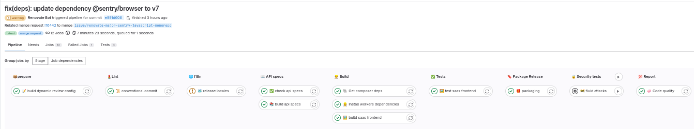
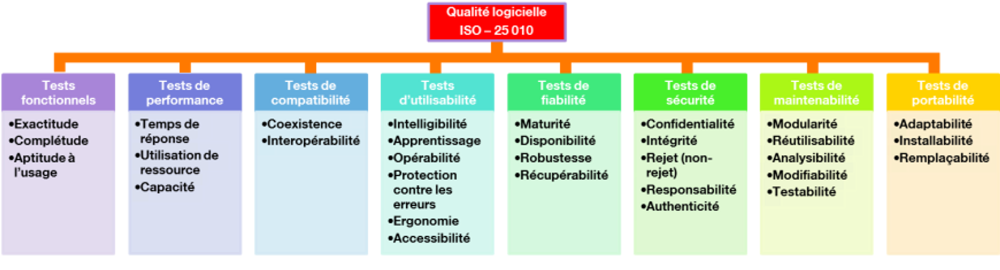
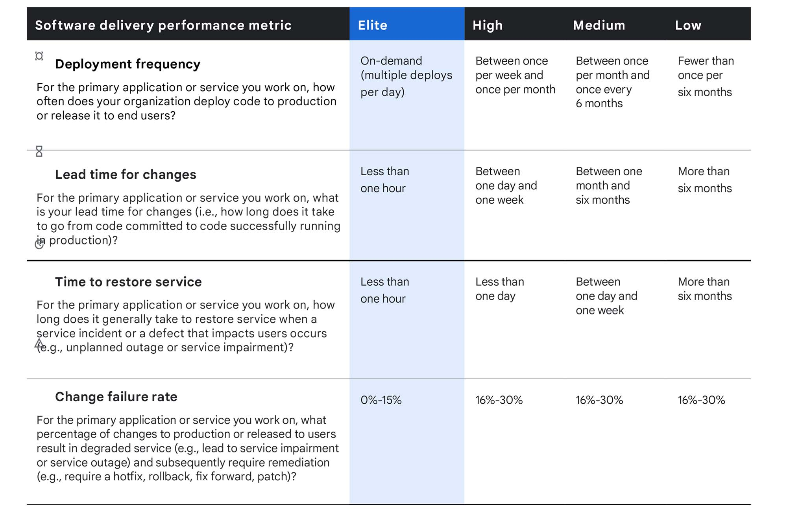
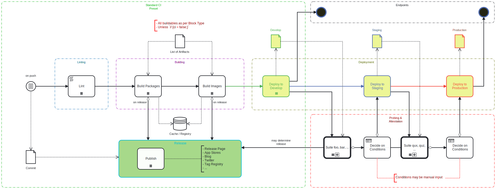

# Software Delivery Life Cycle

<!-- vale off -->

- auto-gen TOC;
  {:toc}

<!-- vale on -->

______________________________________________________________________

## Module Objective

<!-- header: 'Software Delivery Life Cycle Course' -->

<!-- footer: 'Julien Dauliac -- ynov.casualty925@passfwd.com' -->

<!-- headingDivider: 3 -->

<!-- colorPreset: sunset -->

<!-- paginate: true -->

- Cover software delivery life cycle methods
- Understand the importance of CI/CD
- Measure the performance of CI/CD
- Learn basic CI/CD architectures
- Know how to code a basic CI/CD

## Definitions

### Software Delivery Life Cycle

SDLC (Software Development Life Cycle) is a process that enables the production of high-quality software at the lowest cost within the shortest time frame.

In French: Cycle de développement logiciel

### Framework

- Agile
- DevOps

### CI

Continuous Integration (CI) involves regularly and automatically integrating developers' source code into a shared repository. Each code modification triggers automated tests to detect errors as early as possible.

- Test automation
- Supply chain automation
- Code review automation

### Supply Chain

Code used to build software

- [`Taskfile`](https://taskfile.dev)
- [`nix`](https://nixos.org/)
- `cmake`/`make`

### CD

In Continuous Delivery, versions are ready to be deployed but aren't deployed automatically.

- Automation of delivery
- Automation of deployment

### A picture is worth a thousand words:

## 5W

| What | CI/CD is an approach for automating software development processes. |
| --- | --- |
| Who | It involves developers, testers, and automated tools. |
| Where | It can be used in any development environment. |
| When | It's applied throughout the development cycle. |
| How | It automates compilation, testing, deployment, and feedback management. |
| Why | It aims to improve quality, accelerate development, reduce errors, foster collaboration, and enable frequent deployments. |

## Also

- Automate labor: `#DEVOPS` 🌻
- Achieve economies of scale 🪜
- Reduce stress 🧘‍♂️

## Entities

- Culture: DevOps
- Agile management: Release train
- Code: Software Development Life Cycle
- Platform:
  - Software forge (GitLab or others)
  - CD Platform
- Craftsmanship: `Humans + Tools = 🤟`

# DEVOPS 💓 CICD

- A deeply DevOps practice
- Automate labor: #DEVOPS 🌻
- Collective management of non-functional aspects
- Test everything that can be tested

## Non-functional aspects

- A specification: RFC ISO 25 010
- ISQTB

## Keys performance indicators (KPI)

> It doesn’t work, it’s too slow, it’s broken.

______________________________________________________________________

[source](https://www.youtube.com/watch?v=bxDsQ6LlNDE)

______________________________________________________________________

- Managers don’t always know what's best for non-functional aspects.
- An alternative to non-factual directives.
- ⚠️ KPI can become a tool for team pressure:
  Data isn't facts, and facts aren't goals.

### My Favorite KPI 🔑

- Automation factor
- Technical debt
- Code coverage
- CVE rate
- Automated test failure rate

### DORA Metrics

1. Deployment frequency
1. Change execution delay
1. Mean time to recovery
1. Change failure rate

[Use Four Keys metrics like change failure rate to measure your DevOps performance | Google Cloud Blog](https://cloud.google.com/blog/products/devops-sre/using-the-four-keys-to-measure-your-devops-performance?hl=en)

______________________________________________________________________

# CI/CD Architecture 🏗️

## CI/CD Geography 🗺️

- Local to your development machine (on Linux or other OS)
- Software forge: GitLab and others…
- External tools: SonarQube, Argo-CD,

## CI/CD Timeline 🕐

*Software Development Life Cycle (SDLC)*

[CI/CD 10000ft flight height - The Standard Documentation](https://std.divnix.com/patterns/ci-cd-10000-feet.html)

### 4 Steps

______________________________________________________________________

1. Linting:
   The linting phase ensures that the codebase is in good shape. This may include checking formatting, style, and auto generated code.

______________________________________________________________________

2. Building:
   Builds should adhere to these properties:
   - idempotence
   - efficiency
   - speed

______________________________________________________________________

3. Deployment:
   - **[Push vs Pull Workflows](https://std.divnix.com/patterns/ci-cd-10000-feet.html#push-vs-pull-workflows):**

     | Tool | Method | Description |
     | --- | --- | --- |
     | `ansible` | ⬇️ | Code and operations are sent to production from a client machine using SSH. |
     | `fluxCD` | ⬆️ | The `fluxCD` server listens to your software forge to pull updates. |

______________________________________________________________________

4. **[Probing & Attestation Phase](https://std.divnix.com/patterns/ci-cd-10000-feet.html#probing--attestation-phase):**

- Remote runner VS Inplace runner

## Monorepo vs Polyrepo

- The organization of repositories is a crucial aspect of CI/CD.
- Splitting or not splitting projects will determine the ease of adopting tools and practices…

### Polyrepo

- **Advantages:**
  1. Isolation and independence between projects.
  1. Easier management of individual repositories.
  1. Improved performance and scalability, but more complex maintenance.
- **Disadvantages:**
  1. Harder project coordination.
  1. Risk of inconsistency and divergence.
  1. Tedious maintenance with multiple repositories.

### Monorepo

- **Advantages:**
  1. Easier collaboration and code sharing.
  1. Centralized version and security management.
  1. Possibility of frequent merge conflicts and complex dependencies.
- **Disadvantages:**
  1. Frequent merge conflicts.
  1. Errors in one project can impact the entire system.
  1. More complex management as it scales.

### How to split?

- [Team topology](https://teamtopologies.com/)
  - Projects should mirror teams:
    - If CI/CD is a shared responsibility ➡️  Monorepo
    - If each team has its own DevOps *(developers or SRE, OPS)* ➡️  Polyrepo

### And for CI/CD

- Monorepo for CI/CD:
  
