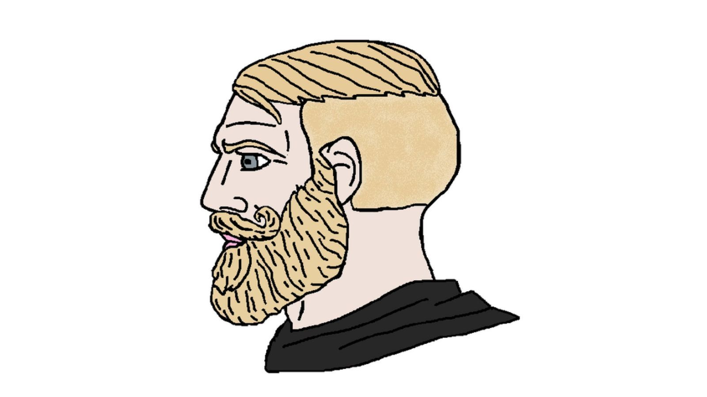
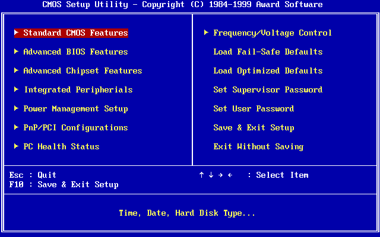
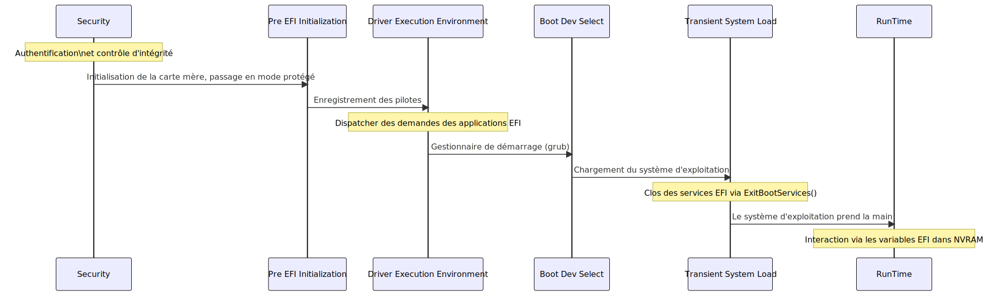

______________________________________________________________________

## header: 'Systems Course' footer: 'Julien Dauliac -- ynov.casualty925@passfwd.com'

<!-- headingDivider: 3 -->

<!-- paginate: true -->

<!-- colorPreset: sunset -->

# Systems Course

- auto-gen TOC;
  {:toc}

# Introduction

## Objectives

- Understand the system boot process, from BIOS initialization to kernel execution.
- Gain foundational knowledge of operating system architectures.
- Explore different forms of isolation, including virtual machines, containers, and lambdas, and understand their advantages and disadvantages.

## What is an OS?

### What does an OS offer?

- Do I need one?
  - Not necessarily, but if it's a personal computer (PC), it’s better.
- Why?
  - To abstract the hardware.

## A Simple System to Start

- BIOS

- Kernel booted by BIOS

- Creation of process 0 by the kernel

- IDLE = process that does nothing:

  ```c
  while(true) {}
  ```

______________________________________________________________________


# BIOS

- **Fun fact:** 🍎 The Mac startup sound comes from an illegal sample from The Beatles’ *Sgt. Pepper’s Lonely Hearts Club Band* album.

## Hardcore BIOS




## Corporate BIOS


## Casual BIOS


## What is a `BIOS`?

- The first instruction executed by the processor
- Detects and initializes hardware:
  - Processors, memory, I/O controllers, peripherals, etc.
- Hardware configuration
- Boots the operating system
- Old term

### A Language Misuse

- *Extensible Firmware Interface → INTEL*
- **Unified Extensible Firmware Interface →** [AMD](https://fr.wikipedia.org/wiki/Advanced_Micro_Devices), [American Megatrends](https://fr.wikipedia.org/wiki/American_Megatrends), [Apple](https://fr.wikipedia.org/wiki/Apple), [ARM](<https://fr.wikipedia.org/wiki/ARM_(entreprise)>), [Dell](https://fr.wikipedia.org/wiki/Dell), [HP](https://fr.wikipedia.org/wiki/Hewlett-Packard), [Intel](https://fr.wikipedia.org/wiki/Intel), [IBM](https://fr.wikipedia.org/wiki/International_Business_Machines_Corporation), Insyde Software, [Microsoft](https://fr.wikipedia.org/wiki/Microsoft), and [Phoenix Technologies](https://fr.wikipedia.org/wiki/Phoenix_Technologies)

### UEFI Architecture

[UEFI](https://fr.wikipedia.org/wiki/UEFI)

______________________________________________________________________

- SEC (*Security*) for executing authentication and integrity control processes (SecureBoot, password, USB token)

______________________________________________________________________

- PEI (*Pre EFI Initialization*) for motherboard and chipset initialization. Switches processor to protected mode.

______________________________________________________________________

- DXE (*Driver Execution Environment*) for driver registration. Manages EFI application requests like a bootloader.

______________________________________________________________________

- BDS (*Boot Dev Select*) for a boot manager like [GRUB](https://fr.wikipedia.org/wiki/GRand_Unified_Bootloader)

______________________________________________________________________

- TSL (*Transient System Load*) for the transition phase where the OS is loaded. EFI services terminate via *ExitBootServices()*, handing over control to the OS.

______________________________________________________________________

- RT (*RunTime*) once the OS takes over. Interaction with firmware is limited to EFI variables stored in NVRAM.

______________________________________________________________________



## Security

> The BIOS is not our domain, but we must protect the foundations.

- Set a UEFI password
- Enable Secure Boot:
  - Signs the bootloader, kernel, and verifies signatures at startup.

## An Open Source BIOS 🎊

**Open Firmware**

[Firmware Switching (Proprietary Firmware or System76 Open Firmware)](https://support.system76.com/articles/transition-firmware/)

# Kernel

- Static code
- Loaded at startup
- Isolates programs from the machine
- Interfaces with user space via `SYSCALL`

## Kernel Components Summary

| Component | Description | Study Time |
| --- | --- | --- |
| Scheduler | Determines which processes run and for how long using scheduling policies. | ✅ |
| Process Management | Manages processes and threads, deciding CPU allocation and priorities. | ✅ |
| System Calls | Handles requests to the operating system. | ✅ |
| I/O Management | Facilitates interactions between hardware and software. | ❌ |
| Drivers | Manages external devices. | ❌ |
| Inter-Process Communication | Provides communication mechanisms like signals, pipes, and semaphores. | ❌ |
| RAM Sharing Between Processes | Uses virtual memory and paging for isolation and sharing. | ❌ |

## Scheduler

*What is it?*

### How do we run multiple processes?


### Scheduler and Timer


______________________________________________________________________

- Scheduler: Algorithm that uses a timer circuit to share CPU access.
- The kernel interrupts processes.
- The time it takes to give all processes a chance to execute is called an **epoch**.
- Uses **system interruptions** to function.

### Scheduling Algorithms

- Round Robin (each takes turns)
- Priority-based
- Multi-level feedback queues

______________________________________________________________________

As in life, inequalities can be created.

```bash
# renice - alter priority of running processes
renice
```

______________________________________________________________________

**Example:**

On critical systems like rockets 🚀, each process can have a set priority.
This is easier when you know all processes in advance.

## System Calls (Syscalls)


______________________________________________________________________

- Communication protocol with the kernel

- List of numerical identifiers

- Found in kernel source code:

  ```c
  SYSCALL_DEFINE3(ioctl, unsigned int, fd, unsigned int, cmd, unsigned long, arg)
  {
  /* do freaky ioctl stuff */
  }
  ```

______________________________________________________________________

| System Call | rax | rdi | rsi | rdx | r10 | r8 | r9 |
| --- | --- | --- | --- | --- | --- | --- | --- |
| sys_chroot | 161 | const char\* filename |  |  |  |  |  |
| sys_chmod | 90 | const char\* filename | uid_t user | gid_t group |  |  |  |
| sys_mkdir | 83 | const char\* pathname | int mode |  |  |  |  |

[Syscall Documentation](https://github.com/torvalds/linux/blob/28f20a19294da7df158dfca259d0e2b5866baaf9/arch/x86/entry/syscalls/syscall_64.tbl)
