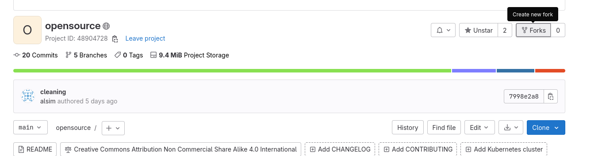
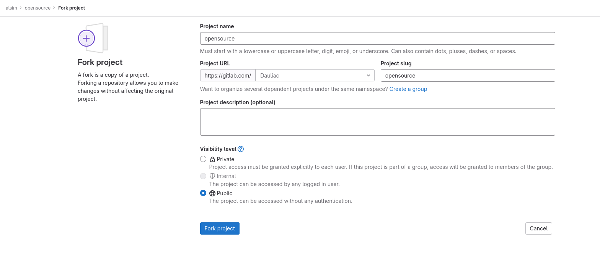
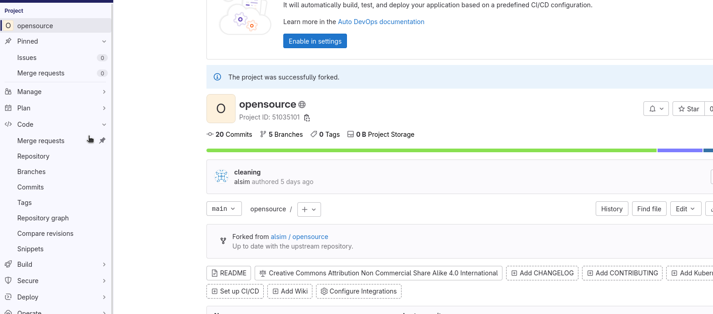
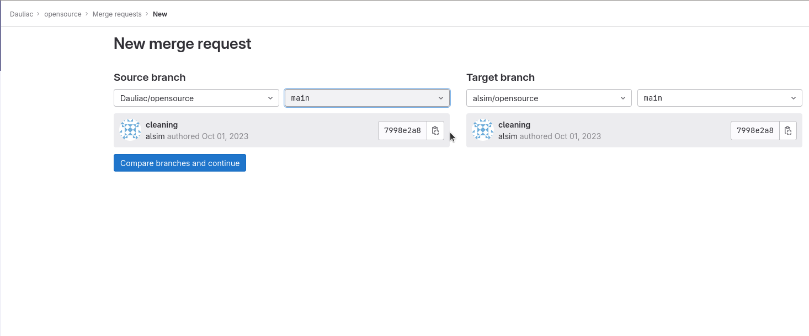

# TP system

## Compte gitlab.com et correction 
Ce TP est à finir chez vous et sera noté en fonction de la qualité du travail rendu.
Un rapport est à rendre dans ce dossier au format markdown et doit se nommer: `RENDU.md`

Correction:
1. Créer un compte sur [gitlab.com](https://gitlab.com) si vous n'en avez pas déjà un.
1. Forkez [ce projet](https://gitlab.com/alsim/opensource) dans votre compte [gitlab.com](https://gitlab.com)
  1. 
  1. 
1. Faites vos commits sur votre fork sur la branche git `main`.
   Une fois terminé, ouvrez une merge request vers le projet original:
  1. 
  1. 
1. Vous pouvez commencer le TP sur votre projet fork ! Pour le reste je me débrouille.

> Pour vos commits, je vous invite à utiliser [conventional commit](https://www.conventionalcommits.org/en/v1.0.0/).

## Nix
[Nix](https://nixos.wiki/) est un outil fantastique, il est multiple:
- C'est un gestionnaire de paquet nix
- C'est également une distribution linux nixos
- Mais également un langage de programmation fonctionnel

Nous allons l'utiliser vous faire installer les différents packets nécessaires à la réalisation de ce TP.

En fonction de votre pc, je vous conseil d'utiliser les système suivants pour vos TPs:
- Linux (Debian/Ubuntu de préférence)
- VM linux (Debian/Ubuntu)
- WSLv2 ubuntu (pour ceux sur windows)
- MacOS (Si vous avez un mac, mais dans ce cas comptez pas sur moi pour vous aider)

sur windows utilisez WSLv2

1. Installez nix en suivant la documentation:https://nixos.org/download.html
1. Relancez votre terminal pour recharger le shell
1. `nix` est développé avec beaucoup de prudence, il propose en version expérimentale, une suite d'outil
   modernes et stable pour le développement: les `flake`. Nous allons les activer:
   ```bash
   mkdir -p ~/.config/nix/
   echo "experimental-features = nix-command flakes" > ~/.config/nix/nix.conf
   ```
1. Nous allons vérifier que votre installation est bonne en installant `direnv`. C'est un outil qui permet
   de charger des variables d'environnement en fonction du dossier dans lequel vous vous trouvez.
   ```bash
    nix profile install nixpkgs#direnv
    # On installe aussi git pour la suite
    nix profile install nixpkgs#git
   ```
1. Vous pouvez cherchez des packets sur nix grace à la commande suivante:
  ```bash
  nix search nixpkgs node
  ```
  > Pour les iencli sur macOs, je ne vous conseil pas de faire ce tp sur un pc non linux.
  > Cependant, nix fonctionne parfaitement sur mac et représente une meilleur alternative à `homebrew` pour installer
  > vos outils de développement.
1.  ajouter le bloc de code suivant dans votre `zshrc` ou `bashrc`
   ```bash
    export DIRENV_WARN_TIMEOUT=40s
    export DIRENV_LOG_FORMAT=""
    eval "$(direnv hook ${SHELL/*\//})"
   ```
   Vous pouvez éditer le fichier avec `nano` par example:
   ```bash
    # si vous utilisez bash
    nano ~/.bashrc
    # si vous utilisez zsh
    nano ~/.zshrc
    ```
1. Relancez votre terminal pour mettre à jour le shell.
1. Nous allons maintenant récupérer le projet du tp (vous vous souvenez votre version fork):
  ```bash
  # git clone git@gitlab.com:<CHANGEME>/opensource.git
  # par exemple pour moi:
  git clone git@gitlab.com:Dauliac/opensource.git
  cd opensource/system/tp
  ```
  - Vous devriez maintenant voir `direnv` qui s’excite et vous demande de l'autoriser à faire des trucs:
      ```
      direnv: error /home/dauliac/ghq/gitlab.com/alsim/opensource/sy
    stem/tp/.envrc is blocked. Run `direnv allow` to approve its c
    ontent
      ````
  - Écoutez le:
    ```bash
    direnv allow
    ```
  - Et paf ! `nix` vient télécharger toutes les dépendances pour commencer le TP !

### Questions
- Donnez moi une explication de ce que sont les [flake nix](https://nixos.wiki/wiki/Flakes)
- Jetez un œil au fichier flake, et ajouter son contenu dans le rapport en commentant son contenu (n'en faites pas trop non plus):
  ```bash
  cat flake.nix
  ```
  - Qu'est ce que `nixpkgs` ?
  - A quoi ca sert
  - Pourquoi la syntaxe elle est bizarre ?
  - ...
  
## Containers
Nous allons commencer par configurer `podman`:
```bash
mkdir -p ~/.config/containers/
cat <<EOF > ~/.config/containers/containers.conf
[engine]
events_logger = "file"
cgroup_manager = "cgroupfs"
EOF
cat <<EOF > ~/.config/containers/policy.json 
{
  "default": [
    { "type": "insecureAcceptAnything" }
  ],
  "transports": {
    "docker-daemon": {
      "": [
        { "type": "insecureAcceptAnything" }
      ]
    }
  }
}
EOF
```
Il vous manque probablement le package `uidmap`:
Vous pouvez l'installer sur debian/ubuntu avec la commande suivante
```bash
sudo apt install -y uidmap
```

### `Containerfile`
Certes docker à inventé et démocratisé les containers, cependant aujourd'hui il existe de nombreux outils, et docker n'est pas le seul.
Nous utiliserons `podman` dans notre cas car ne nécessite pas de daemon et c'était pour moi plus simple de vous le faire installer.

Historiquement, les containers étaient build à partir de `Dockerfile`, c'est un fichier qui décrit comment construire un container.
Cependant dans notre tp nous allons utiliser un nouveau nom plus moderne et agnostique: `Containerfile`.

Ouvrez votre IDE pref et nous allons créer un `Containerfile`:
```Dockerfile
FROM docker.io/alpine:latest

ENV \
    PATH="/root/.cargo/bin:$PATH"

RUN \
  apk add \
    cargo \
  && cargo install tealdeer \
  && tldr --update 

ENTRYPOINT [ "bash", "-c", "tldr -update && tldr $@"]
CMD []
```

> [Ici la page de documentation des différents mots clefs servant à construire des `Dockerfiles`](https://docs.docker.com/engine/reference/builder/)

Nous allons maintenant construire notre container:
```bash
podman build -t tldr .
```
En cas d'erreur suivante


Cette commande vient de créer une image docker, il s'agit d'une archive contenant l'image système de notre container.
Elle sont publiables, et directement exécutable sur des machines supportant les containers:
```bash
podman run tldr podman
```
Cette commande vous donne de la documentation sous forme de guide pratique pour utiliser podman.
Vous pouvez lui demander des précisions:
```bash
podman run tldr podman ps
podman run tldr podman rm
```
Jouez avec la cli podman en utilisant tldr pour vous aider.
Vous commenterez ce que vous avez fait dans le rapport.

### Questions
- Faites des recherches, et donnez moi la différence entre le mot clef `Dockefile`: `CMD` et `ENTRYPOINT`

### Qualité et sécurité
Il existe de nombreux outils pour analyser la qualité et la sécurité de vos containers.
Utilisions les !

`hadolints`, est un linter qui vient vérifier statiquement votre `Containerfile`. [Sa documentation se trouve ici](https://github.com/hadolint/hadolint/wiki):
```bash
hadolint Containerfile
```
Faites les correctifs nécessaires sur votre `Containerfile`.

`trivy` est un outil qui vient scanner votre image docker pour trouver des vulnérabilités connues.
Pour le tp, nous allons l'installer dans le container que nous venons de créer.
Cependant ce n'est pas une pratique que je recommande, je conseil plutôt d'installer `trivy` dans votre environment de dev/CICD (avec `nix` par exemple)

Ajoutez triy dans votre `Containerfile`:
```Dockerfile
RUN apk add curl \
    && curl -sfL https://raw.githubusercontent.com/aquasecurity/trivy/main/contrib/install.sh | sh -s -- -b /usr/local/bin \
    && trivy --insecure filesystem --exit-code 1 --no-progress /
```
Et reconstruisez votre image.

Essayez de configurer `trivy` de sorte qu'il ne vous donne pas de faux positifs,
et qu'il n'affiche plus les failles impossibles à fixer.

[La documentation de `trivy`](https://aquasecurity.github.io/trivy/v0.45/docs/scanner/vulnerability/#severity-selection)

Trivy permet également de scanner vos projets, essayez le:
```bash
trivy fs --scanners vuln,secret,config
```

Vous pouvez aussi regarder des examples de commandes `trivy` ou `hadolint` avec `tldr`:
```bash
podman run tldr trivy
podman run tldr hadolint
```

### Mini cours
Les constructions de container fonctionnent en layer, en couche qui viennent s’empiler.
Cela permet de réutiliser des morceaux de build entre image, ou de faire du cache et d'accélérer le build.
```Dockerfile
+-----------------------------------------------------+
|                   Docker Image                      |
|                                                     |
|  +-----------------------------------------------+  |
|  |                  Layer 6                      |  |
|  | (CMD ["tldr"])                                |  |
|  |                                               |  |
|  +-----------------------------------------------+  |
|  +-----------------------------------------------+  |
|  |                  Layer 5                      |  |
|  | (CMD [])                                      |  |
|  |                                               |  |
|  +-----------------------------------------------+  |
|  +-----------------------------------------------+  |
|  |                  Layer 4                      |  |
|  | (RUN trivy filesystem --exit-code 1 --no-     |  |
|  |   progress /)                                 |  |
|  |                                               |  |
|  +-----------------------------------------------+  |
|  +-----------------------------------------------+  |
|  |                  Layer 3                      |  |
|  | (RUN curl -sfL ... | sh -s -- -b /usr/local/  |  |
|  |   bin && trivy filesystem --exit-code 1 --no- |  |
|  |   progress /)                                 |  |
|  |                                               |  |
|  +-----------------------------------------------+  |
|  +-----------------------------------------------+  |
|  |                  Layer 2                      |  |
|  | (RUN apk add cargo bash && cargo install      |  |
|  |   tealdeer && tldr --update)                  |  |
|  |                                               |  |
|  +-----------------------------------------------+  |
|  +-----------------------------------------------+  |
|  |                  Layer 1                      |  |
|  | (FROM docker.io/alpine:latest)                |  |
|  |                                               |  |
|  +-----------------------------------------------+  |
|                                                     |
+-----------------------------------------------------+
```

Cependant, cela peut faire gonfler la taille de vos images.
Limiter le nombre d'instructions `RUN` est une bonne pratique pour accélérer le build de vos containers.

Proposer moi une seconde version de votre `Containerfile` ou vous réduisez le nombre d'instructions `RUN` à une instruction.

### Impératif vs Déclaratif
Pour construire des systèmes avec des containers, il existe deux approches:

|                   | Impératif                                                   | Déclaratif                                                |
| ----------------- | ----------------------------------------------------------- | --------------------------------------------------------- |
| **Description**   | Fournit des instructions détaillées sur la manière d'atteindre un état souhaité. | Déclare simplement l'état souhaité, le système s'ajuste automatiquement. |
| **Technologies**  | - Dockerfile<br>- Ansible<br>- Shell scripts                | - Docker Compose<br>- Terraform<br>- Nix                 |

Avantages de l'approche déclarative :
- Déclaration de l'état souhaité du système.
- Abstraction du comment, se concentre sur le quoi.
- Gestion automatique des dépendances et de l'ordre d'exécution.
- Idéal pour l'orchestration d'infrastructures complexes.

Nix offre une approche qui permet de construire des systèmes, et donc des containers de manière déclarative.

nix.dev est un blogue qui explicite les usages de nix.
[Ici la section expliquant comment build des containers en utilisant les `flakes`:](https://nix.dev/tutorials/nixos/building-and-running-docker-images)

Éditez le fichier `flake.nix` et ajoutez y un nouvel output `container` (au meme niveau que `devShells`):
```nix
# Dans la section let, en dessous de tpPackages = [...];
containerImage = pkgs.dockerTools.buildImage {
  name = "tldr-nix";
  copyToRoot = pkgs.buildEnv {
    name = "image-root";
    paths = [ pkgs.bash ] ++ tpPackages;
    pathsToLink = [ "/bin" ];
  };
};

# Dans l'output au dessus de devShells
# Les backages dans nix sont un output spécial qui permet build des:
# - bibliothèques
# - applications
# - scripts 
# - containers
packages.tp-container = containerImage;
```

Comme on peut le voir, il n'y a pas besoin d’enchaîner les commandes d'installation, mais juste de préciser leur nom.

Construisez votre container avec la commande:
```bash
nix build '.#tp-container'
```
Notez l’apparition d'un nouveau dossier `result` contenant votre container.

On peut le charger dans podman avec la commande:
```bash
podman load -i result
```

Nous venons d'utiliser le `flake` `nix` `dockerTools` qui propose une interface pour construire des images docker.
Cette fonctionnalité permet de déclarer et de composer des configurations d'infrastructures et des environnements de manière déclarative, fournissant une approche plus moderne et flexible pour décrire les dépendances logicielles et les configurations système.

[Ici la documentation du flake `dockerTools`](https://nixos.org/manual/nixpkgs/stable/#sec-pkgs-dockerTools)


Nous allons maintenant lancer notre container avec podman:
```bash
# Changez le tag de l'image par le votre
podman run -it localhost/tldr-nix:v74l0dnfbkdq3x5yshqkh0956wiki5pw bash
```

Essayez de lancer plusieurs binaires habituels comme `ls` ou `mkdir` et constatez leur absence.

En effet grace à la gestion explicite et déclarative des dépendances, nous n'héritons plus de la complexité et la multitude d'outils installés par défaut dans les distributions classiques et donc images docker.

Nous avons cependant installé `trivy` dans notre container, et nous pouvons donc l'utiliser:

```bash
trivy --insecure filesystem --exit-code 1 --ignore-unfixed --no-progress /
```

On peut voir qu'il ne reste plus que 1 vulnérabilités, et qu'elles sont toutes les deux dans le binaire `bash`.

Et encore, si l'on ajoute l'option `--ignore-unfixed` qui permet d'ignorer les vulnérabilités non corrigées, il ne reste plus aucune vulnérabilité.

Le mode déclaratif, en ne permettant pas de faire de compromis sur les dépendances, permet de garantir la sécurité de nos containers.
C'est une application stricte de 2 bonnes pratiques:
- le principe du droit minimum
- l'évitement

Notez que les applications dans les containers sons soumises à certains parti prix:
- Les logs ne sont pas écrit dans des fichiers mais envoyé sur `stdout`/`stderr`
- Le réseau n'est pas managé par l'application elle meme.
- et bien d'autres

On peut regrouper ses bonnes pratiques sous le nom de [12 factor app](https://12factor.net/fr/)
Renseignez vous dessus et faites moi un court résumé dans votre rapport.

### Questions
- Expliquez moi ce que sont les `namespaces`, et les `cgroups`.
- Expliquez moi ce qu'est `containerd` ?
- Donnez moi les `syscalls` qui sont utilisé pour faire tourner les containers.
- Nous avons utilisé comme source en début de TP un container `alpine`, expliquer en quoi il est intéressant par rapport `debian` ou `ubuntu`.
- Qu'est ce que `busl` dans la distribution alpine, en quoi est-ce intéressant ?
